# CI/CD with GitHub Actions

A small Flask service, a CI workflow that refuses to let a broken change through, and a CD
workflow that publishes the image and deploys it to Kubernetes. The code is in
[`project/`](project); the workflows are in
[`project/.github/workflows/`](project/.github/workflows).

Every pipeline run below was executed for real with [`act`](https://github.com/nektos/act),
which runs GitHub Actions workflows locally inside the same `ubuntu-latest` runner image
(`catthehacker/ubuntu:act-latest`) that GitHub-hosted jobs are modelled on. The `project/`
folder is laid out as a standalone repository, so on GitHub it runs unchanged once it sits at
the root of its own repo — workflows are only picked up from `.github/workflows/` at the
repository root.

## 1. CI vs CD

| | CI — Continuous Integration | CD — Continuous Delivery / Deployment |
|---|---|---|
| Question it answers | "Is this change safe to merge?" | "Can this change reach users without a human doing it?" |
| Trigger here | every `push` and `pull_request` to `main` | CI finishing green on `main` (`workflow_run`), or by hand |
| Stages | lint → test (matrix) → build image → container smoke test | publish image → deploy to Kubernetes → smoke test |
| Output | test reports, a build bundle, a tested image tarball | an image in a registry and a running, verified Deployment |
| File | [`ci.yml`](project/.github/workflows/ci.yml) | [`cd.yml`](project/.github/workflows/cd.yml) |

*Delivery* stops at "ready to release, a person presses the button"; *deployment* goes all the
way to production automatically. `cd.yml` does both: `workflow_run` deploys automatically,
`workflow_dispatch` keeps a manual button for the same pipeline.

## 2. The pipeline

```text
 push / pull request ──► CI (ci.yml)
                         lint (flake8 + hadolint)
                           │ needs
                           ▼
                         test  ── matrix: py3.11 · py3.12 · py3.13 ──► artifacts: junit.xml, coverage.xml
                           │ needs
                           ▼
                         build ── build.sh + docker save ──► artifacts: build-bundle, docker-image
                           │ needs
                           ▼
                         integration-test ── docker load, run with secrets.GRADE_API_KEY, curl every endpoint

 CI green on main ──► CD (cd.yml)   [workflow_run, or workflow_dispatch]
                         publish ── docker build + push  <registry>/<owner>/campus-grade-api:sha-<commit>, :latest
                           │ needs
                           ▼
                         deploy  ── kind cluster on the runner ─► kubectl apply k8s/ ─► rollout status ─► curl via Service
```

Each arrow is a `needs:` dependency (inside a workflow) or a `workflow_run` trigger (between
workflows). A stage only starts when the one before it has passed, so a failure anywhere stops
the line before anything is built, published or deployed.

## 3. The application

[`project/app/`](project/app) — a campus grade API. The grading rules live in
[`grading.py`](project/app/grading.py) with no Flask imports, so they can be unit-tested
directly; [`main.py`](project/app/main.py) is a thin HTTP layer on top.

| Endpoint | Purpose |
|---|---|
| `GET /` | service name, version, `git_sha` baked in at build time, hostname |
| `GET /health` | probe target for Docker `HEALTHCHECK` and Kubernetes probes |
| `GET /api/grade?marks=<n>` | letter grade and grade points on a 10-point scale |
| `POST /api/sgpa` | credit-weighted SGPA for a list of `{marks, credits}` courses |
| `GET /api/secure/report` | protected: the `X-API-Key` header must match the `API_KEY` env var (constant-time compare) |

The [`Dockerfile`](project/Dockerfile) is two-stage (dependencies installed in a builder,
copied into a clean `python:3.12-slim`), runs as UID 10001, serves with gunicorn, and takes
`GIT_SHA` as a build argument so every image can say which commit it came from.

## 4. Build and test locally first

The [`Makefile`](project/Makefile) mirrors the CI stages, so whatever CI will do can be done
on a laptop first:

```bash
make install   # pip install -r requirements-dev.txt
make lint      # flake8 app tests
make test      # pytest, coverage gate 90%
make build     # ./build.sh -> image + build/ bundle
make run       # docker run -p 8000:8000 -e API_KEY=... campus-grade-api:local
```

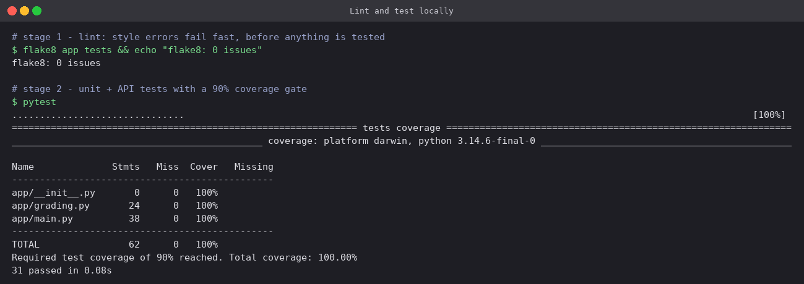

31 tests, 100% line coverage. `pytest.ini` sets `--cov-fail-under=90`, so the coverage
threshold is itself a gate: deleting tests makes CI fail just as surely as breaking code does.

```bash
./build.sh local
docker run -d --name grade-local -p 8000:8000 -e API_KEY=local-demo-key campus-grade-api:local
curl -s "localhost:8000/api/grade?marks=84"
curl -s -w '  HTTP %{http_code}\n' localhost:8000/api/secure/report
curl -s -w '  HTTP %{http_code}\n' -H 'X-API-Key: local-demo-key' localhost:8000/api/secure/report
```

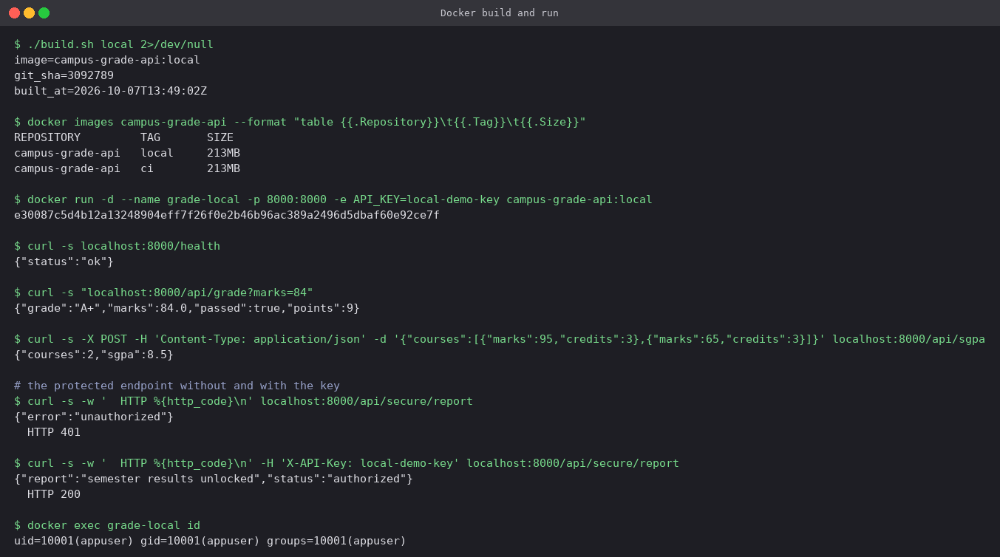

- 84 marks → `A+`, 9 points; the SGPA of a 95 and a 65 in two 3-credit courses is `8.5`.
- The protected endpoint returns **401** without the key and **200** with it.
- `docker exec … id` confirms the process is `uid=10001`, not root.

## 5. Workflows, jobs, steps and runners

| Term | Meaning | Here |
|---|---|---|
| **Workflow** | A YAML file in `.github/workflows/` with triggers (`on:`) and jobs | `ci.yml`, `cd.yml` |
| **Event** | What starts a workflow | `push`, `pull_request`, `workflow_run`, `workflow_dispatch` |
| **Job** | A set of steps that runs on one runner; jobs run in parallel unless linked by `needs:` | `lint`, `test`, `build`, `integration-test`, `publish`, `deploy` |
| **Step** | A shell command (`run:`) or a reusable action (`uses:`) | `flake8 app tests`, `actions/setup-python@v5` |
| **Runner** | The machine a job runs on, fresh for every job | `ubuntu-latest` |
| **Matrix** | One job definition expanded into several jobs | `python-version: [3.11, 3.12, 3.13]` |

```bash
act -l                                  # every job, its stage and its triggers
act -g -W .github/workflows/ci.yml      # the needs: graph
```

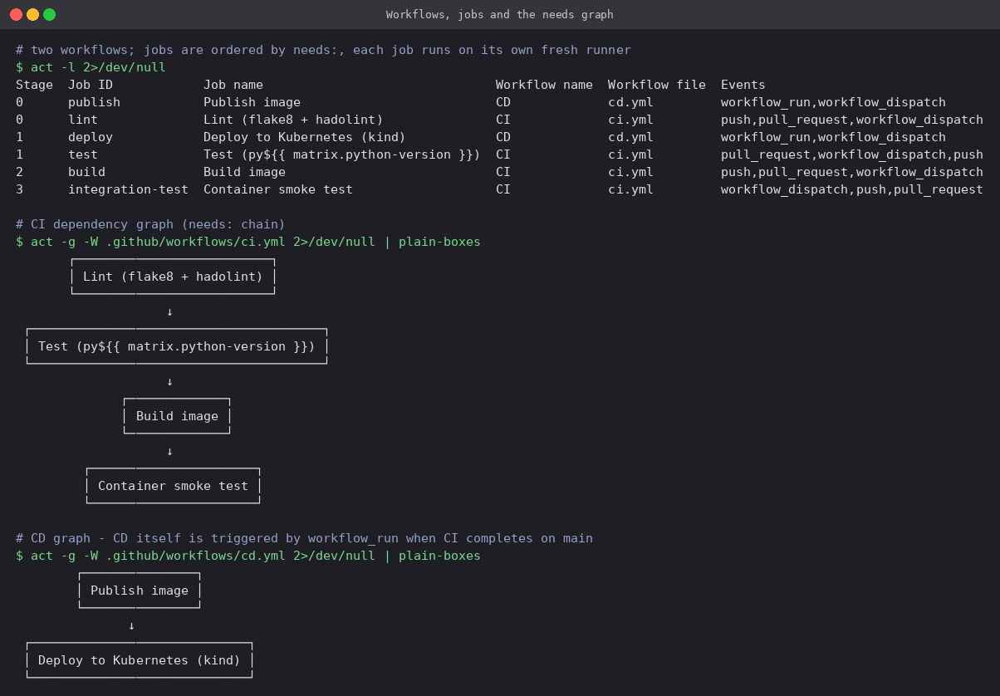

Two consequences of "every job gets a fresh runner": nothing on disk survives from one job to
the next (that is what artifacts are for), and the jobs in one stage — the three matrix test
jobs here — really do run in parallel.

Other settings worth noting in the YAML:

- `permissions: contents: read` in CI, and only CD gets `packages: write`. The automatic
  `GITHUB_TOKEN` gets exactly what each workflow needs and no more.
- `concurrency:` cancels a superseded CI run on the same branch, but CD uses
  `cancel-in-progress: false` so two deployments never overlap and none is cut off half way.
- `fail-fast: false` on the matrix: one Python version failing does not cancel the others, so
  a single run shows the full picture.

## 6. The CI run

```bash
act push -W .github/workflows/ci.yml
```

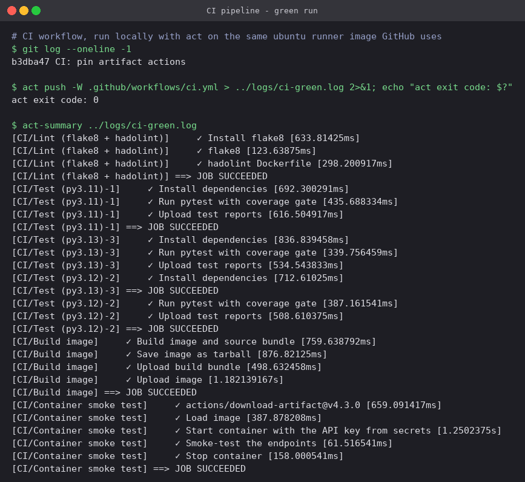

All six jobs succeed in dependency order: lint, three parallel matrix test jobs, build, then
the container smoke test.

### The matrix and the artifacts

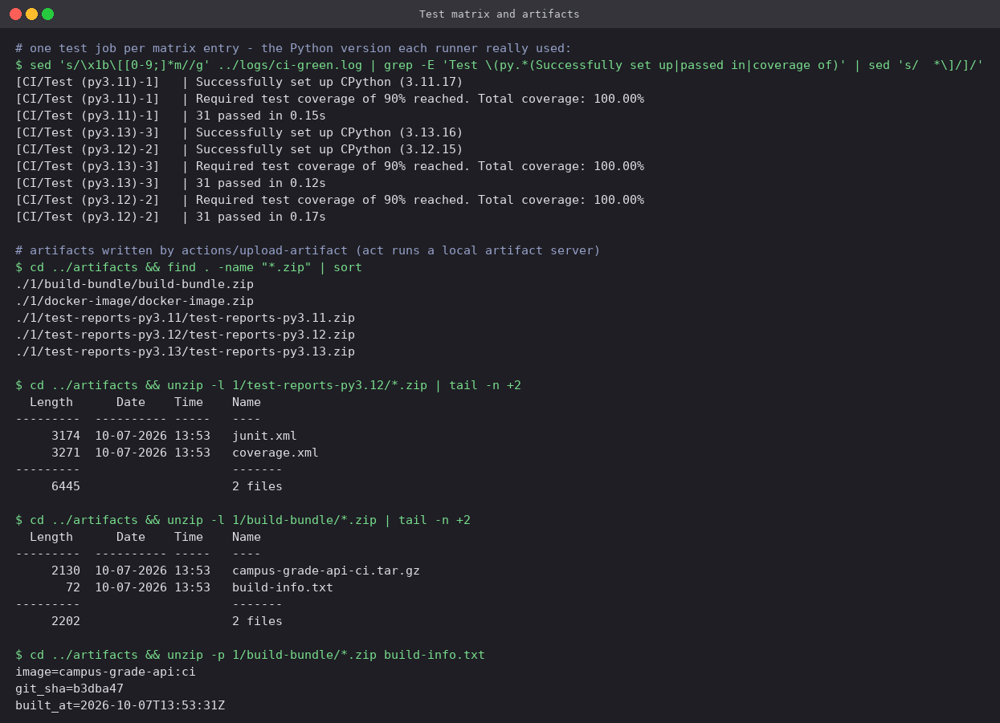

- `setup-python` installed three real interpreters (3.11.17, 3.12.15, 3.13.16) and the same
  31 tests passed on each — compatibility is checked rather than assumed.
- Five artifacts came out of one run: a test-report bundle per matrix entry (`junit.xml` +
  `coverage.xml`), the `build-bundle` (source tarball + `build-info.txt`) and the
  `docker-image` tarball.
- The `docker-image` artifact is how the image built in the `build` job gets to the
  `integration-test` job on a *different* runner. The smoke test therefore runs the exact bytes
  that were built, not a rebuild.
- Test reports upload with `if: always()`, so they are kept even — especially — when tests
  fail.

### Secrets

The protected endpoint needs a key, and the key is never in the repository. On GitHub it is a
repository secret:

```bash
gh secret set GRADE_API_KEY --body "<value>"
```

For the local runs it lives in a `.secrets` file that `act` reads and `.gitignore` excludes.
Either way the workflow reads it as `${{ secrets.GRADE_API_KEY }}`:

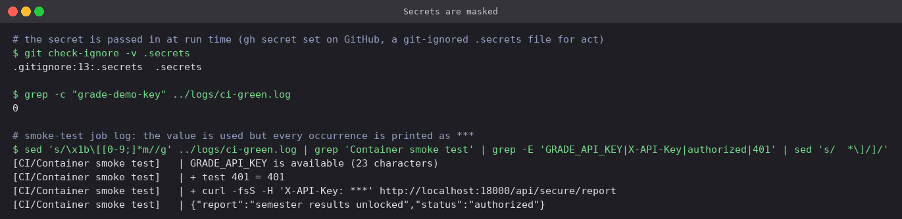

- The job proves the secret is present (`23 characters`) without printing it.
- `set -x` echoes the `curl` command, but the header shows as `X-API-Key: ***`. Every
  registered secret value is masked wherever it appears in the log.
- Searching the whole log for the real value finds **0** occurrences.
- Secrets are not passed to workflows triggered from forks, which is why the protected-endpoint
  test belongs in a job that only runs for trusted events on a public repo.

## 7. CI blocks bad code

### A Dockerfile problem caught by lint

The very first CI run failed at the lint job. `hadolint` flagged the original Dockerfile:

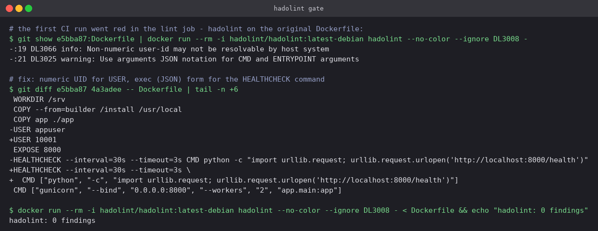

- **DL3066** — `USER appuser` is a name; Kubernetes `runAsNonRoot` can only verify a numeric
  UID, so `USER 10001` is the portable form.
- **DL3025** — shell-form `HEALTHCHECK CMD` runs under `/bin/sh -c`; the JSON exec form runs
  the process directly and gets signals properly.

Fixed, re-linted clean, and the next run went green. The lint stage costs a couple of seconds
and caught a real problem before a single test ran.

### A logic change caught by tests

A pull request raises the `A+` threshold from 80 to 85 — a one-character change that looks
harmless in review:

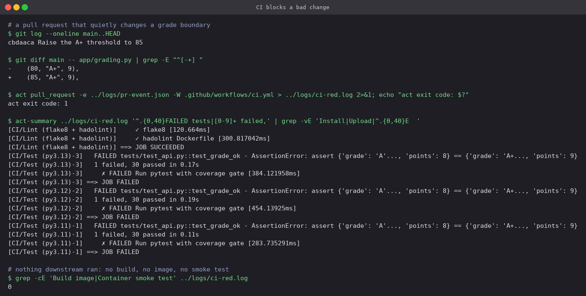

- Lint passes — the code is perfectly tidy, just wrong.
- All three matrix jobs fail on `test_grade_ok`: 84 marks used to be `A+`/9 points and is now
  `A`/8. Nothing else in the codebase knew that boundary had moved; the test did.
- `build` and `integration-test` **never ran** (0 lines in the log for either): no image was
  built from the broken code, so there was nothing for CD to publish. With branch protection
  requiring the CI check, the PR's merge button stays disabled.

After reverting the change on the branch, the same PR goes green and can be merged:

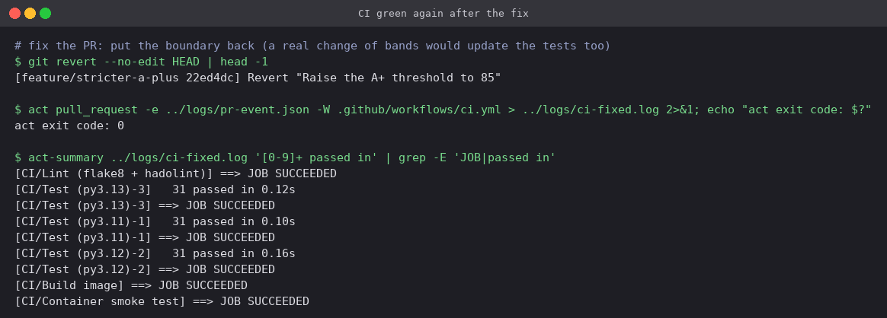

## 8. The CD run

[`cd.yml`](project/.github/workflows/cd.yml) has two jobs:

1. **publish** — computes `sha-<short commit>`, logs in to GHCR with `GITHUB_TOKEN` (skipped
   when another registry is configured), builds with `--build-arg GIT_SHA`, pushes `sha-…`
   and `latest`.
2. **deploy** (`needs: publish`) — `helm/kind-action` creates a Kubernetes cluster *on the
   runner*, the published image is loaded into it, the API key secret is created from
   `secrets.GRADE_API_KEY`, the manifests in [`project/k8s/`](project/k8s) are applied with the
   image tag substituted in, `kubectl rollout status` waits for 2/2 Ready, and a port-forward
   plus `curl` smoke-tests through the Service.

For the local run the registry is selected by a repository variable
(`vars.REGISTRY`) pointed at a `registry:2` container on `localhost:5001`; on GitHub the
variable is unset and the default `ghcr.io` applies. `act` cannot chain one workflow off
another, so CD was started through its `workflow_dispatch` trigger, which runs the same jobs.

```bash
docker run -d --name local-registry -p 5001:5000 registry:2
act workflow_dispatch -W .github/workflows/cd.yml
```

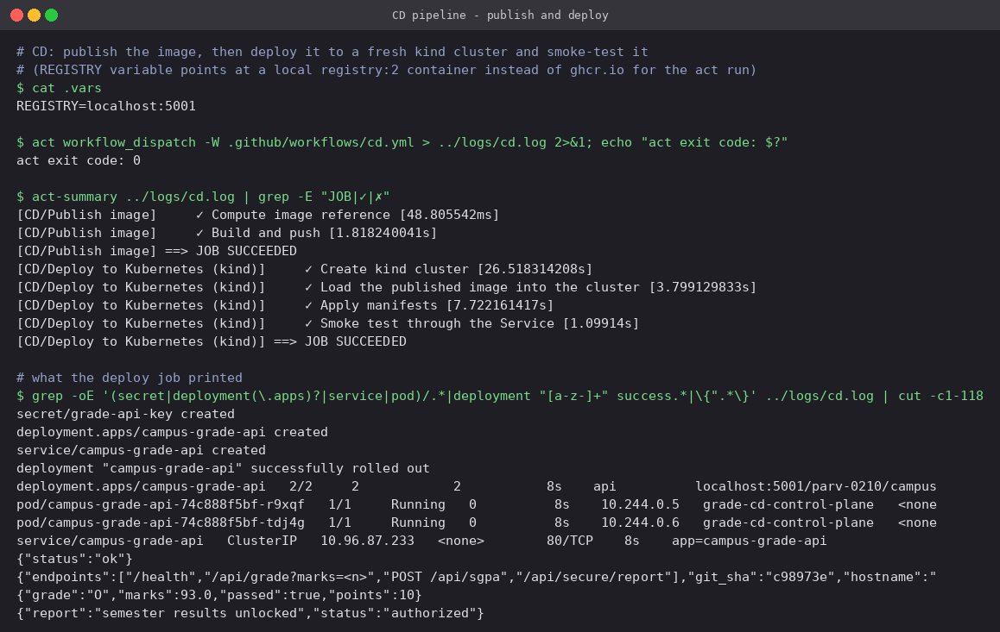

- The rollout reaches **2/2** with `maxUnavailable: 0`, and both Pods pass their readiness
  probe on `/health` before the Service sends them traffic.
- The smoke test reaches the app through the Service, including the protected endpoint with the
  key that came from the secret.
- `kind-action` deletes the cluster at the end of the job, so every deployment test starts from
  nothing.

### Traceability

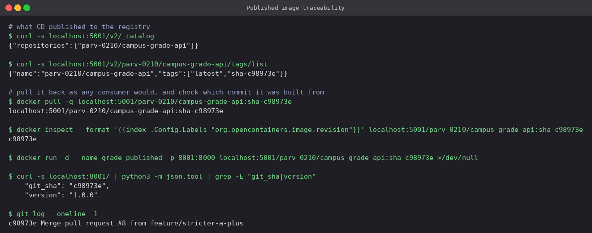

The registry holds `sha-c98973e` and `latest`. The image's OCI `revision` label, the
`git_sha` the running app reports, and `git log` all say `c98973e`. Given any running
container, the exact source commit is one `curl` away — and `latest` is only a convenience
alias; deployments always reference the immutable `sha-` tag.

## Project layout

```text
project/
├── .github/workflows/
│   ├── ci.yml            lint → test matrix → build → container smoke test
│   └── cd.yml            publish image → deploy to kind → smoke test
├── app/
│   ├── grading.py        grade bands, SGPA (pure functions)
│   └── main.py           Flask routes
├── tests/                31 pytest tests (unit + API)
├── k8s/                  Deployment (2 replicas, probes, limits) + ClusterIP Service
├── Dockerfile            two-stage, non-root, HEALTHCHECK, GIT_SHA build arg
├── build.sh              image + versioned source bundle + build-info.txt
├── Makefile              install / lint / test / build / run
├── .flake8  pytest.ini  requirements.txt  requirements-dev.txt  .dockerignore  .gitignore
```

## Running it on GitHub

```bash
cp -r project/ ../campus-grade-api && cd ../campus-grade-api
git init -b main && git add -A && git commit -m "Campus grade API with CI/CD"
gh repo create campus-grade-api --public --source . --push
gh secret set GRADE_API_KEY --body "<value>"
gh run list                       # CI starts on the push; CD follows when CI is green
gh run view --log | grep -A3 "Smoke-test"
```

## Cleanup

```bash
docker rm -f local-registry grade-local
docker rmi campus-grade-api:local campus-grade-api:ci
kind get clusters                 # kind-action already removed grade-cd
```

---

**Prince Shakya** · Roll No. 24BCS10084
