# Cloud Terraform Project

A small but complete AWS environment defined in Terraform: a VPC across two Availability Zones,
public and private subnets, an internet gateway and route table, a security group, an IAM role
with an instance profile, an S3 bucket holding the site, and EC2 web servers that configure
themselves on first boot with `user_data`.

The infrastructure was planned, applied, changed, inspected and destroyed against
**LocalStack 3.8**, a local AWS emulator running in Docker; see
[Terraform and AWS](../Terraform%20and%20AWS/README.md#where-this-ran-localstack) for that
setup. Because LocalStack only *records* an EC2 instance and never boots one, the boot script
was additionally run in a real Ubuntu 24.04 container to prove it works (section 8). That test
caught a real bug.

## Task checklist

| Requirement | Where |
|---|---|
| Architecture diagram | [`diagrams/architecture.md`](diagrams/architecture.md) |
| VPC, subnets, IGW, route table | [`network.tf`](terraform-project/network.tf) |
| Security group | [`security.tf`](terraform-project/security.tf) |
| EC2 with user_data | [`compute.tf`](terraform-project/compute.tf), [`user_data.sh.tftpl`](terraform-project/user_data.sh.tftpl) |
| S3 bucket | [`storage.tf`](terraform-project/storage.tf) |
| IAM role for EC2 → S3 | [`iam.tf`](terraform-project/iam.tf) |
| Variables, outputs, locals | `variables.tf`, `outputs.tf`, `locals.tf`, `terraform.tfvars` |
| Full lifecycle: init → plan → apply → change → destroy | Sections 1–11 below |
| Remote state | Section 10, [`backend.s3.tf.example`](terraform-project/backend.s3.tf.example) |

## Layout

```text
Cloud Terraform Project/
├── diagrams/
│   ├── architecture.md        Mermaid diagram + design notes
│   └── terraform-graph.png    output of terraform graph
├── screenshots/
└── terraform-project/
    ├── versions.tf            Terraform and provider version pins (aws, random)
    ├── provider.tf            region, default_tags, LocalStack endpoint switch
    ├── variables.tf           inputs with defaults and validation
    ├── locals.tf              name prefix, common tags, AZ list, AMI choice
    ├── network.tf             VPC, 2 public + 1 private subnet, IGW, route table
    ├── security.tf            web security group
    ├── iam.tf                 role, inline policy, instance profile
    ├── storage.tf             random suffix, bucket + versioning/encryption/PAB, index.html
    ├── compute.tf             aws_instance.web (count)
    ├── outputs.tf
    ├── user_data.sh.tftpl     first-boot script, rendered with templatefile()
    ├── site/index.html        page template uploaded to S3
    ├── terraform.tfvars
    ├── backend.s3.tf.example  optional S3 remote-state backend
    └── localstack.s3.tfbackend  backend settings used for the LocalStack run
```

Splitting by concern rather than one `main.tf` is only for reading. Terraform loads every `.tf`
file in the directory as one configuration, and the order of files does not matter.

Architecture overview (full diagram in [`diagrams/architecture.md`](diagrams/architecture.md)):

```text
 Internet ── IGW ── public route table (0.0.0.0/0 → IGW)
                          │                         │
          10.40.1.0/24 (ap-south-1a)     10.40.2.0/24 (ap-south-1b)
              EC2 web-1                      EC2 web-2 (count = 2)
                  │  security group: 80 from all, 22 from admin /32
                  │  instance profile → IAM role → s3:GetObject site/*
                  ▼
       S3 campus-portal-dev-site-<hex>  (site/index.html)

          10.40.101.0/24 (ap-south-1a) private, no internet route
```

## 1. `terraform init`: two providers

```bash
terraform init
terraform providers
```

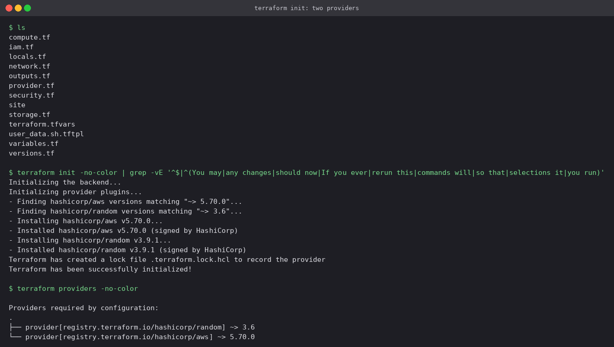

Two providers are installed: `hashicorp/aws` for every AWS resource and `hashicorp/random` for
the bucket-name suffix. Both versions are recorded in `.terraform.lock.hcl`, which is
committed. The AWS provider is held at `~> 5.70.0` for the LocalStack compatibility reason
explained in [Terraform and AWS](../Terraform%20and%20AWS/README.md#1-terraform-init).

## 2. `fmt`, `validate`, and the console

```bash
terraform fmt -check -recursive
terraform validate
terraform plan -var vpc_cidr=10.40.0.0/33
echo 'cidrsubnet("10.40.0.0/16", 8, 1)' | terraform console
```

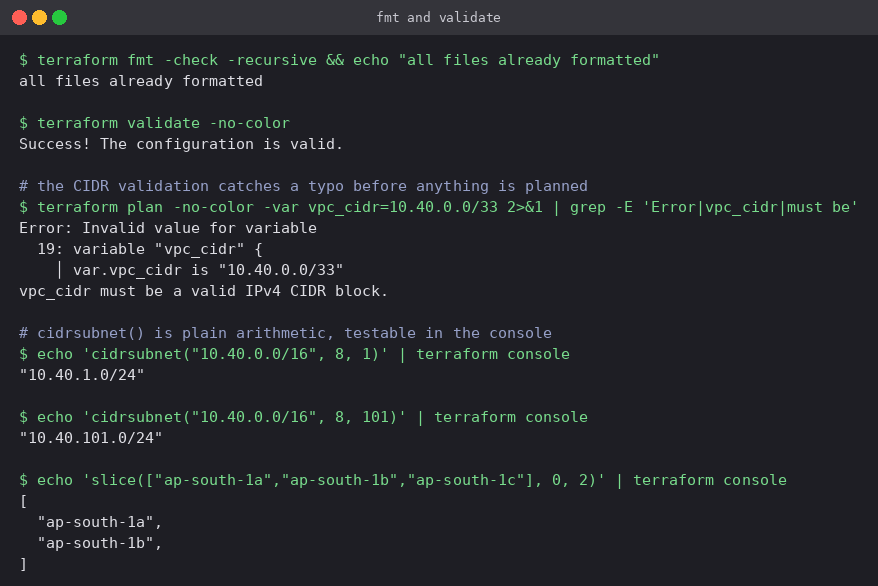

- `/33` is not a valid IPv4 prefix. The `validation` block uses `can(cidrhost(var.vpc_cidr, 0))`
  to try parsing the value, and fails the plan with a readable message instead of an AWS API
  error halfway through an apply.
- `terraform console` evaluates expressions using the real functions, which is the quickest way
  to check the subnet maths: `cidrsubnet("10.40.0.0/16", 8, 1)` adds 8 bits to the prefix and
  picks the 1st block, `10.40.1.0/24`. Network number 101 gives the private subnet,
  `10.40.101.0/24`, kept well away from the public range so more public subnets can be added
  later without overlap.

## 3. `terraform plan`: 19 resources

```bash
terraform plan -out=tfplan
```

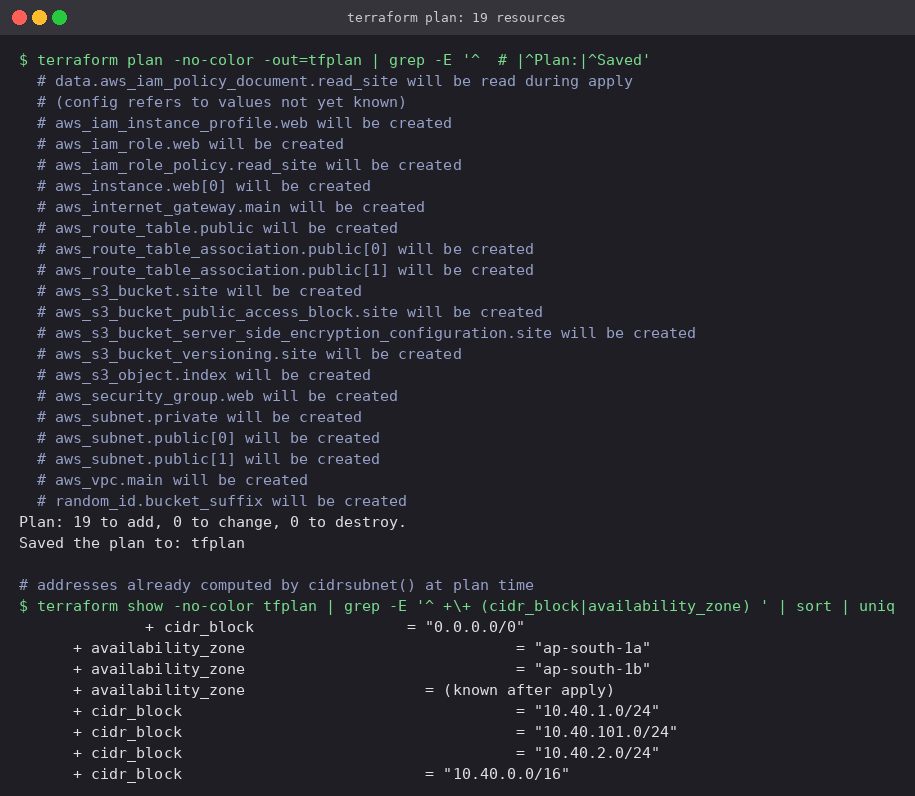

- 19 resources: networking (8), security group (1), IAM (3), S3 (5), EC2 (1) and
  `random_id` (1).
- `data.aws_iam_policy_document.read_site` will be **read during apply**: the policy embeds the
  bucket ARN, which does not exist until the bucket is created. Terraform defers the data source
  and works out the ordering itself.
- Subnet CIDRs and AZs are already concrete in the plan because they come only from variables
  and functions. IDs and IPs are `(known after apply)`.

## 4. `terraform apply`

```bash
terraform apply tfplan
```

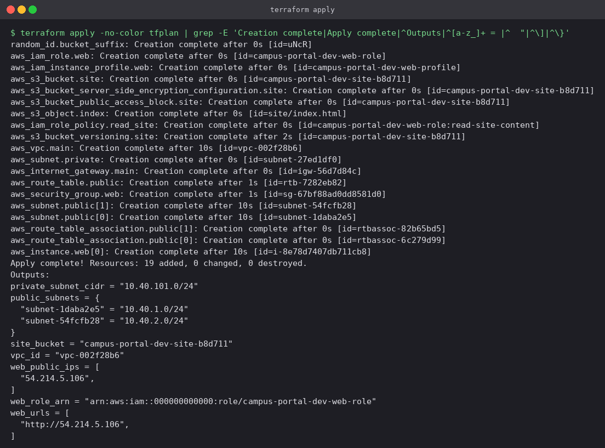

The order of the `Creation complete` lines is the dependency graph being walked in parallel. The
random suffix, IAM role and bucket go first because they depend on nothing. The VPC follows,
then subnets, gateway, route table and security group. The instance comes last because it needs
a subnet, the security group, the instance profile, *and* (through the explicit `depends_on`)
the `index.html` object it will download at boot.

The outputs give everything needed to use or verify the environment without opening a console.

## 5. State

```bash
terraform state list
terraform state show 'aws_subnet.public[0]'
```

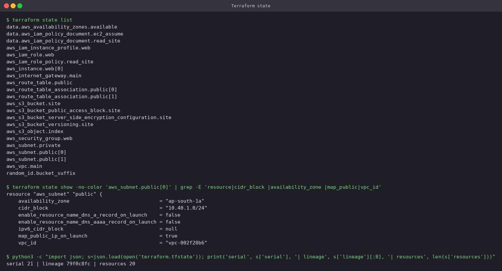

Resources created with `count` appear as indexed addresses (`aws_subnet.public[0]`, `[1]`).
The state holds the mapping from each address to a real ID (`subnet-…`), plus every attribute.
The `serial` increments on every write and the `lineage` identifies this particular state's
history, which together let Terraform refuse to overwrite a newer state with an older one.

## 6. `terraform graph`

```bash
terraform graph | dot -Tpng -o ../diagrams/terraform-graph.png
```

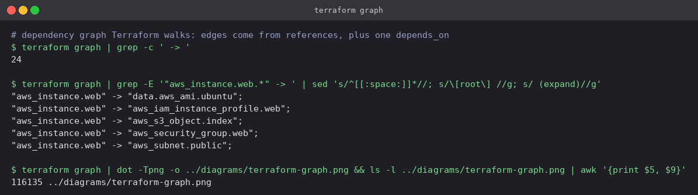

The edges out of `aws_instance.web` are exactly its inputs: AMI, instance profile, S3 object,
security group, subnet. The rendered graph is in
[`diagrams/architecture.md`](diagrams/architecture.md#dependency-graph). On the LocalStack run
`data.aws_ami.ubuntu` has `count = 0`, but it still appears as a node because the graph is built
from the configuration, not from what was evaluated.

## 7. Verifying with the AWS CLI

```bash
awsl ec2 describe-subnets --filters Name=vpc-id,Values=$VPC
awsl ec2 describe-route-tables --filters Name=vpc-id,Values=$VPC Name=tag:Name,Values=campus-portal-dev-public-rt
awsl ec2 describe-security-groups --filters Name=vpc-id,Values=$VPC Name=group-name,Values=campus-portal-dev-web-sg
awsl ec2 describe-instances --instance-ids $ID
awsl s3 ls s3://$BUCKET --recursive
awsl iam get-role-policy --role-name campus-portal-dev-web-role --policy-name read-site-content
```

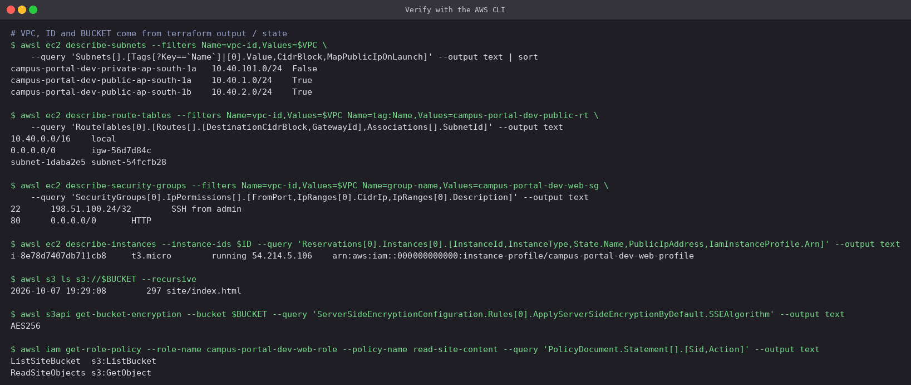

Each resource read back from the API: two public subnets with `MapPublicIpOnLaunch = True` and
the private one `False`; a route table with the IGW default route associated with *both* public
subnets; the security group's two rules with their descriptions; a running `t3.micro` with a
public IP and the instance profile attached; the page in S3 with `AES256`; and the role's
two-statement read-only policy.

```bash
awsl ec2 describe-instance-attribute --instance-id $ID --attribute userData \
  --query UserData.Value --output text | base64 --decode
```

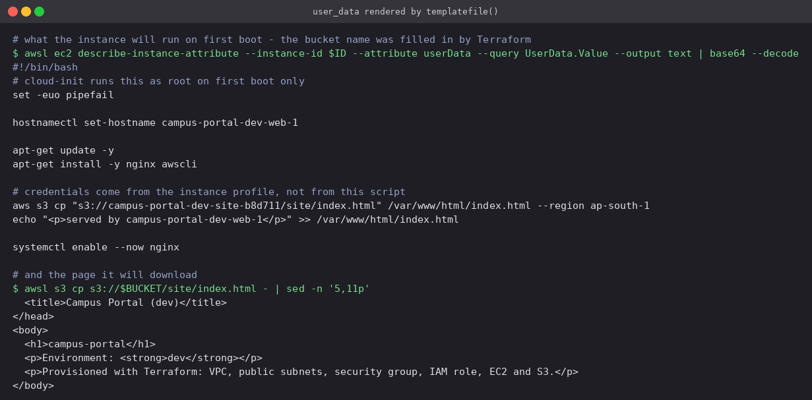

`templatefile()` replaced `${bucket}`, `${region}` and `${hostname}` with real values before the
script was sent. The bucket name, including its random suffix, could not have been
hard-coded.

## 8. Boot-testing user_data, and fixing it

LocalStack stores user_data but runs nothing, so a broken script would still produce a clean
`apply`. To actually execute it, the rendered script was run in a plain `ubuntu:24.04`
container on the same Docker network as LocalStack, with `AWS_ENDPOINT_URL` pointing the AWS CLI
at LocalStack's S3. `hostnamectl` and `systemctl` were replaced by two tiny shims because a
container has no systemd. Everything else ran exactly as written.

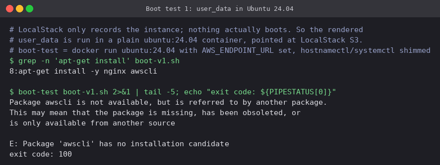

**The first version failed.** `apt-get install -y nginx awscli` stops with
`Package 'awscli' has no installation candidate`: Ubuntu 24.04 removed the `awscli` apt package.
With `set -euo pipefail` the script aborted, so nginx was never started. On real EC2 the
instance would have shown as `running`, passed its status checks, and served nothing on port 80.

The fix installs AWS CLI v2 from the official bundle, choosing the right build with
`uname -m` so it works on both x86 (`t3`) and Graviton (`t4g`):

```bash
apt-get install -y nginx curl unzip
curl -fsSL "https://awscli.amazonaws.com/awscli-exe-linux-$(uname -m).zip" -o /tmp/awscliv2.zip
unzip -q /tmp/awscliv2.zip -d /tmp
/tmp/aws/install
```

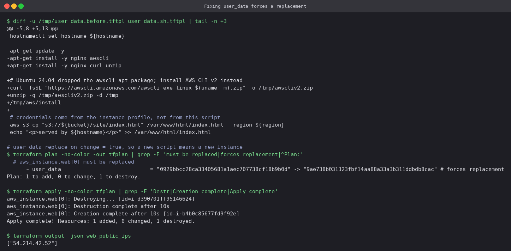

Because of `user_data_replace_on_change = true`, the plan is `1 to add, 1 to destroy`: the
user_data hash change `# forces replacement` and the instance is destroyed and recreated. That
is intended, since user_data only runs on first boot. Without that flag the provider would
update the stored script in place and the running instance would never run the fix.

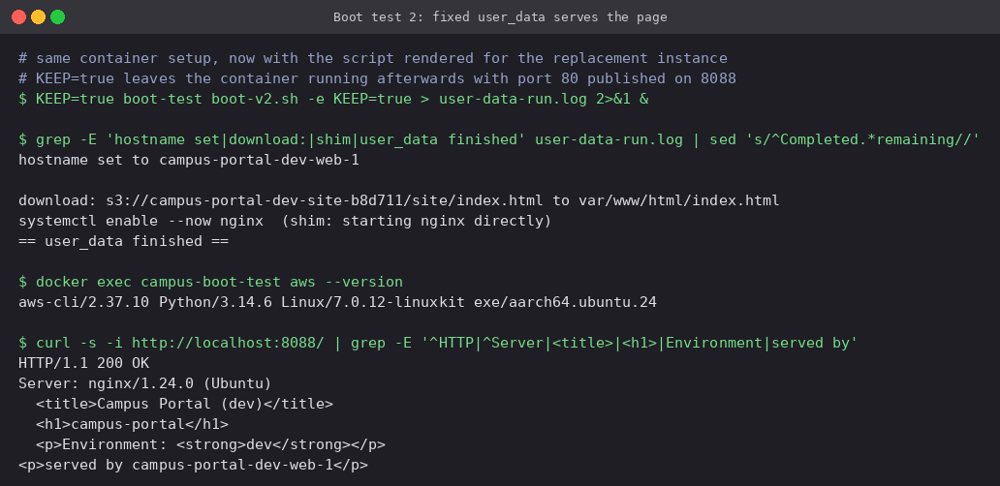

The replacement instance's script, run the same way, completes. The hostname is set, AWS CLI v2
is installed, `index.html` is downloaded from the private bucket, nginx starts, and `curl`
gets `HTTP/1.1 200 OK` from `nginx/1.24.0 (Ubuntu)` with the page rendered for `dev` and the
`served by campus-portal-dev-web-1` line appended at boot.

## 9. Scaling out with a variable override

```bash
terraform plan -var web_instance_count=2 -out=tfplan
terraform apply tfplan
```

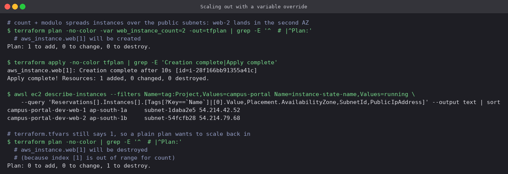

- Raising `count` adds exactly one resource, `aws_instance.web[1]`, and leaves `web[0]`
  untouched.
- `count.index % public_subnet_count` placed `web-2` in the **second** subnet, so the two
  servers are in `ap-south-1a` and `ap-south-1b`. One AZ failing would leave one server up.
- The final plain `plan` wants to **destroy** `web[1]` again, because `terraform.tfvars` still
  says `1`. A `-var` on the command line is not remembered. The value that should persist
  belongs in `tfvars` (or the CI job's variables), or the next person to run `apply` silently
  scales the service back down.

## 10. Remote state in S3

Local state works for one person on one laptop. A team needs the state in shared storage, with
locking so two applies cannot run at once.

```bash
awsl s3 mb s3://parv-tfstate-24bcs10301
awsl s3api put-bucket-versioning --bucket parv-tfstate-24bcs10301 --versioning-configuration Status=Enabled
cp backend.s3.tf.example backend.tf
terraform init -migrate-state -backend-config=localstack.s3.tfbackend
```

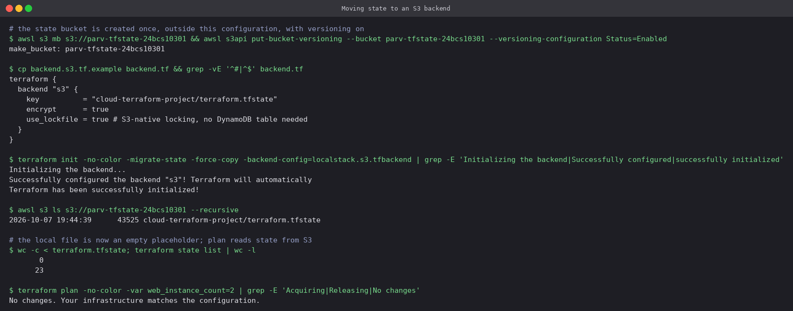

- The state bucket is created **outside** this configuration. A configuration cannot store its
  state in a bucket it is about to create.
- Backend blocks cannot use variables, so the environment-specific parts (bucket, endpoint,
  credentials for LocalStack) are in a separate `.tfbackend` file passed with
  `-backend-config`. A real-AWS file would contain only `bucket` and `region`.
- `use_lockfile = true` is S3-native locking (Terraform 1.10+), which writes a `.tflock` object
  next to the state. The older approach needed a separate DynamoDB table.
- After migration the state object (~43 KB) is in S3, the local `terraform.tfstate` is 0 bytes,
  and `terraform state list` still shows all 23 entries, now read remotely. A follow-up plan
  shows `No changes`.

Versioning on the state bucket means every apply leaves the previous state recoverable.
`backend.tf` is not committed. The project defaults to local state, and the backend is opt-in
by copying the example file.

## 11. `terraform destroy`

```bash
terraform destroy -var web_instance_count=2
```

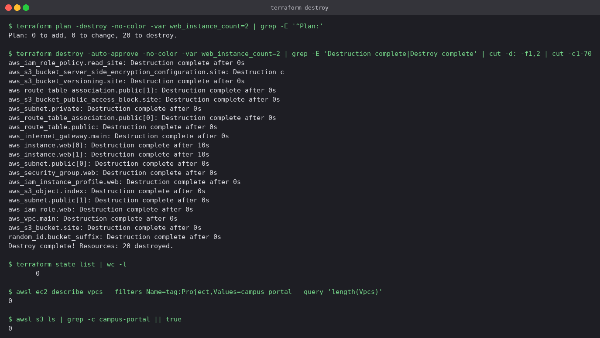

Twenty resources are removed in reverse dependency order. Leaves with nothing depending on them
(the role policy, bucket settings, route table associations, the private subnet) go first and in
parallel. The public subnets, security group and instance profile wait until both instances
are gone, and the VPC, bucket and `random_id` come last. The bucket is deleted despite holding a
versioned object because of `force_destroy = true`. Afterwards the state is empty and the CLI
finds no VPC or bucket tagged `campus-portal`.

## Running it

```bash
cd terraform-project

# LocalStack
docker run -d --name devops-localstack -p 4566:4566 localstack/localstack:3.8
terraform init && terraform apply

# Real AWS: set use_localstack = false in terraform.tfvars and admin_cidr to your own IP/32
aws sts get-caller-identity          # confirm which account you are about to change
terraform init && terraform apply
curl "$(terraform output -json web_urls | jq -r '.[0]')"
terraform destroy
```

On real AWS, `data.aws_ami.ubuntu` looks up the newest Canonical Ubuntu 24.04 image and the
instance enforces IMDSv2. Both are skipped on LocalStack, which has neither real AMIs nor
instance metadata options.

---

**Prince Shakya** · Roll No. 24BCS10084
