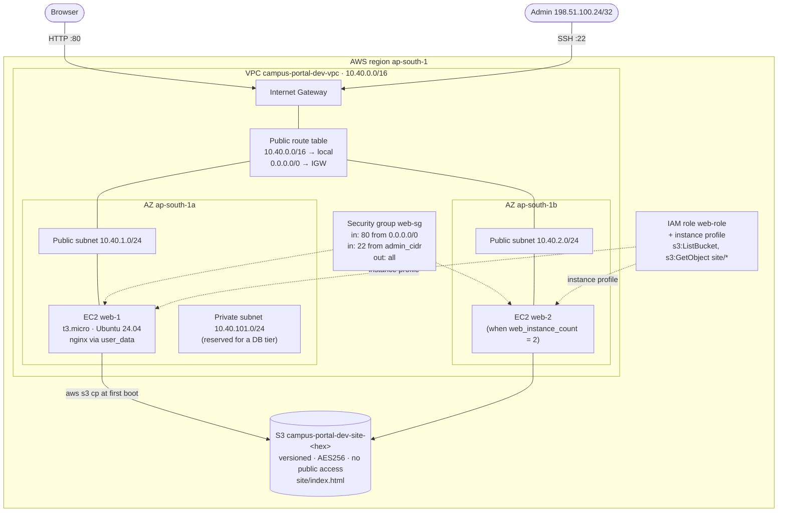
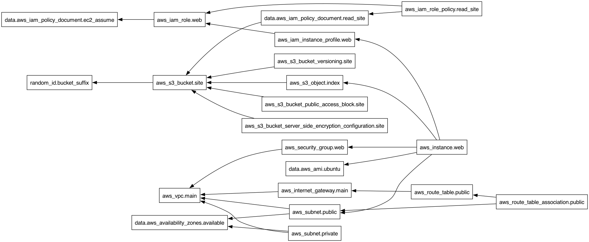

# Architecture: campus-portal

What [`../terraform-project`](../terraform-project) builds, for `environment = dev` in
`ap-south-1`.

## Request and boot flow

1. `terraform apply` uploads `site/index.html` to the bucket **before** creating the instances
   (`depends_on = [aws_s3_object.index]`).
2. Each instance boots in a public subnet, receives a public IP (`map_public_ip_on_launch`), and
   runs its rendered `user_data`: set the hostname, install nginx and AWS CLI v2, copy the page
   from S3, start nginx.
3. The S3 download is authorised by the **instance profile**: the CLI fetches temporary role
   credentials from the instance metadata service (IMDSv2 required on real AWS). No access key
   exists anywhere on the machine.
4. A browser reaches the instance on port 80 through the Internet Gateway; the security group
   admits 80 from anywhere and 22 only from `admin_cidr`.

## Dependency graph

Generated with `terraform graph | dot -Tpng`. Arrows point from a resource to what it depends
on:

## Design choices

| Choice | Why |
|---|---|
| Subnet CIDRs from `cidrsubnet(var.vpc_cidr, 8, n)` | Changing `vpc_cidr` re-plans every subnet consistently; no hard-coded addresses |
| `count` + `count.index % public_subnet_count` | Instances spread round-robin over AZs as `web_instance_count` grows |
| Separate private subnet with no IGW route | The place for a future RDS instance; nothing in it is reachable from the internet |
| Random hex suffix on the bucket | S3 names are global; repeated `apply`/`destroy` cycles never collide |
| `user_data_replace_on_change = true` | A changed boot script produces a fresh instance instead of being silently ignored |
| IAM role instead of keys | Credentials rotate automatically and cannot leak from the instance |
| Encrypted gp3 root volume, IMDSv2 | Secure defaults that cost nothing |

---

**Prince Shakya** · Roll No. 24BCS10084
