# DevSecOps Pipeline

Security checks moved into the CI/CD pipeline itself: static analysis, dependency scanning,
secret scanning, IaC scanning and container image scanning, all feeding a single security gate
that decides whether an image may be pushed and deployed. The app and pipeline are in
[`project/`](project); the workflow is
[`project/.github/workflows/devsecops.yml`](project/.github/workflows/devsecops.yml).

Every run below was executed for real with [`act`](https://github.com/nektos/act) on the
`ubuntu-latest` runner image, and every local scan was run on this machine. The project is
laid out as a standalone repository (workflows only run from `.github/workflows/` at a repo
root).

## 1. Concepts

**Shift left** — find a problem at the earliest, cheapest point. A shell-injection bug caught by
a scanner on a pull request costs a one-line change; the same bug found in production costs an
incident. Every check below runs on every PR, before review even starts.

| Scan type | Question it answers | Looks at | Tools here |
|---|---|---|---|
| **SAST** — static application security testing | Is *our code* written insecurely? | Source code, without running it | Bandit, Semgrep |
| **IaC scanning** | Are the Dockerfile and manifests insecure? | `Dockerfile`, `k8s/*.yaml` | Trivy config, hadolint |
| **SCA** — software composition analysis | Do the *libraries we depend on* have known CVEs? | `requirements.txt` and its dependency tree | pip-audit, Trivy fs |
| **Secret scanning** | Was a credential ever committed? | The **entire git history**, every branch | Gitleaks |
| **Container image scanning** | Does the *final image* (OS packages + libraries) have known CVEs or embedded secrets? | The built image's layers | Trivy image |

**Security gate** — a checkpoint with an explicit policy. Scanners on their own only produce
reports; the gate is what turns "we scanned it" into "we will not ship it". In this pipeline the
scanner jobs never fail on findings — each publishes a *blocking count* as a job output, and
one `security-gate` job compares every count to its policy and is the single place that fails.

## 2. Pipeline flow

```text
                              ┌──► SAST     Bandit · Semgrep · Trivy config ──┐
                              ├──► SCA      pip-audit · Trivy fs · SBOM ───────┤
  push / PR ──► build + test ─┼──► Secrets  Gitleaks (fetch-depth: 0) ─────────┤
               (coverage≥80%) └──► Docker build ─► smoke test ─► Image scan ───┤
                                    (image.tar artifact)         Trivy image   │
                                                                               ▼
                                                                  SECURITY GATE
                                                         every count == 0 and no job failed?
                                                    BLOCK │                        │ PASS (main only)
                                                          ▼                        ▼
                                          push + deploy skipped           push image.tar (no rebuild)
                                                                                   ▼
                                                              deploy to kind ─► rollout ─► smoke test
```

| # | Job | What it does | Blocking policy |
|---|---|---|---|
| 1 | Build and unit test | Pinned install, byte-compile, import check, pytest with JUnit + coverage XML | Tests pass, coverage ≥ 80% |
| 2 | SAST | Bandit; Semgrep with 4 project rules + `p/python` + `p/flask`; Trivy config on Dockerfile and manifests | Bandit MEDIUM+/MEDIUM+, Semgrep `ERROR`, Trivy config HIGH/CRITICAL |
| 3 | SCA | pip-audit, Trivy fs, CycloneDX SBOM | pip-audit: any; Trivy fs: HIGH/CRITICAL |
| 4 | Secret scan | Gitleaks over full history with a custom rule for our token format | Any finding |
| 5 | Docker build | Multi-stage distroless build, run with `--read-only`, `docker save` to an artifact | Container must answer `/health` |
| 6 | Image scan | Trivy on the exact saved tarball: vulnerabilities and embedded secrets | Fixable HIGH/CRITICAL or any secret |
| 7 | Security gate | Prints a decision table from the job outputs | Every count is a clean `0` and no upstream job failed or was skipped |
| 8 | Push | Loads the scanned tarball and pushes it | Only on `main`, only after the gate |
| 9 | Deploy | kind cluster, Pod Security `restricted` namespace, rollout, smoke test through the Service | Rollout + smoke test |

Two design points:

- **The image that is scanned is the image that ships.** `docker-build` saves a tarball, the
  scan reads that tarball, and `push` loads the same tarball. Rebuilding after the gate could
  pull a different base layer and ship something nobody scanned.
- **The gate fails closed.** The first version of the gate treated a skipped scanner's empty
  output as "no findings" and printed `PASS` — exactly backwards. It now treats anything that
  is not a clean integer, and any skipped or failed upstream job, as `BLOCK`.

## 3. The application

[`project/app/app.py`](project/app/app.py) — a campus notice board (Flask, served by
gunicorn).

| Route | Purpose |
|---|---|
| `GET /` | HTML page listing notices (Jinja2 auto-escaping; a test proves `<script>` is escaped) |
| `GET /health` | Probe target |
| `GET /api/version` | Version and baked-in `git_sha` |
| `GET /api/notices?category=` | List, optionally filtered by an allow-listed category |
| `GET /api/notices/<id>` | One notice, or 404 |
| `POST /api/notices` | Create; title, body and category validated (length, type, allow-list) |

## 4. The scanners, run locally

To show what each scanner actually catches, a pull request `feature/admin-tools` was opened with
a set of realistic mistakes: an admin "ping" endpoint that builds a shell command from a query
parameter, a bulk-import endpoint using `yaml.load`, a hard-coded notification-service token,
`debug=True`, two old dependency pins, a quick `python:3.9` Dockerfile running as root, and a
`privileged: true` container.

### SAST — Bandit

```bash
bandit -c bandit.yaml -r app --severity-level medium --confidence-level medium
```

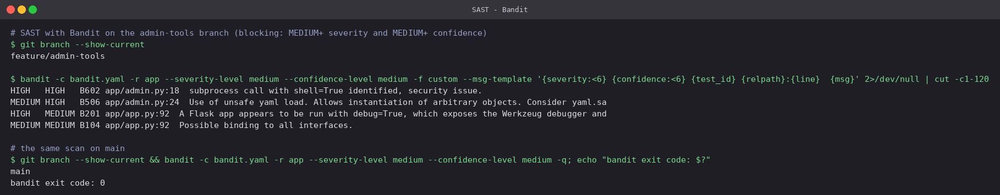

- **B602** `shell=True` with an f-string — `?host=x;cat /etc/passwd` would run a second
  command. HIGH/HIGH.
- **B506** `yaml.load` with the full loader can construct arbitrary Python objects from the
  request body.
- **B201** `debug=True` exposes the Werkzeug debugger, i.e. a remote Python console.
- **B104** binding to `0.0.0.0` is reported as well; on `main` the dev-server `__main__` block
  was removed entirely because the container runs gunicorn, so Bandit is clean there.

### SAST — Semgrep

[`project/.semgrep.yml`](project/.semgrep.yml) holds four project rules; the registry packs
add general Python and Flask rules.

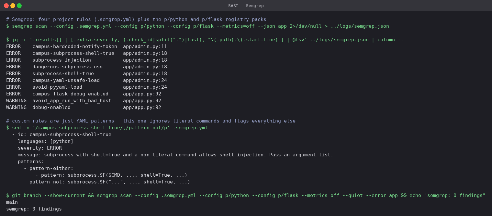

- The shell-injection line is caught by **four** rules (ours plus three from the registry) — a
  second SAST tool is not redundant, it is a second opinion with different patterns.
- Semgrep is the only SAST tool that caught the hard-coded token, because we wrote a rule for
  our own `cnb_live_` token format. Bandit only recognises names like `password`.
- A Semgrep rule is a code pattern, not a regex over text:
  `pattern-not: subprocess.$F("...", shell=True)` exempts literal commands so the rule only
  fires when input can reach the shell.

### SCA — pip-audit and Trivy fs

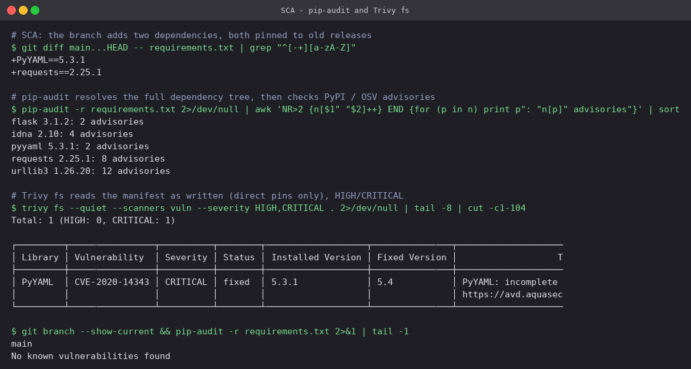

- **pip-audit resolves the whole tree.** The branch pinned two packages but five are
  vulnerable: `requests 2.25.1` drags in old `urllib3` and `idna`. 28 advisories in total.
- **Trivy fs reads the manifest as written** — direct pins only — and filtered to
  HIGH/CRITICAL it reports just PyYAML's CVE-2020-14343 (CRITICAL, fixed in 5.4). Same
  question, different database and different depth, which is why the pipeline runs both.
- `flask 3.1.2` shows up as well — see section 6; that one was a genuine surprise.

### Secret scanning — Gitleaks

[`project/.gitleaks.toml`](project/.gitleaks.toml) keeps every built-in rule and adds one for
our token format.

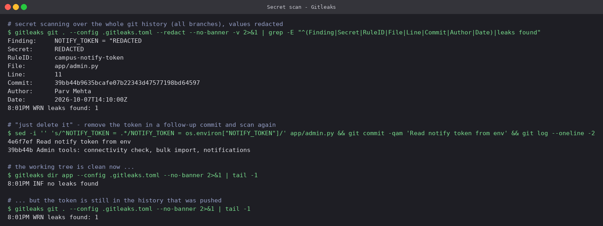

- The finding names the rule, file, line, commit and author; the value itself is printed as
  `REDACTED` so the scan report does not become a second leak.
- **Deleting the secret does not un-leak it.** After a follow-up commit replaced the token with
  `os.environ["NOTIFY_TOKEN"]`, a scan of the files (`gitleaks dir`) is clean but a scan of the
  history (`gitleaks git`) still finds it. Anyone who cloned the branch has the token. The only
  real fix is to **revoke and rotate** it; rewriting history afterwards is housekeeping.
- That is why the pipeline checks out with `fetch-depth: 0` — a shallow clone would only see
  the latest commit.

No real credential was used anywhere: the token is a random string in a made-up format, created
for this exercise.

### IaC — Trivy config and hadolint

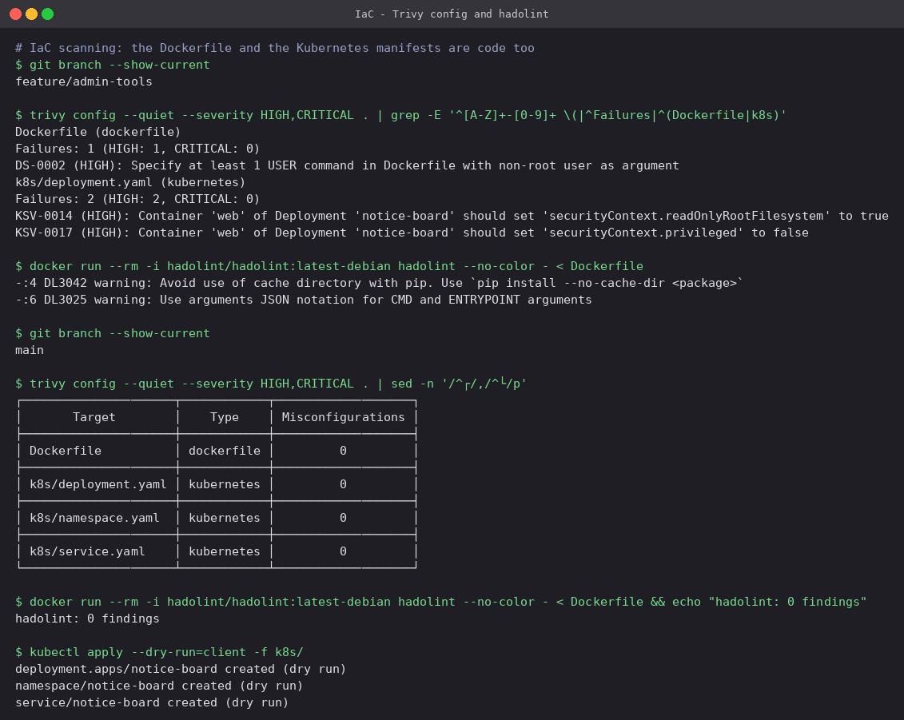

| Finding | Where | Fix on `main` |
|---|---|---|
| DS-0002 — image runs as root | quick Dockerfile has no `USER` | `USER 65532:65532` (distroless `nonroot`) |
| KSV-0017 — privileged container | `privileged: true` "for ping" | removed; `capabilities: drop: [ALL]`, `allowPrivilegeEscalation: false` |
| KSV-0014 — writable root filesystem | no `readOnlyRootFilesystem` | `readOnlyRootFilesystem: true`, `/tmp` as a memory `emptyDir` |
| DL3042, DL3025 (hadolint) | pip cache kept, shell-form `CMD` | `--no-cache-dir`, exec-form `ENTRYPOINT` |

`kubectl apply --dry-run=client` validates the hardened manifests' structure without touching
any cluster.

### Container image — Trivy image

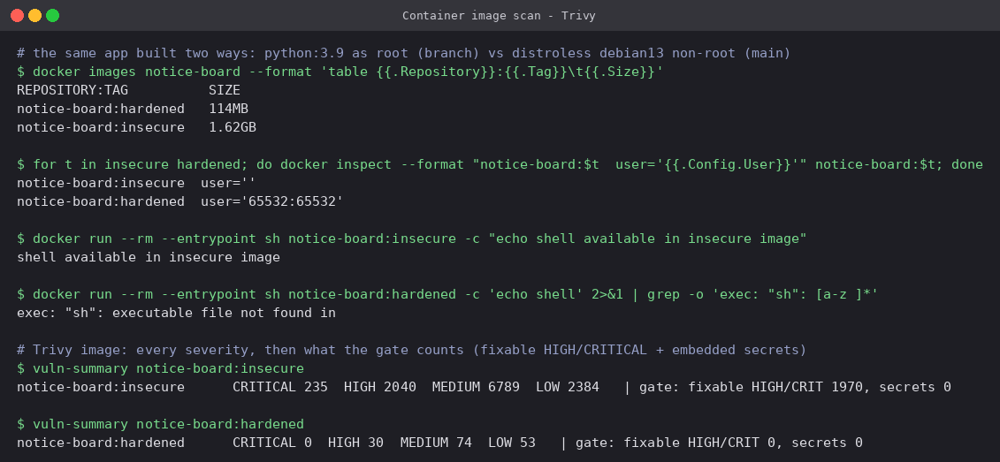

The same application built two ways ([`scripts/vuln-summary.sh`](project/scripts/vuln-summary.sh)
prints the counts):

| | `python:3.9`, root | distroless `python3-debian13:nonroot` |
|---|---|---|
| Size | 1.62 GB | 114 MB |
| User | root (empty `User`) | 65532 |
| Shell | yes | none — `exec: "sh": executable file not found` |
| CRITICAL / HIGH (all) | 235 / 2040 | 0 / 30 |
| Gate count (fixable HIGH/CRITICAL + secrets) | **1970** | **0** |

Most of a full Debian image is compilers, headers and libraries the app never uses — every one
of them is attack surface and CVE noise. The 30 remaining HIGHs in the hardened image have no
fixed package yet; the gate uses `--ignore-unfixed` so it only blocks on things a rebuild could
actually fix, and the informational full report keeps the rest visible.

Trivy's own secret scanner found 0 secrets in the insecure image even though the token is
inside it — it only knows well-known formats. The custom Gitleaks rule is what catches ours.

## 5. Blocked: the pull request

```bash
act pull_request -e pr-event.json -W .github/workflows/devsecops.yml
```

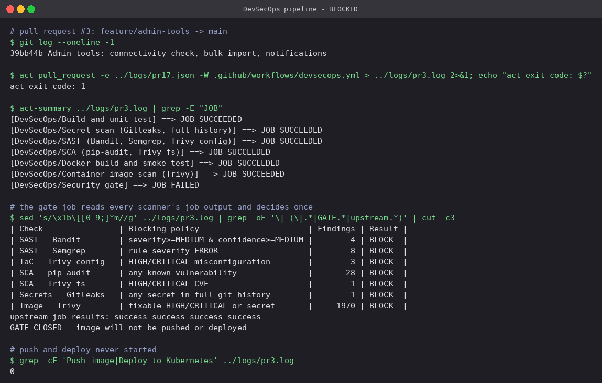

Every scanner job **succeeded** — they did their job, which is reporting — and the gate failed.
All seven checks block. `Push image` and `Deploy to Kubernetes` never appear in the log: a
pull request never publishes, and nothing gets past a closed gate.

## 6. Blocked: main, with no bad code at all

Running the pipeline on `main` (commit `9ed3dce`, which never contained the PR's code)
produced a result that was not planned:

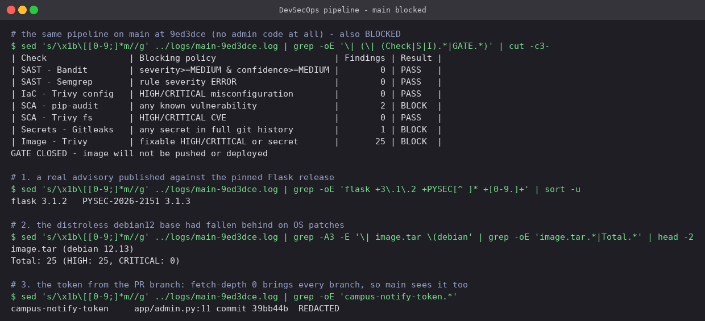

1. **A real advisory, PYSEC-2026-2151, had been published against Flask 3.1.2** — the version
   pinned in this project. Nothing in our code changed; the world changed. This is the case
   for running SCA on every build rather than once when a dependency is added.
2. **The distroless `debian12` base had 25 fixable HIGH vulnerabilities** in OS packages
   (expat, krb5, …). "Distroless" reduces attack surface, it does not make an image
   permanently patched; base images have to be refreshed too.
3. **The PR branch's token blocked `main`.** `fetch-depth: 0` fetches every branch, and Gitleaks
   scans everything it is given. Once a secret is pushed to *any* branch, the repository has
   leaked it.

## 7. Remediation and the passing run

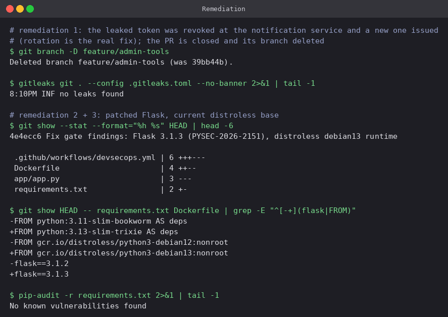

- Token revoked and reissued (in a real system, at the provider), PR closed, branch deleted.
  Gitleaks history scan: no leaks.
- Flask 3.1.2 → **3.1.3**; base images moved to `python:3.13-slim-trixie` (builder) and
  `distroless/python3-debian13:nonroot` (runtime); CI Python moved to 3.13 to match.

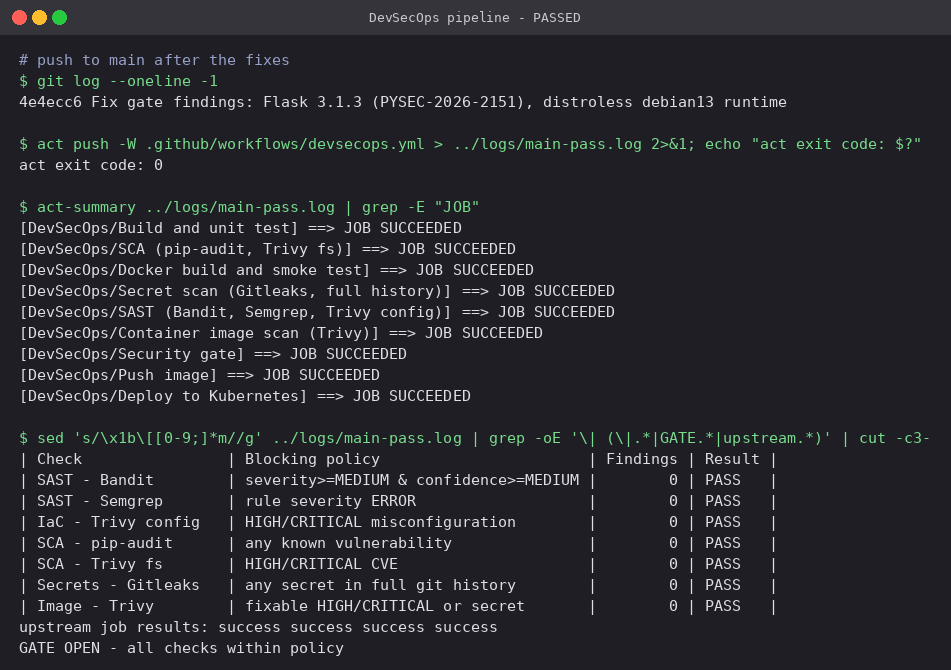

All nine jobs succeed and every count in the gate table is `0`. Only now do `push` and `deploy`
run:

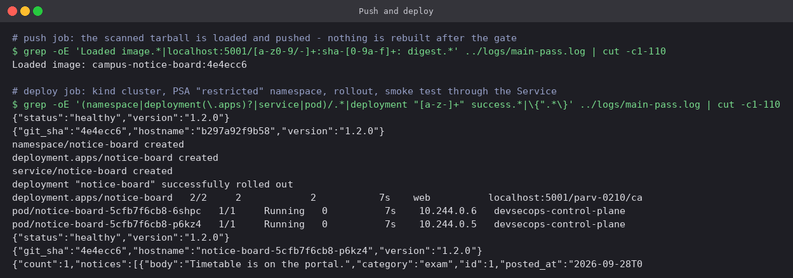

- The deploy job's first object is the `notice-board` namespace with Pod Security Admission
  `enforce: restricted`. The API server itself would reject a Pod that runs as root, allows
  privilege escalation, keeps capabilities or lacks a seccomp profile — so the hardened
  `securityContext` is not just good manners, it is required to get scheduled at all.
- 2/2 replicas roll out with `maxUnavailable: 0`; readiness and liveness probes hit `/health`.
- The smoke test goes through the Service and reports `git_sha 4e4ecc6` — the commit that
  passed the gate is the one running.

## 8. Tool configuration

| File | Purpose |
|---|---|
| [`bandit.yaml`](project/bandit.yaml) | Excludes tests; skips B101 (assert) |
| [`.semgrep.yml`](project/.semgrep.yml) | Four project rules: Flask debug, `shell=True` with non-literal command, unsafe `yaml.load`, our token format |
| [`.gitleaks.toml`](project/.gitleaks.toml) | Default rules + `campus-notify-token`; test fixtures allow-listed by path |
| [`.trivyignore`](project/.trivyignore) | Accepted risks, each with a reason and review date — currently empty |
| [`k8s/namespace.yaml`](project/k8s/namespace.yaml) | PSA `enforce: restricted` |
| [`k8s/deployment.yaml`](project/k8s/deployment.yaml) | Non-root UID 65532, read-only root FS, `drop: ALL`, no privilege escalation, `RuntimeDefault` seccomp, no service-account token, probes, limits |
| [`k8s/service.yaml`](project/k8s/service.yaml) | ClusterIP `80 → http (8080)` |

## Reproduce

```bash
cd project
pip install -r requirements-dev.txt bandit semgrep pip-audit
pytest
bandit -c bandit.yaml -r app --severity-level medium --confidence-level medium
semgrep scan --config .semgrep.yml --config p/python --config p/flask app
pip-audit -r requirements.txt
trivy fs --scanners vuln --severity HIGH,CRITICAL .
trivy config --severity HIGH,CRITICAL .
gitleaks git . --config .gitleaks.toml --redact
docker build -t notice-board:hardened . && ./scripts/vuln-summary.sh notice-board:hardened

# whole pipeline locally (REGISTRY points at a registry:2 container)
docker run -d --name local-registry -p 5001:5000 registry:2
echo REGISTRY=localhost:5001 > .vars
act push -W .github/workflows/devsecops.yml
```

## Cleanup

```bash
docker rm -f local-registry
docker rmi notice-board:insecure notice-board:hardened
```

---

**Prince Shakya** · Roll No. 24BCS10084
