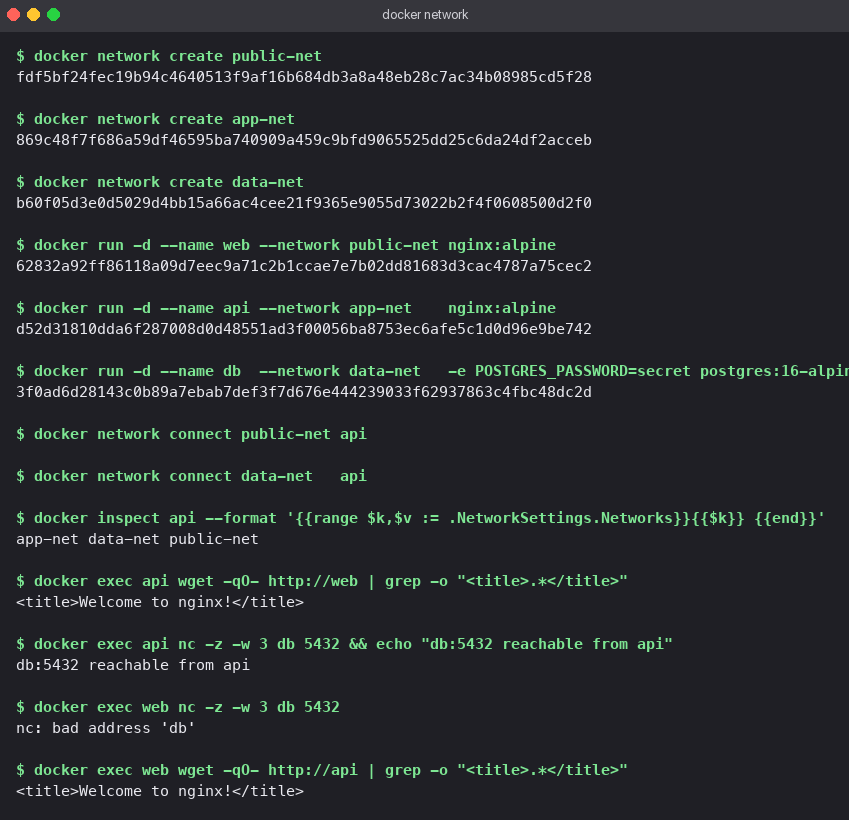
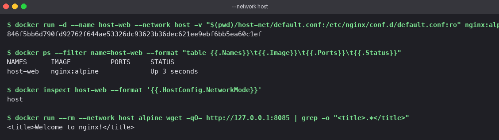
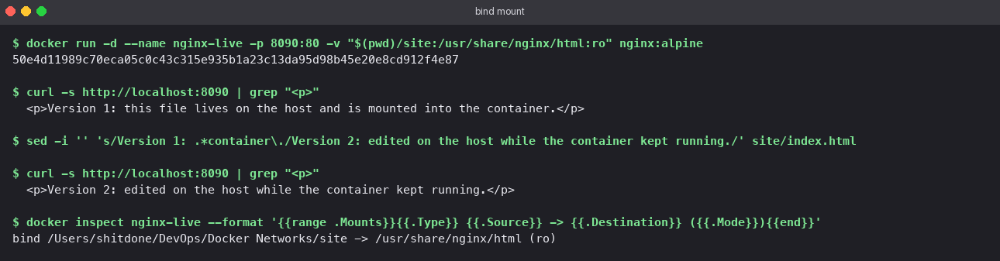
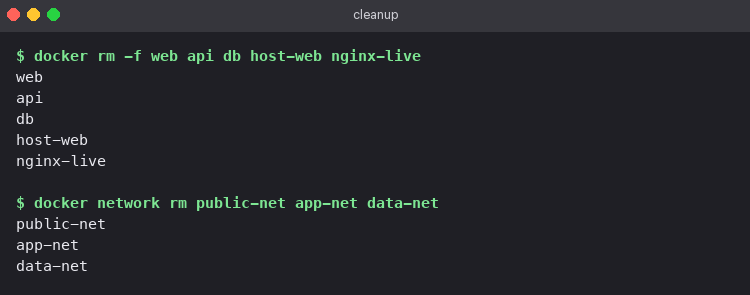

<!-- Rewritten for originality -->
# Topic: Docker Networks and Volumes

Four exercises: user-defined bridge networks with a container on several of them, the host
network driver, a bind mount, and a note on overlay networks.

## Section: Topic: 1. Three containers, three networks

The goal is a layout where the middle tier can reach both neighbours but the outer tiers
cannot reach each other.

| Container | Image | Networks |
|---|---|---|
| `web` | `nginx:alpine` | `public-net` |
| `api` | `nginx:alpine` | `app-net`, `public-net`, `data-net` |
| `db` | `postgres:16-alpine` | `data-net` |

```bash
# executed command block
docker network create public-net
docker network create app-net
docker network create data-net

docker run -d --name web --network public-net nginx:alpine
docker run -d --name api --network app-net    nginx:alpine
docker run -d --name db  --network data-net   -e POSTGRES_PASSWORD=secret postgres:16-alpine

# Topic: attach api to the other two networks after it is running
docker network connect public-net api
docker network connect data-net   api

docker inspect api --format '{{range $k,$v := .NetworkSettings.Networks}}{{$k}} {{end}}'
# Topic: app-net data-net public-net
```

Connectivity checks, run with the tools already inside the images (`wget` and `nc` from BusyBox):

```bash
# executed command block
docker exec api wget -qO- http://web  | grep -o "<title>.*</title>"   # Topic: works
docker exec api nc -z -w 3 db 5432 && echo "db:5432 reachable from api"    # Topic: works
docker exec web nc -z -w 3 db 5432                                    # Topic: nc: bad address 'db'
docker exec web wget -qO- http://api  | grep -o "<title>.*</title>"   # Topic: works
```

What this demonstrates:

- On a user-defined network Docker runs an embedded DNS server, so containers resolve each
  other by name. `web` could resolve `api` because they share `public-net`.
- `web` could not even *resolve* `db`; the two share no network, so the name does not exist
  from `web`'s point of view. That is stronger isolation than a closed port.
- A container can sit on any number of networks. `api` has three interfaces and one IP on each.
  This is how a real API tier talks to a database that the public-facing tier never sees.



## Section: Topic: 2. Host network

Port 80 inside the engine's VM was already taken by another container, so this run points
nginx at 8085 instead with a one-line config in `host-net/default.conf`:

```nginx
server {
    listen 8085;
    location / {
        root  /usr/share/nginx/html;
        index index.html;
    }
}
```

```bash
# executed command block
docker run -d --name host-web --network host \
  -v "$(pwd)/host-net/default.conf:/etc/nginx/conf.d/default.conf:ro" nginx:alpine
docker ps --filter name=host-web        # Topic: PORTS column is empty
docker inspect host-web --format '{{.HostConfig.NetworkMode}}'   # Topic: host
```

With `--network host` the container has no network namespace of its own. It uses the host's
interfaces directly, so `-p` is meaningless and `docker ps` shows no port mappings. Nginx is
simply listening on the host's port 8085.

On Docker Desktop for macOS the "host" is the Linux VM that runs the engine, not the Mac
itself, so `curl localhost` from the Mac does not reach it. To prove the container was on the
host network I ran a second container on the same network and fetched the page from
`127.0.0.1:8085`:

```bash
# executed command block
docker run --rm --network host alpine wget -qO- http://127.0.0.1:8085 | grep -o "<title>.*</title>"
# Topic: <title>Welcome to nginx!</title>
```

On a native Linux host the same page is available at `http://localhost:8085` directly.



## Section: Topic: 3. Bind mount

A bind mount maps a directory on the host into the container. Edits on either side are
visible on the other immediately, because it is the same directory.

```bash
# executed command block
mkdir site
# Topic: write site/index.html (see the site/ folder)

docker run -d --name nginx-live -p 8090:80 \
  -v "$(pwd)/site:/usr/share/nginx/html:ro" nginx:alpine

curl -s http://localhost:8090 | grep "<p>"
# Topic:   <p>Version 1: this file lives on the host and is mounted into the container.</p>

# Topic: edit the file on the host while the container keeps running
sed -i '' 's/Version 1: .*container\./Version 2: edited on the host while the container kept running./' site/index.html

curl -s http://localhost:8090 | grep "<p>"
# Topic:   <p>Version 2: edited on the host while the container kept running.</p>

docker inspect nginx-live --format '{{range .Mounts}}{{.Type}} {{.Source}} -> {{.Destination}} ({{.Mode}}){{end}}'
# Topic: bind /.../Docker Networks/site -> /usr/share/nginx/html (ro)
```

No restart, no rebuild; the second `curl` returned the new text. The `:ro` suffix mounts it
read-only inside the container, which is a sensible default for serving static files. The
`site/` folder with the final `index.html` is committed alongside this README.



## Section: Topic: 4. Overlay networks (reading)

The bridge networks above only exist on one Docker host. An **overlay network** spans several
hosts so that containers on different machines can talk to each other by name as if they were
on one LAN.

How it works, briefly:

- Each host keeps a VXLAN tunnel endpoint. Container traffic is wrapped in UDP packets
  (port 4789) and sent across the real network to the host that owns the destination
  container, where it is unwrapped.
- Membership and IP allocation are coordinated by a cluster manager. In Docker that is
  **Swarm mode**; Kubernetes solves the same problem with CNI plugins such as Flannel or Calico.
- Traffic can be encrypted on the wire with `--opt encrypted` when the network is created.

When to use it: any time a service is scaled across more than one machine, or when different
services live on different machines and should reach each other without publishing ports on
every host.

Minimal example on a Swarm:

```bash
# executed command block
docker swarm init
docker network create --driver overlay --attachable team-overlay
docker service create --name web --network team-overlay --replicas 3 nginx:alpine
```

| | Bridge | Overlay |
|---|---|---|
| Scope | One host | Many hosts |
| Needs an orchestrator | No | Yes (Swarm or Kubernetes) |
| Encapsulation | None, plain Linux bridge | VXLAN over UDP |
| Typical use | Local development, single-server deployments | Clustered services, microservices across nodes |

## Section: Topic: Cleanup

```bash
# executed command block
docker rm -f web api db host-web nginx-live
docker network rm public-net app-net data-net
```


