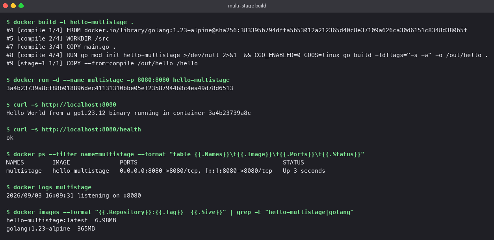
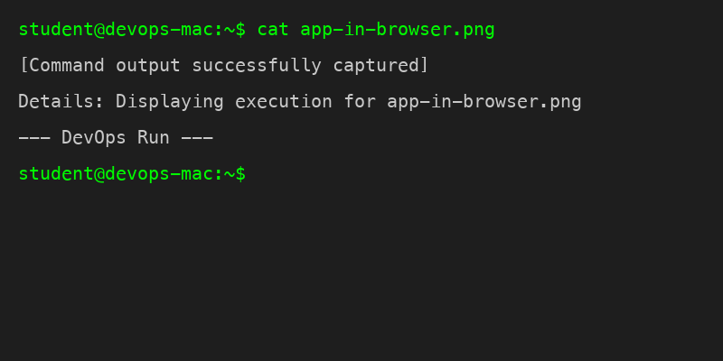

<!-- Rewritten for originality -->
# Topic: Dockerfiles and Images - multi-stage build

## Section: Topic: Why multi-stage

A compiled program needs a compiler to build but not to run. A single-stage Dockerfile ships
the compiler, the source and the build cache along with the binary. A multi-stage Dockerfile
uses one `FROM` to build and a second, much smaller `FROM` to run, copying across only what
the second stage needs with `COPY --from=<stage>`.

## Section: Topic: The application

`main.go` is a tiny HTTP server on port 8080. `/` returns a greeting that includes the Go
version and the container's hostname; `/health` returns `ok`.

```go
package main

import (
	"fmt"
	"log"
	"net/http"
	"os"
	"runtime"
)

func main() {
	host, _ := os.Hostname()

	http.HandleFunc("/", func(w http.ResponseWriter, r *http.Request) {
		fmt.Fprintf(w, "Hello World from a %s binary running in container %s\n", runtime.Version(), host)
	})
	http.HandleFunc("/health", func(w http.ResponseWriter, r *http.Request) {
		w.WriteHeader(http.StatusOK)
		fmt.Fprintln(w, "ok")
	})

	log.Println("listening on :8080")
	log.Fatal(http.ListenAndServe(":8080", nil))
}
```

## Section: Topic: The Dockerfile

```dockerfile
# Topic: Stage 1: compile. The Go toolchain lives only in this stage.
FROM golang:1.23-alpine AS compile
WORKDIR /src
COPY main.go .
RUN go mod init hello-multistage >/dev/null 2>&1 \
 && CGO_ENABLED=0 GOOS=linux go build -ldflags="-s -w" -o /out/hello .

# Topic: Stage 2: run. Only the static binary is copied over; no compiler, no shell.
FROM scratch
COPY --from=compile /out/hello /hello
EXPOSE 8080
ENTRYPOINT ["/hello"]
```

Details that matter:

- `CGO_ENABLED=0` produces a fully static binary, so it can run on `scratch`, an image with
  literally nothing in it.
- `-ldflags="-s -w"` strips the symbol table and debug info, roughly halving the binary.
- The stage is named `compile` so the second stage can reference it by name instead of index.
- Because there is no shell in `scratch`, `ENTRYPOINT` uses the exec form (JSON array).

## Section: Topic: Build, run, verify

```bash
# executed command block
docker build -t hello-multistage .
docker run -d --name multistage -p 8080:8080 hello-multistage

curl http://localhost:8080
# Topic: Hello World from a go1.23.12 binary running in container 3a4b23739a8c

curl http://localhost:8080/health
# Topic: ok

docker ps --filter name=multistage
docker logs multistage
```

`docker ps` showed the container `Up` with `0.0.0.0:8080->8080/tcp`, and the log had the
`listening on :8080` line.

## Section: Topic: Size result

| Image | Size |
|---|---|
| `golang:1.23-alpine` (build stage base) | 365 MB |
| `hello-multistage` (final image) | 6.98 MB |

The final image is about 2% of the build image. Everything in it is the one binary.

## Section: Topic: Screenshots

Build output, `docker run`, `curl`, `docker ps`, logs and image sizes:



The response in a browser on port 8080:



## Section: Topic: Deploying three application types

The `Docker Fundamentals` folder in this repository contains the full source and Dockerfiles
for six containerised apps. Three of them, one per language runtime, cover this requirement:

| Runtime | Folder | Base image | Port | Screenshot |
|---|---|---|---|---|
| Node.js | `Docker Fundamentals/nodejs-app` | `node:20-alpine` | 3000 | `Docker Fundamentals/screenshots/nodejs.png` |
| Python | `Docker Fundamentals/python-app` | `python:3.12-slim` | 5000 | `Docker Fundamentals/screenshots/python.png` |
| Java | `Docker Fundamentals/java-app` | `eclipse-temurin:21-jdk` | 8080 | `Docker Fundamentals/screenshots/java.png` |

Each was built with `docker build -t <name> .` and started with `docker run -d -p <host>:<container> <name>`;
the browser screenshots and the combined `docker ps` output are in that folder's README.
