# Final DevOps Project & Troubleshooting (Session 21)

**Session 21 homework:** running a three-tier app with Docker Compose.

A small full-stack app, **Campus Lost & Found**, run in two ways. First every container is
started by hand with `docker run`. Then the same app is described once in
`docker-compose.yml` and started with a single command. The app is tested in a browser and
through its REST API, and two common Compose failures are reproduced and fixed. Every
screenshot comes from a real run on macOS with Docker Desktop.

| Tier | Tech | Container |
|---|---|---|
| Frontend | React (Vite) built to static files, served by **nginx**, which also proxies `/api` | `frontend` |
| Backend | Python **FastAPI** + psycopg, REST API on port 8000 | `backend` |
| Database | **PostgreSQL 16** with a named volume for its data | `db` |

```text
  browser ──► localhost:3100 ──► frontend (nginx)
                                  │  /        → React build
                                  │  /api/... → proxy_pass http://backend:8000
                                  ▼
                       ┌──── frontend-net ────┐
                                backend (FastAPI)
                       └──── backend-net ─────┘
                                  ▼
                              db (PostgreSQL) ── volume: pgdata
```

Only the frontend publishes a port. The backend and the database can be reached only over
Docker networks, and the database sits on a network the frontend is not connected to.

```text
Final DevOps Project & Troubleshooting/
├── backend/
│   ├── app/main.py          FastAPI app: /api/health and CRUD on /api/items
│   ├── requirements.txt
│   └── Dockerfile
├── frontend/
│   ├── src/main.jsx         React UI: list, report, mark returned
│   ├── nginx.conf           static files + /api reverse proxy
│   └── Dockerfile           multi-stage: node build → nginx
├── docker-compose.yml
├── .env.example
├── troubleshooting/         two deliberately broken compose files
└── screenshots/
```

## API

| Method | Path | Does |
|---|---|---|
| `GET` | `/api/health` | Runs `SELECT 1` against Postgres and returns `{"status":"ok","db":"up"}` |
| `GET` | `/api/items` | Lists all items |
| `POST` | `/api/items` | Creates an item `{title, location, kind: lost\|found}` and returns **201** |
| `PATCH` | `/api/items/{id}` | Changes the status, e.g. `{"status":"returned"}` |
| `DELETE` | `/api/items/{id}` | Deletes an item: **204**, or **404** if it doesn't exist |

On startup the backend creates the `items` table if it is missing. It retries the database
connection a few times and then exits with a clear error, so it never keeps running in a
half-working state.

## 1. Running the application manually

Before Compose, every piece the Compose file automates was done by hand.

### PostgreSQL

```bash
docker network create lostfound-manual
docker volume create lostfound-manual-data
docker run -d --name db --network lostfound-manual \
  -e POSTGRES_DB=lostfound -e POSTGRES_USER=lostfound -e POSTGRES_PASSWORD=lostfound \
  -v lostfound-manual-data:/var/lib/postgresql/data postgres:16-alpine
docker exec db pg_isready -U lostfound -d lostfound
```

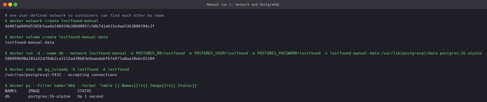

A **user-defined network** matters here. On the default bridge network containers cannot
resolve each other by name, but on `lostfound-manual` the name `db` resolves to the Postgres
container.

### Backend

```bash
docker build -t lostfound-backend:manual backend
docker run -d --name backend --network lostfound-manual \
  -e DB_HOST=db -e DB_NAME=lostfound -e DB_USER=lostfound -e DB_PASSWORD=lostfound \
  lostfound-backend:manual
docker logs backend
docker run --rm --network lostfound-manual curlimages/curl:8.10.1 -s http://backend:8000/api/health
```

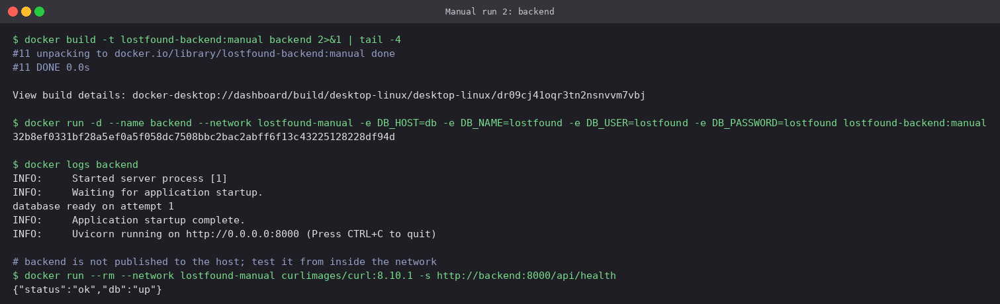

`database ready on attempt 1` in the log shows the backend connected and created its table.
The backend publishes no port to the host, so the health check was run from a throwaway curl
container on the same network.

### Frontend

```bash
docker build -t lostfound-frontend:manual frontend
docker run -d --name frontend --network lostfound-manual -p 3100:80 lostfound-frontend:manual
curl -s http://localhost:3100/
curl -s -X POST localhost:3100/api/items -H 'Content-Type: application/json' \
  -d '{"title":"Blue water bottle","location":"Library 2nd floor","kind":"lost"}'
curl -s localhost:3100/api/items
```

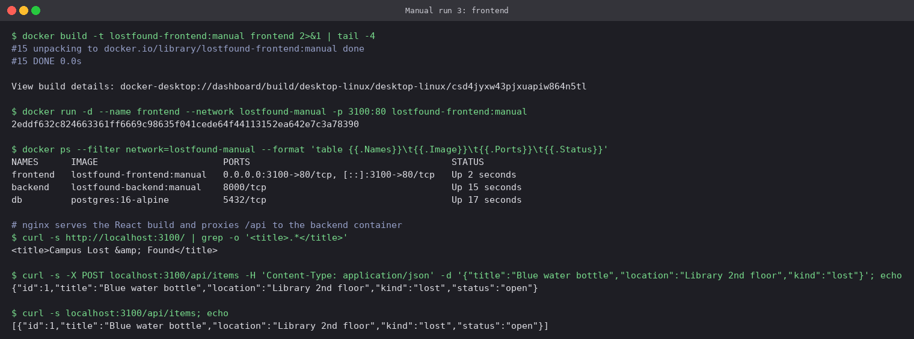

The full chain works: host → nginx → backend → Postgres. The manual run took three
`docker run` commands with long flag lists, a network and a volume created beforehand, and
the containers had to be started **in the right order**, with a wait for Postgres in between.
Compose takes all of that over.

```bash
docker rm -f frontend backend db
docker network rm lostfound-manual && docker volume rm lostfound-manual-data
```

## 2. Dockerfiles

[`backend/Dockerfile`](backend/Dockerfile) and [`frontend/Dockerfile`](frontend/Dockerfile):

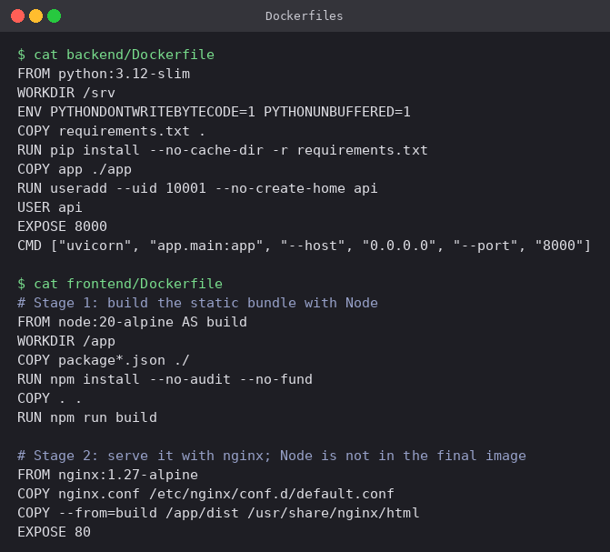

- **Backend:** `python:3.12-slim`. `requirements.txt` is copied and installed *before* the
  code, so editing `main.py` does not reinstall dependencies on the next build. The app runs
  as a non-root user (`uid 10001`).
- **Frontend:** a **multi-stage** build. Stage 1 (`node:20-alpine`) runs `npm install` and
  `vite build`. Stage 2 copies only the `dist/` output into `nginx:1.27-alpine`, so Node and
  `node_modules` never reach the final image. It is **76 MB**, against **277 MB** for the
  Python backend.
- `.dockerignore` files keep `node_modules`, `dist` and `__pycache__` out of the build
  context.

## 3. docker-compose.yml

[`docker-compose.yml`](docker-compose.yml) brings together everything from section 1:

```yaml
services:
  db:
    image: postgres:16-alpine
    volumes: [pgdata:/var/lib/postgresql/data]
    healthcheck:
      test: ["CMD-SHELL", "pg_isready -U $${POSTGRES_USER} -d $${POSTGRES_DB}"]
    networks: [backend-net]
  backend:
    build: ./backend
    environment: { DB_HOST: db, ... }
    depends_on:
      db: { condition: service_healthy }
    healthcheck: ...           # GET /api/health
    networks: [backend-net, frontend-net]
  frontend:
    build: ./frontend
    ports: ["3100:80"]
    depends_on:
      backend: { condition: service_healthy }
    networks: [frontend-net]
volumes:
  pgdata:
```

```bash
docker compose config --quiet && echo valid
docker compose config --services
```

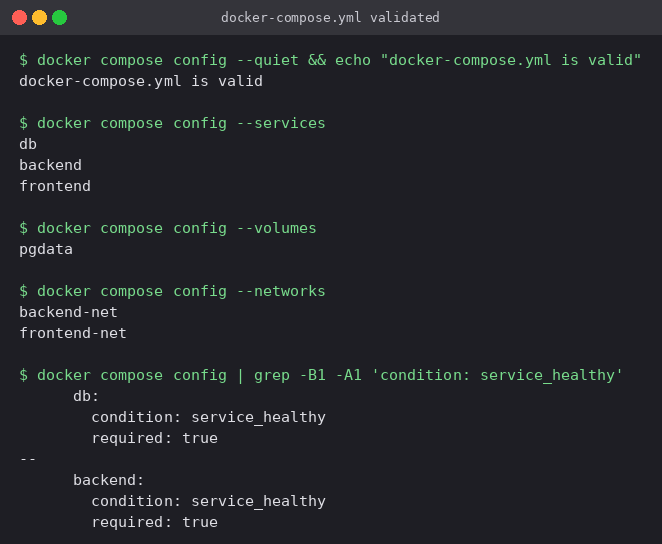

- **Start order with readiness.** `db` must pass `pg_isready` before `backend` starts, and
  `backend` must pass its own `/api/health` check before `frontend` starts. Section 6 shows
  what happens without these conditions.
- **Two networks.** `db` is only on `backend-net`, so the frontend container cannot even
  resolve its name (checked in section 5).
- **Credentials** default to `lostfound`. They can be overridden from a `.env` file (see
  [`.env.example`](.env.example)), which is gitignored.

## 4. `docker compose up -d --build`

```bash
docker compose up -d --build
docker compose ps
```

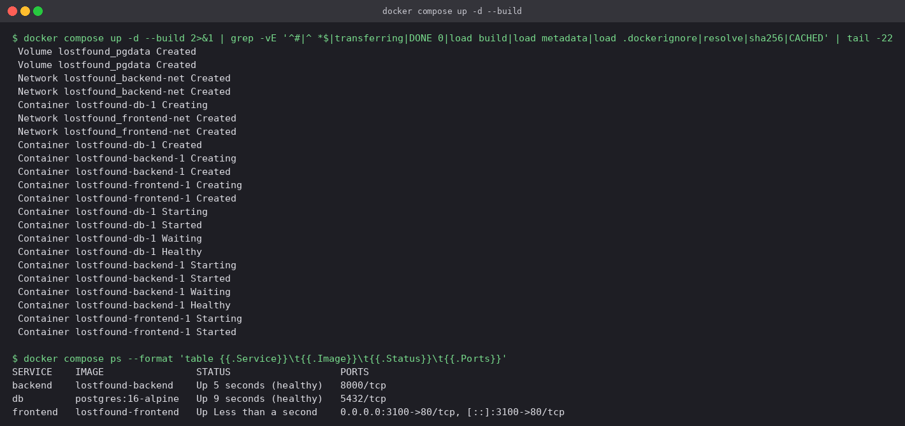

Compose created the volume and both networks, then started the containers in dependency order
and waited at every health gate:
`db Started → db Waiting → db Healthy → backend Started → backend Waiting → backend Healthy
→ frontend Started`. `docker compose ps` shows `db` and `backend` as `(healthy)` and only the
frontend publishing a port (`3100->80`).

## 5. Testing the application

### In the browser

`http://localhost:3100`:

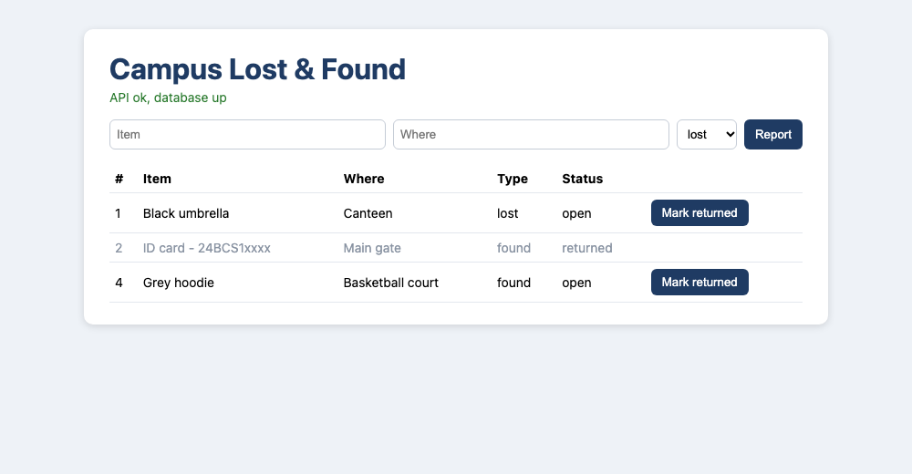

The green line is the React app calling `/api/health` through nginx, so the browser view
confirms all three tiers at once. Returned items are greyed out, and their "Mark returned"
button is gone.

### Backend API with curl

```bash
curl -s localhost:3100/api/health
curl -s -X POST  localhost:3100/api/items -H 'Content-Type: application/json' -d '{...}'
curl -s          localhost:3100/api/items
curl -s -X PATCH localhost:3100/api/items/2 -H 'Content-Type: application/json' -d '{"status":"returned"}'
curl -s -X DELETE localhost:3100/api/items/3
```

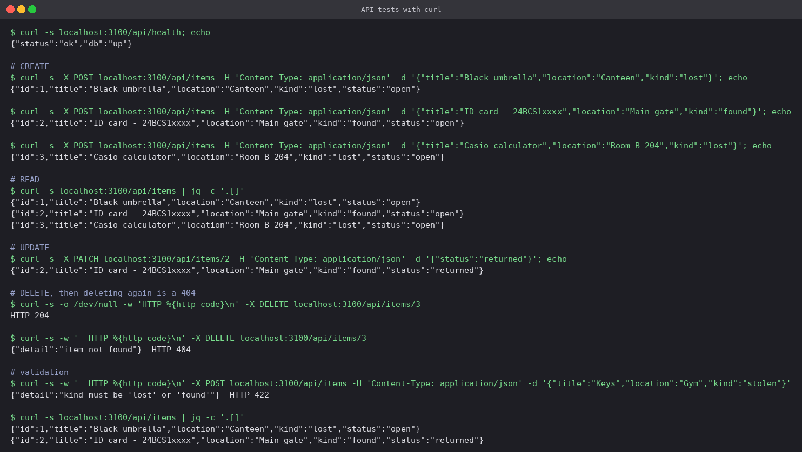

| Test | Result |
|---|---|
| Health | `{"status":"ok","db":"up"}` |
| Create ×3 | **201**, ids 1-3 assigned by Postgres `SERIAL` |
| List | all three items |
| Update item 2 | `status` changed to `returned` |
| Delete item 3 | **204**, and a second delete gives **404** `item not found` |
| Invalid `kind: "stolen"` | **422** `kind must be 'lost' or 'found'` |

### Inside the database

```bash
docker compose exec db psql -U lostfound -d lostfound -c '\dt'
docker compose exec db psql -U lostfound -d lostfound -c 'SELECT id, title, kind, status FROM items;'
docker compose exec frontend sh -c 'nc -zw2 db 5432'
```

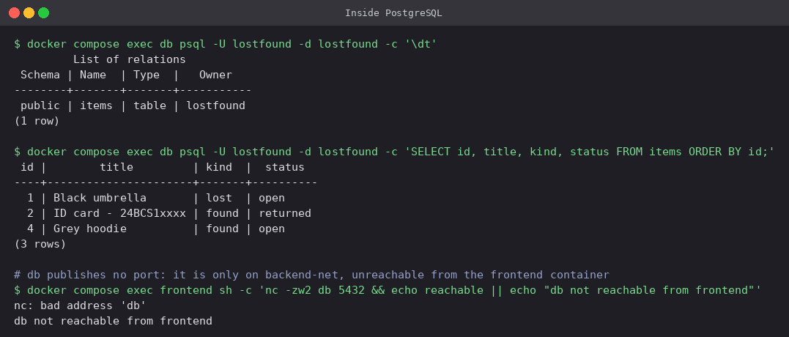

The rows match what the API returned, including the gap at id 3: `SERIAL` never reuses a
deleted id. The last command shows the network isolation working. From the frontend container
`db` is `bad address`, because the two are not on a shared network.

### Persistence across `down` / `up`

```bash
docker compose down
docker volume ls --filter name=lostfound_pgdata
docker compose up -d
curl -s localhost:3100/api/items
```

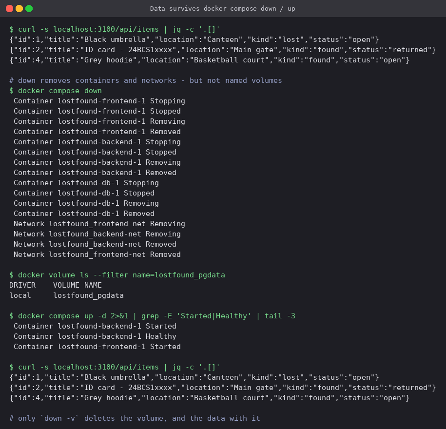

`docker compose down` removed every container and both networks, but the named volume
`lostfound_pgdata` was left in place. After `up`, new containers mounted it and all three
items came back. Only `docker compose down -v` removes the volume, and the data along with it.

### Logs

```bash
docker compose logs backend
docker compose logs frontend
```

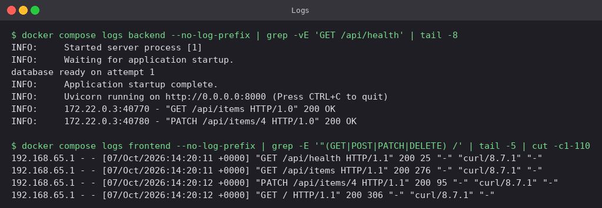

The backend log shows requests arriving from the nginx container's IP (`172.22.0.3`) over
HTTP/1.0, which is nginx's default for upstream connections. The frontend's nginx access log
shows the same requests as they came from the host.

## 6. Troubleshooting

Two failures reproduced with the compose files in [`troubleshooting/`](troubleshooting).

### Backend starts before PostgreSQL is ready

[`compose-no-healthcheck.yml`](troubleshooting/compose-no-healthcheck.yml) uses a plain
`depends_on: [db]` and allows a single connection attempt:

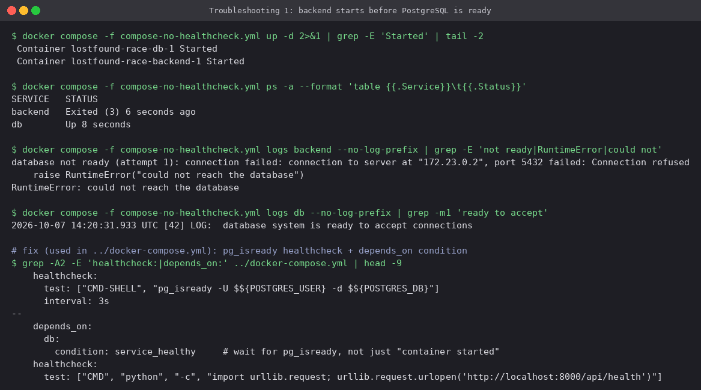

`depends_on` without a condition only waits for the db **container to start**. On a fresh
volume Postgres needs a few seconds to initialise, so the backend got `Connection refused` and
exited with code 3. The fix is the one already in the main compose file: a `pg_isready`
healthcheck on `db` and `condition: service_healthy` on the backend. Retries in the app as
well (`DB_RETRIES`) are good practice anyway, because a database can also restart *after*
the app is up.

### Wrong database host name

[`compose-wrong-host.yml`](troubleshooting/compose-wrong-host.yml) sets `DB_HOST=postgres`,
but the service is named `db`:

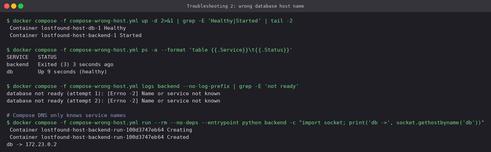

`Name or service not known` points to DNS, not to Postgres. Compose's embedded DNS knows only
**service names** (plus any aliases), and `db` resolves correctly from the same container. The
fix is `DB_HOST: db`. The *image* name `postgres` is not a host name.

## Cleanup

```bash
docker compose down -v          # containers, networks and the data volume
docker image rm lostfound-backend lostfound-frontend
```

## Command cheat sheet

```bash
docker compose up -d --build        # build images and start in the background
docker compose ps                   # status and health
docker compose logs -f backend      # follow one service's logs
docker compose exec db psql -U lostfound -d lostfound
docker compose restart backend
docker compose down                 # stop and remove containers + networks (keeps volumes)
docker compose down -v              # ...and the named volumes
docker compose config               # fully resolved compose file, good for checking variables
```

---

**Prince Shakya** · Roll No. 24BCS10084
