# Helm Commands

The chart for this exercise is [`campus-site/`](campus-site), generated by `helm create` and
changed only in `Chart.yaml` (description, `appVersion: 1.27-alpine`, which the scaffold
also uses as the image tag). It runs in namespace `helm-lab`.

| Command | What it does |
|---|---|
| `helm create` | Scaffolds a working chart (nginx Deployment, Service, optional Ingress/HPA, a test Pod) |
| `helm lint` | Checks chart structure and template syntax |
| `helm template` | Renders the templates to plain YAML locally |
| `helm install` | Renders, sends to the cluster, records revision 1 |
| `helm list` | Releases in a namespace (`-A` for all) |
| `helm status` | State of a release and the objects it owns |
| `helm get` | Values / manifest / notes / metadata of a revision |
| `helm upgrade` | New revision with a new chart or new values |
| `helm history` | Every revision of a release |
| `helm rollback` | A new revision that copies an older one |
| `helm uninstall` | Deletes the release's objects and its history |
| `helm repo` / `search` / `show` | Find and inspect published charts |
| `helm package` | Bundles a chart into a versioned `.tgz` |

## 1. `helm create`

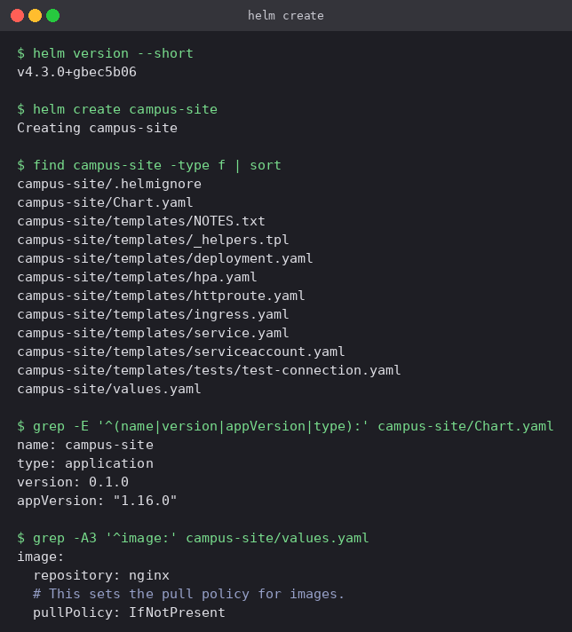

The scaffold is a complete, installable chart. Helm 4 also includes an `httproute.yaml`
for the Gateway API alongside the classic `ingress.yaml`. Both are switched off by
default in `values.yaml`.

## 2. `helm lint` and `helm template`

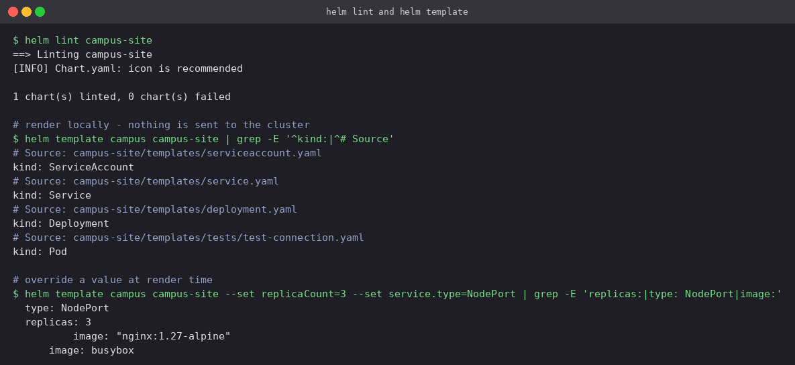

`lint` passes with only an informational note about a missing icon. `template` shows what
the chart *would* create (ServiceAccount, Service, Deployment, plus a test Pod that runs only
on `helm test`) without touching the cluster. Adding `--set` changes the output right away:
`replicas: 3` and `type: NodePort`. This is the quickest way to debug a template.

## 3. `helm install` and `helm list`

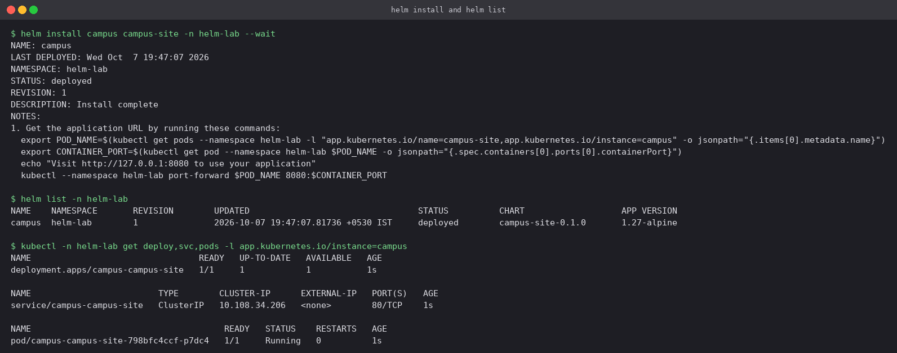

`--wait` made Helm block until the Deployment was ready, so `STATUS: deployed` really
means it is running. The object names come from the scaffold's `fullname` helper:
`<release>-<chart>` → `campus-campus-site`.

## 4. `helm status`

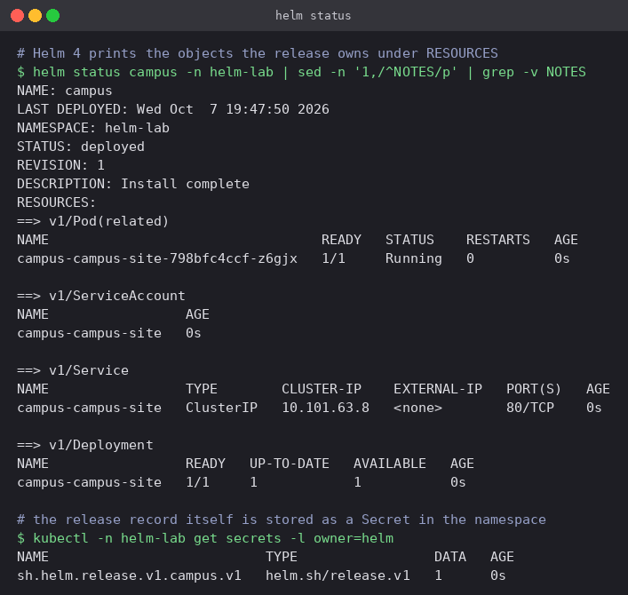

Helm 4 prints every resource of the release under `RESOURCES`. The release record itself
is a Secret of type `helm.sh/release.v1`, one per revision (`...campus.v1`). Helm keeps
release state in the cluster, so there is no local state file to lose.

## 5. `helm get`

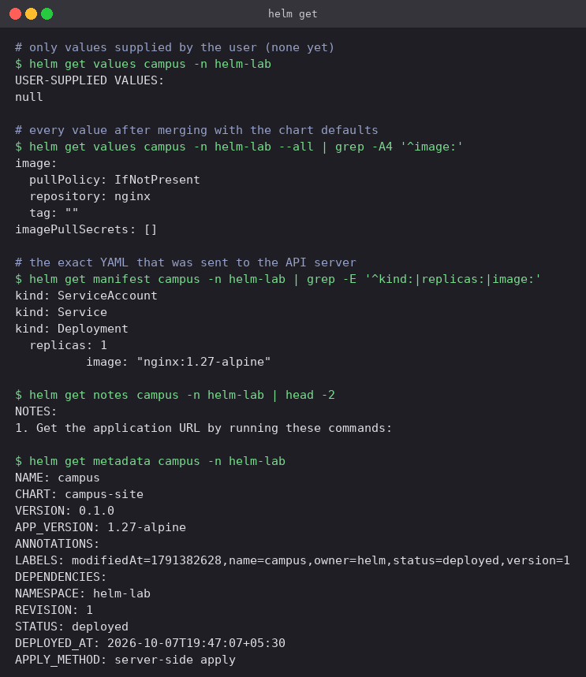

- `get values` shows only what the user supplied (nothing yet). Adding `--all` merges in the
  chart defaults.
- `get manifest` is the exact YAML that was applied. It is the reference point when the
  live object and the chart disagree.
- `get notes` re-prints the rendered `NOTES.txt`, and `get metadata` the chart, version
  and revision.

## 6. `helm upgrade` and `helm history`

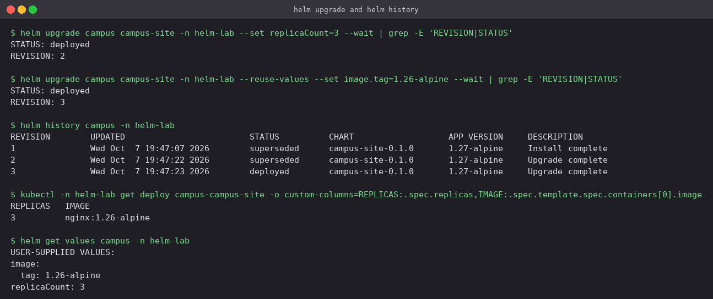

Two upgrades: first `replicaCount=3`, then a new image tag. The second one uses
`--reuse-values`. Without it, an upgrade starts again from the chart defaults plus only the
flags on that command line, and the replica count would quietly have gone back to 1.
`get values` confirms both overrides are now stored.

## 7. `helm rollback`

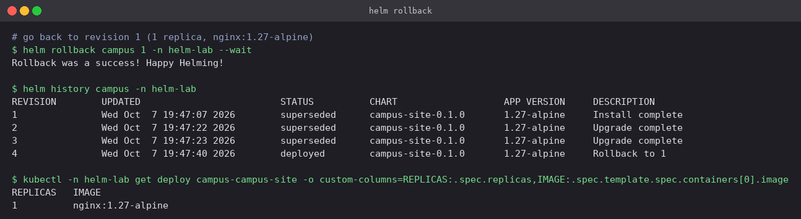

Rolling back to revision 1 did not delete revisions 2 and 3. It created **revision 4**
(`Rollback to 1`) with revision 1's manifest, so the history is append-only. The
Deployment returned to 1 replica on `nginx:1.27-alpine`.

## 8. `--dry-run` and `helm uninstall`

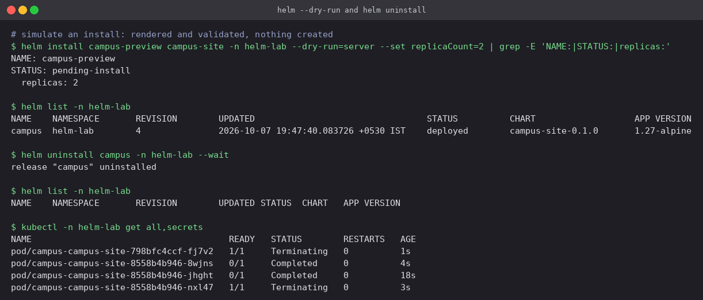

`--dry-run=server` renders the chart and has the API server validate it, but creates
nothing. `helm list` shows only the real release afterwards. `uninstall` removed the
Deployment, the Service and all the revision Secrets, leaving the namespace empty.

## 9. `helm repo`, `helm search`, `helm show`

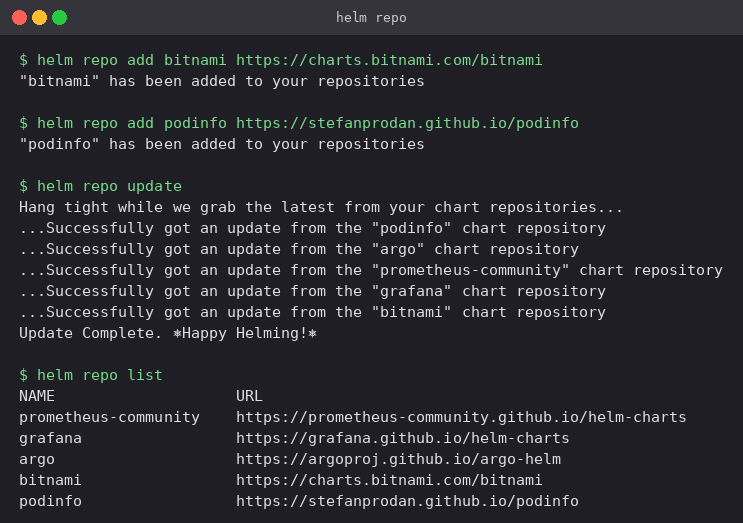

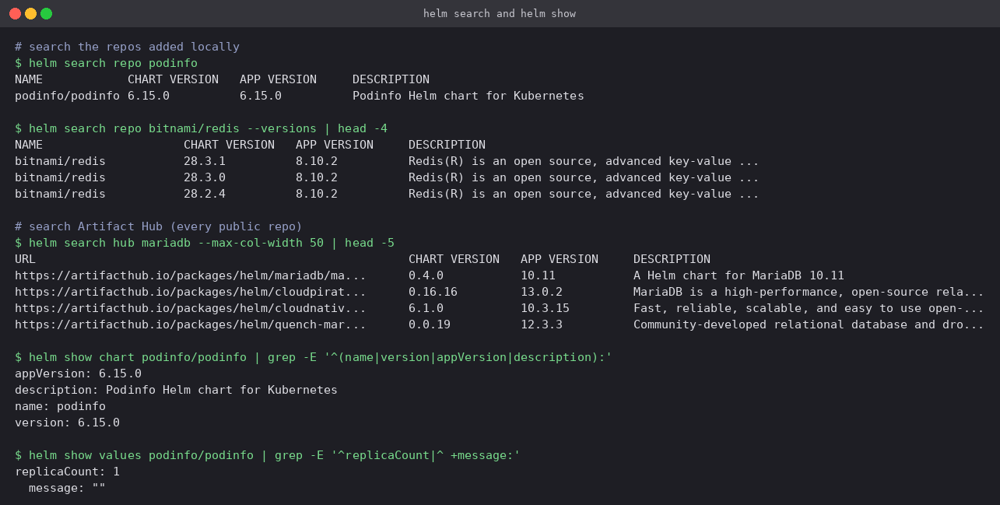

`search repo` only looks through repositories that were added locally. `--versions` lists
every published chart version. `search hub` queries Artifact Hub across all public repos.
`show chart` and `show values` let you read a chart before installing it.

## 10. Installing a public chart

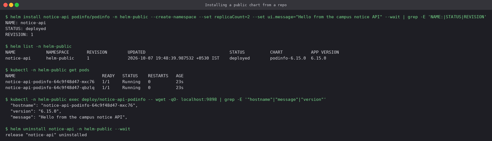

`podinfo/podinfo` was installed with two overrides (`replicaCount=2` and a custom
`ui.message`). The API response from inside the Pod contains that message, so the
`--set` value went all the way through the chart's templates to the running container.

## 11. `helm package` and removing a repo

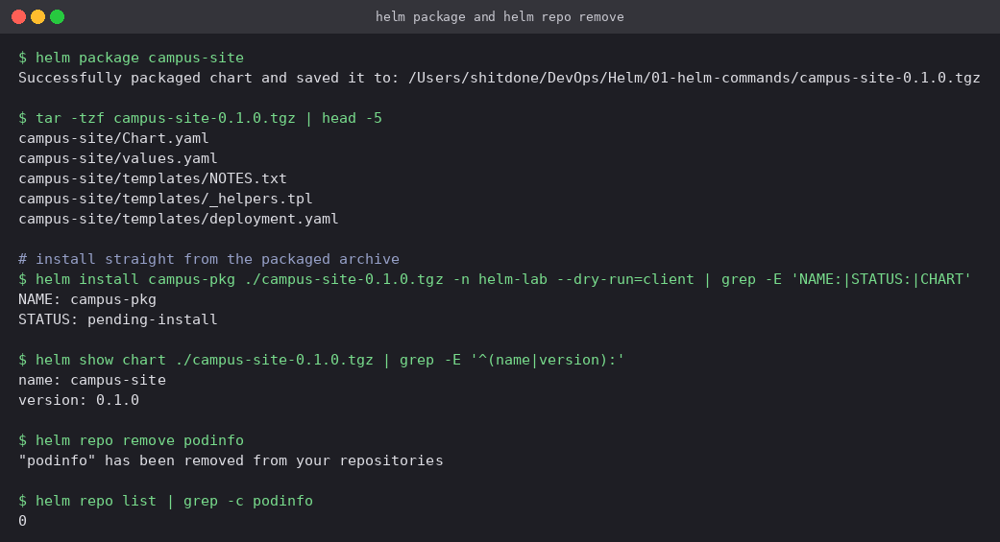

`helm package` produced `campus-site-0.1.0.tgz`. The version in the file name comes from
`Chart.yaml`. That archive is what gets uploaded to a chart repository or OCI registry,
and Helm can install it directly.

---

**Prince Shakya** · Roll No. 24BCS10084
