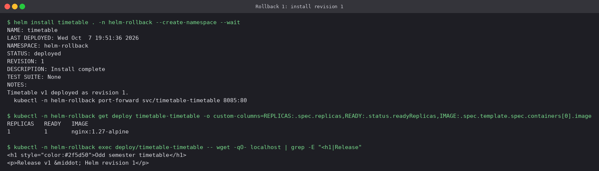
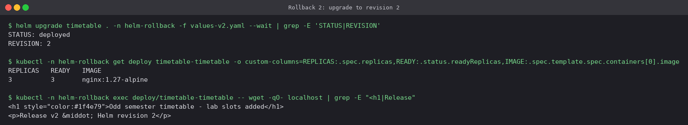
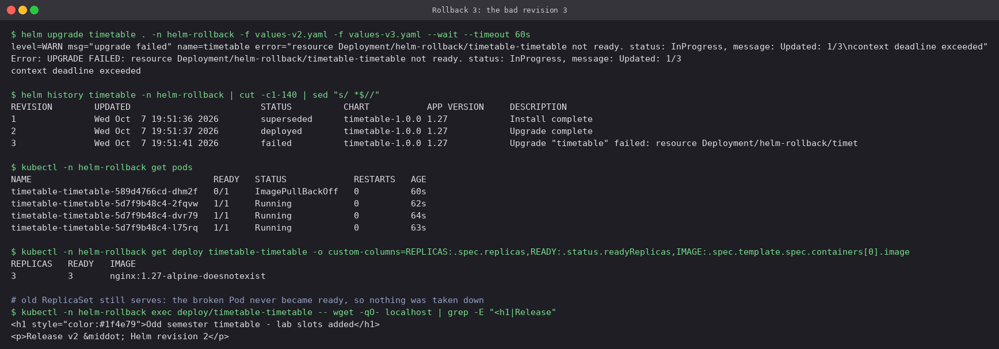
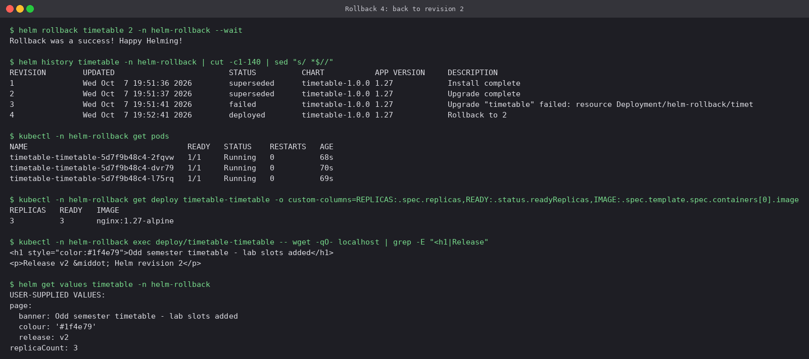

# Helm Rollback Workflow

[`timetable-chart/`](timetable-chart) serves a one-page class timetable from nginx. The
page is generated from values: the banner, its colour, a release label and
`{{ .Release.Revision }}`. So one `wget` shows exactly which revision is serving traffic.

| File | Revision | Change |
|---|---|---|
| [`values.yaml`](timetable-chart/values.yaml) | 1 | 1 replica, banner "Odd semester timetable" |
| [`values-v2.yaml`](timetable-chart/values-v2.yaml) | 2 | 3 replicas, new banner and colour |
| [`values-v3.yaml`](timetable-chart/values-v3.yaml) | 3 | image tag `1.27-alpine-doesnotexist`, the bad release |

The Deployment template has a `checksum/page` annotation: a hash of the rendered ConfigMap.
Changing only the page content still changes the Pod template, so a values-only upgrade
always rolls out new Pods.

## Step 1: install (revision 1)

```bash
helm install timetable . -n helm-rollback --create-namespace --wait
```



## Step 2: upgrade (revision 2)

```bash
helm upgrade timetable . -n helm-rollback -f values-v2.yaml --wait
```



Three replicas, blue banner, "Release v2 · Helm revision 2".

## Step 3: the bad upgrade (revision 3)

```bash
helm upgrade timetable . -n helm-rollback -f values-v2.yaml -f values-v3.yaml --wait --timeout 60s
```



- Both files were passed, `values-v2.yaml` first and `values-v3.yaml` second. Later files
  win, so revision 3 is "v2 with a broken image" and not a reset to the defaults.
- `--wait --timeout 60s` turned "Pods never became ready" into a failed Helm command, and
  revision 3 is recorded as `failed`.
- The rolling update created **one** new Pod, which is stuck in `ImagePullBackOff`, while
  all three old Pods kept serving. The live page still says v2. The Deployment's
  `maxUnavailable` keeps a bad image from taking the app down. Helm only reports the
  failure.

## Step 4: roll back to revision 2

```bash
helm history timetable -n helm-rollback
helm rollback timetable 2 -n helm-rollback --wait
```



- The rollback became **revision 4** (`Rollback to 2`). Revision 3 stays in the history as
  `failed`, which is the audit trail.
- The broken Pod is gone, the image is `nginx:1.27-alpine` again, and there are 3/3
  replicas.
- The page says **"Helm revision 2"** even though the release is now at revision 4. A
  rollback re-applies revision 2's *stored manifest* and does not re-render the templates,
  so `{{ .Release.Revision }}` keeps the value it had when revision 2 was rendered.
- `get values` shows the v2 values. A later `helm upgrade --reuse-values` would continue
  from these values and not from the broken ones.

## Takeaways

- Run upgrades with `--wait` (and in CI with `--rollback-on-failure`, Helm 4's name for the
  old `--atomic`), otherwise Helm reports success as soon as the API accepts the YAML.
- `helm rollback REL` with no revision number goes to the previous one. With a number it
  goes to that exact revision.
- History is capped by `--history-max` (default 10). Old revision Secrets are pruned, so
  a revision far back cannot be rolled back to.

## Cleanup

```bash
helm uninstall timetable -n helm-rollback
kubectl delete namespace helm-rollback
```

---

**Prince Shakya** · Roll No. 24BCS10084
