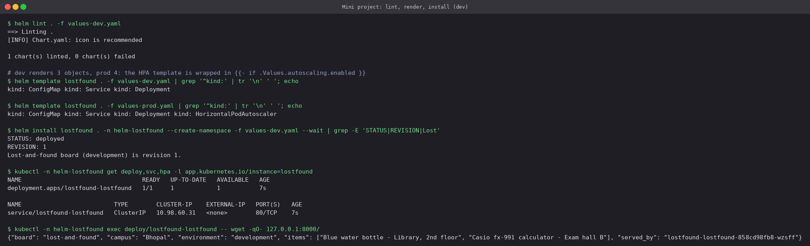
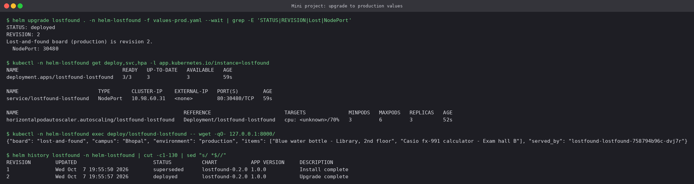
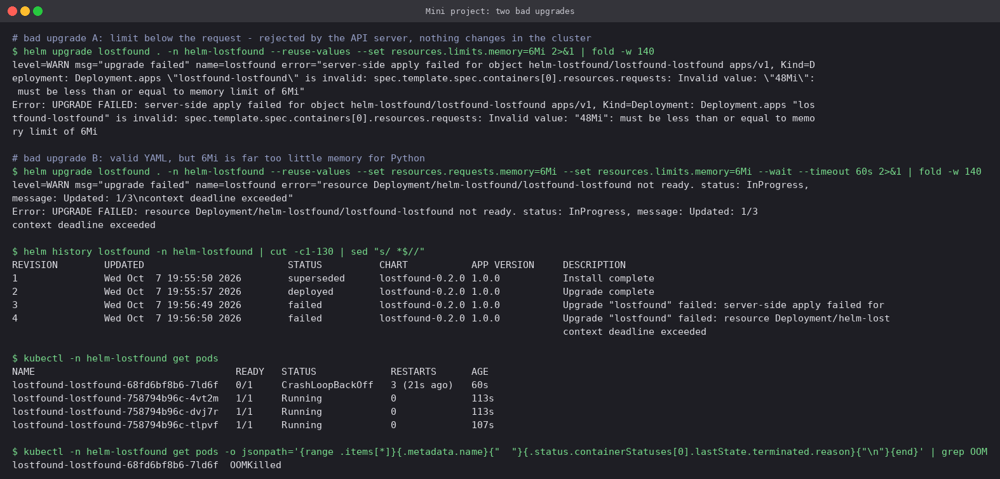
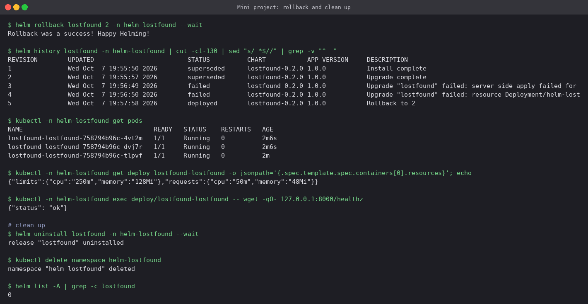

# Mini Project: Packaging a Campus Lost-and-Found API with Helm

A chart written from scratch (not from `helm create`) for a small Python API that lists
lost-and-found items on campus. The API's source, its settings and the item list all come
from one ConfigMap, so the stock `python:3.12-alpine` image is enough.

```text
lostfound-chart/
├── Chart.yaml            name, chart version 0.2.0, appVersion 1.0.0
├── values.yaml           defaults (development)
├── values-dev.yaml       1 replica, ClusterIP
├── values-prod.yaml      3 replicas, NodePort 30480, bigger resources, HPA 3→6
└── templates/
    ├── _helpers.tpl      fullname, selector labels, common labels
    ├── configmap.yaml    env settings + server.py
    ├── deployment.yaml   probes, resources, config checksum, replicas omitted when HPA is on
    ├── service.yaml      nodePort only rendered for type NodePort
    ├── hpa.yaml          whole file wrapped in {{- if .Values.autoscaling.enabled }}
    └── NOTES.txt
```

Template features used:

| Feature | Where | Why |
|---|---|---|
| `include` + named templates | `_helpers.tpl` | One definition of names and labels, so selectors can never drift |
| `if` | `hpa.yaml`, `deployment.yaml`, `service.yaml` | HPA only in prod; `replicas:` dropped when an HPA owns the count |
| `toYaml \| nindent` | `deployment.yaml` | Resources block copied from values as-is |
| `join` / `quote` | `configmap.yaml` | A YAML list of items turned into one env var |
| `sha256sum` checksum | Pod annotation | A ConfigMap change rolls the Pods automatically |

## 1. Lint, render, install (development)

```bash
helm lint . -f values-dev.yaml
helm template lostfound . -f values-dev.yaml  | grep '^kind:'
helm template lostfound . -f values-prod.yaml | grep '^kind:'
helm install lostfound . -n helm-lostfound --create-namespace -f values-dev.yaml --wait
```



The same chart renders three objects for dev and four for prod. The API answers with
`"environment": "development"` and the item list from `values.yaml`.

## 2. Upgrade to production values

```bash
helm upgrade lostfound . -n helm-lostfound -f values-prod.yaml --wait
```



One command turned the dev release into prod. The Service became `NodePort 80:30480`, an
HPA (min 3 / max 6) appeared, the Deployment runs 3 replicas, and the API now reports
`"environment": "production"`. Nothing had to be deleted by hand: Helm compares the
revisions and applies only the differences.

## 3. Two bad upgrades

```bash
# A: limit lower than the request
helm upgrade lostfound . -n helm-lostfound --reuse-values --set resources.limits.memory=6Mi
# B: request and limit both 6Mi, valid but far too small
helm upgrade lostfound . -n helm-lostfound --reuse-values \
  --set resources.requests.memory=6Mi --set resources.limits.memory=6Mi --wait --timeout 60s
```



The two failures happen at different stages:

- **A (revision 3)** was rejected by the **API server**: `requests: Invalid value "48Mi":
  must be less than or equal to memory limit of 6Mi`. No object changed. Helm still records
  the attempt as a `failed` revision.
- **B (revision 4)** passed validation, and the problem only showed up **at runtime**. The
  new Pod was `OOMKilled` → `CrashLoopBackOff`, `--wait` timed out after 60s, and the three
  old Pods kept serving.

## 4. Roll back and clean up

```bash
helm rollback lostfound 2 -n helm-lostfound --wait
helm uninstall lostfound -n helm-lostfound
kubectl delete namespace helm-lostfound
```



Revision 5 is `Rollback to 2`. The crashing Pod is gone, the resources are back to the
production values (`48Mi` / `128Mi`), and `/healthz` answers. After `uninstall`, `helm list
-A` has no `lostfound` release left.

---

**Prince Shakya** · Roll No. 24BCS10084
