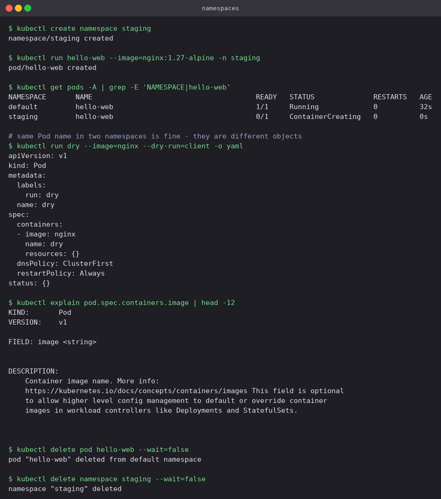

# Kubernetes Fundamentals

The basics worked through on a local single-node Minikube cluster (Docker driver, Kubernetes
v1.37.0). Everything below is from an actual run — the screenshots are the terminal output,
not a transcription of it.

```bash
minikube start --driver=docker
```

## 1. What the control plane is made of

Kubernetes is **declarative**: you write down the state you want, and a set of control loops
keeps working until reality matches it. Nothing here is a one-shot command that "does" a
thing — every component below is a loop watching for drift.

| Component | Runs on | Job |
|---|---|---|
| `kube-apiserver` | Control plane | The only way in. `kubectl` and every other component talks to it, nothing talks to etcd directly |
| `etcd` | Control plane | Key-value store holding the entire cluster state |
| `kube-scheduler` | Control plane | Picks a node for each Pod that does not have one yet |
| `kube-controller-manager` | Control plane | The control loops that drive actual state towards desired state |
| `kubelet` | Every node | Agent that starts the Pod's containers and reports back on them |
| `kube-proxy` | Every node | Writes the network rules that make Services reachable |
| `containerd` | Every node | The container runtime that actually runs containers |
| `CoreDNS` | Add-on | In-cluster DNS for Services and Pods |

## 2. Cluster information

```bash
kubectl cluster-info
kubectl get nodes -o wide
kubectl get namespaces
```


Minikube is a single-node cluster, so the one node named `minikube` is both control plane and
worker — on a real cluster these would be separate machines, and the `ROLES` column would show
it. The four namespaces present from the start are `default` (where your own objects go),
`kube-system` (the cluster's own components), `kube-public` and `kube-node-lease` (node
heartbeats). `ingress-nginx` appears too, because the ingress addon was enabled for a later
exercise.

## 3. The components are just Pods

```bash
kubectl get pods -n kube-system -o wide
```


This is the point worth taking away: every component in the table above is visible here as an
ordinary Pod. `etcd`, `kube-apiserver`, `kube-controller-manager` and `kube-scheduler` are
running as static Pods on the control plane, with `kube-proxy` and `kindnet` (the CNI plugin)
running one per node. Kubernetes runs itself on itself.

Notice the IP column: the control-plane components use `192.168.49.2`, the node's own IP,
because they run on the host network. `coredns` has `10.244.0.2` from the Pod network, like
any normal Pod would.

## 4. Node capacity and the API surface

```bash
kubectl describe node minikube | sed -n '/^Capacity/,/^System Info/p'
kubectl api-resources | head -12
```


`Capacity` is what the node physically has; `Allocatable` is what the scheduler is allowed to
hand out to Pods after reserving what the system needs. The scheduler works from
`Allocatable`, never from `Capacity`. The cap of 110 Pods per node is a kubelet default, not a
hardware limit.

`kubectl api-resources` is the fastest way to remember a short name — `po`, `cm`, `ns`, `pvc`
— and to check whether a resource is namespaced. Nodes and PersistentVolumes are not, which is
why `-n` has no effect on them.

## 5. A first Pod

```bash
kubectl run hello-web --image=nginx:1.27-alpine --port=80
kubectl wait --for=condition=Ready pod/hello-web --timeout=120s
kubectl get pod hello-web -o wide
kubectl describe pod hello-web | sed -n '/^Events/,$p'
kubectl exec hello-web -- nginx -v
kubectl logs hello-web | tail -3
```


The `Events` block is the most useful output in the whole exercise, because it is the life of
the Pod in order: **Scheduled** (the scheduler chose a node) → **Pulling** / **Pulled** (the
kubelet asked containerd for the image — 9.3s here, the first pull of that tag) → **Created**
→ **Started**. When a Pod is not running, this list almost always says why.

The Pod got IP `10.244.0.9` from the Pod network. That address belongs to the Pod, not to the
node, and it is gone the moment the Pod is replaced — which is the entire reason Services
exist.

## 6. Namespaces

```bash
kubectl create namespace staging
kubectl run hello-web --image=nginx:1.27-alpine -n staging
kubectl get pods -A | grep -E 'NAMESPACE|hello-web'
```



Namespaces are virtual clusters inside one real cluster, used to keep environments or teams
apart. The run above deliberately creates a **second Pod with the same name** `hello-web` in
`staging`: both exist happily, because a name only has to be unique within its namespace.
`-n <ns>` targets one, `-A` lists across all of them.

## 7. Two commands worth knowing early

```bash
kubectl run dry --image=nginx --dry-run=client -o yaml
kubectl explain pod.spec.containers.image
```

`--dry-run=client -o yaml` prints the manifest without creating anything — much faster than
writing YAML from a blank file. `kubectl explain` is the API reference built into the CLI, so
there is rarely a reason to guess at a field name.

## 8. Cleanup

```bash
kubectl delete pod hello-web --wait=false
kubectl delete namespace staging --wait=false
```

Deleting a namespace deletes everything inside it, which is the quickest way to clean up an
experiment.

## kubectl cheat sheet

| Command | Purpose |
|---|---|
| `kubectl get <type> [-o wide] [-n ns] [-A]` | List objects |
| `kubectl describe <type> <name>` | Details and Events — first stop when something is wrong |
| `kubectl logs <pod> [-f] [--previous]` | Container logs; `--previous` for a crashed container |
| `kubectl exec -it <pod> -- sh` | Shell inside a running container |
| `kubectl apply -f file.yaml` | Create or update from a manifest (declarative) |
| `kubectl delete -f file.yaml` | Remove whatever that manifest created |
| `kubectl run` / `kubectl create` | Quick imperative creation, useful for scratch work |
| `kubectl explain <type.field>` | Built-in field documentation |
| `kubectl config get-contexts` | Check which cluster you are actually talking to |

---

**Parv Mehta** · Roll No. 24BCS10301
