# Kubernetes Ingress and Config: Advanced

A second, deeper pass over the same three objects as
[`Kubernetes Ingress and Config/`](../Kubernetes%20Ingress%20and%20Config): every way a Pod
can consume a ConfigMap or a Secret, what happens when they change underneath a running Pod,
why Secrets are not actually secret, an Ingress tested with and without its controller, host
routing, TLS, and five broken-then-fixed configurations.

Everything below was run on the same single-node Minikube cluster (Docker driver). The demo
app is **Hostel Desk**: an Nginx frontend and a small Python API, configured by ConfigMaps,
credentialed by a Secret, and exposed through one Ingress.

```text
Kubernetes Ingress and Config Advanced/
├── manifests/
│   ├── 01-configmap.yaml          two ConfigMaps: key/value settings + whole files
│   ├── 01-configmap-pod.yaml      one Pod consuming them three different ways
│   ├── 02-secret.yaml             Secret using both data (base64) and stringData (plain)
│   ├── 02-secret-pod.yaml         the Secret as env vars and as a read-only volume
│   ├── 03-frontend.yaml           Nginx Deployment + Service, HTML from a ConfigMap
│   ├── 03-backend.yaml            Python API Deployment + Service, code from a ConfigMap
│   └── 03-ingress.yaml            path rules, host rules and TLS
├── ingress-vs-ingress-controller/  concept note, backed by the run below
├── troubleshooting/                five broken → fixed scenarios
└── screenshots/
```

## 0. Cluster

```bash
minikube status
kubectl get nodes -o wide
kubectl get pods -n ingress-nginx
```

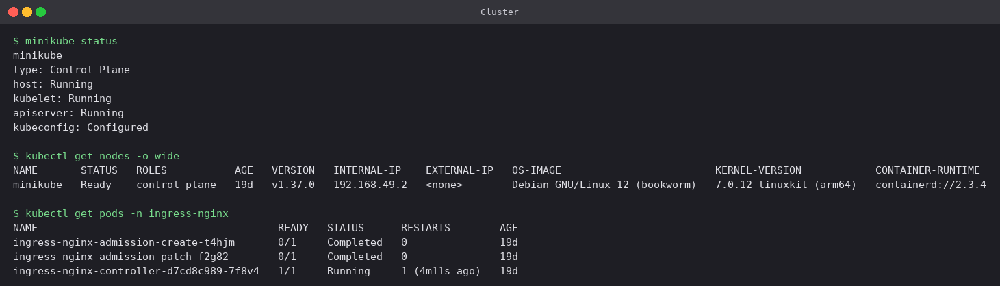

## 1. ConfigMaps

### Creating them

[`manifests/01-configmap.yaml`](manifests/01-configmap.yaml) holds two ConfigMaps with
different shapes. `hostel-settings` is flat `KEY: value` pairs meant to become environment
variables. `hostel-files` stores whole files (`app.properties`, `welcome.txt`) meant to be
mounted.

```bash
kubectl apply -f 01-configmap.yaml
kubectl get configmaps hostel-settings hostel-files
kubectl describe configmap hostel-files | sed -n '/^Data/,/^BinaryData/p'

kubectl create configmap hostel-rules --from-file=/tmp/rules.properties
kubectl get configmap hostel-rules -o jsonpath='{.data}'
```

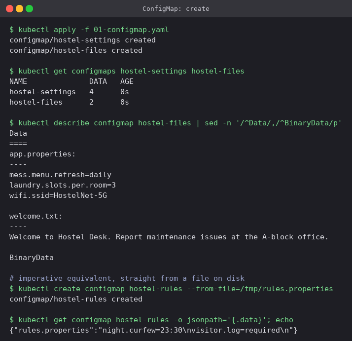

`--from-file` uses the file name as the key and the file content as the value. That is the
same structure `hostel-files` has in YAML.

### Three ways into a Pod

[`manifests/01-configmap-pod.yaml`](manifests/01-configmap-pod.yaml):

| Method | Spec | Result in the container |
|---|---|---|
| `envFrom.configMapRef` | whole ConfigMap | every key becomes an env var of the same name |
| `env.valueFrom.configMapKeyRef` | one key | a single env var, can be renamed (`MAX_GUESTS` → `GUEST_LIMIT`) |
| `volumes.configMap` | whole ConfigMap | every key becomes a file under the mount path |

```bash
kubectl apply -f 01-configmap-pod.yaml
kubectl exec config-reader -- env | grep -E 'APP_MODE|HOSTEL_BLOCKS|CHECKIN_WINDOW|MAX_GUESTS'
kubectl exec config-reader -- printenv GUEST_LIMIT
kubectl exec config-reader -- ls /etc/hostel
kubectl exec config-reader -- cat /etc/hostel/app.properties
```

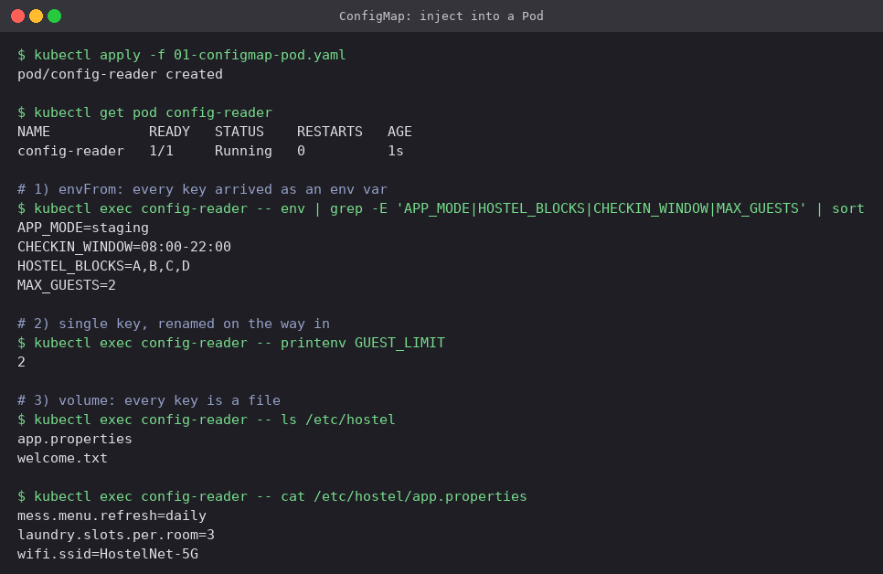

### Changing a ConfigMap under a running Pod

```bash
kubectl patch configmap hostel-settings --type merge -p '{"data":{"APP_MODE":"production"}}'
kubectl patch configmap hostel-files    --type merge -p '{"data":{"welcome.txt":"..."}}'
# ...wait about a minute...
kubectl exec config-reader -- cat /etc/hostel/welcome.txt
kubectl exec config-reader -- printenv APP_MODE
kubectl delete pod config-reader && kubectl apply -f 01-configmap-pod.yaml
```

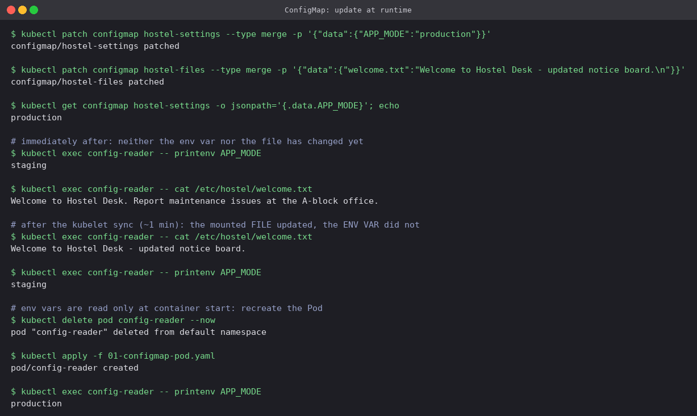

This is the most useful result in the section:

- **Right after the patch, nothing in the Pod changed.** The API object updated instantly
  but the container still saw `staging` and the old welcome text.
- **About a minute later the mounted file had changed but the env var had not.** The kubelet
  periodically re-syncs ConfigMap volumes and swaps the files atomically through a symlink.
  Env vars are copied into the process once at start-up, and nothing can change them after.
- **Recreating the Pod** made `APP_MODE=production` appear.

In practice: settings that must change without a restart belong in a volume, and the app has
to re-read the file. Settings that come in as env vars need `kubectl rollout restart` after
every change. (One exception: a volume mounted with `subPath` never updates.)

## 2. Secrets

### Creating one

[`manifests/02-secret.yaml`](manifests/02-secret.yaml) uses both fields on purpose:

- `data:` values are base64 that I encoded by hand (`echo -n 'warden' | base64`)
- `stringData:` takes plain text, and the API server encodes it on write

```bash
kubectl apply -f 02-secret.yaml
kubectl describe secret hostel-db-credentials | sed -n '/^Type/,$p'
kubectl get secret hostel-db-credentials -o jsonpath='{.data.DB_HOST}'
kubectl create secret generic hostel-api-token --from-literal=TOKEN=hd-7f3a91c2
```

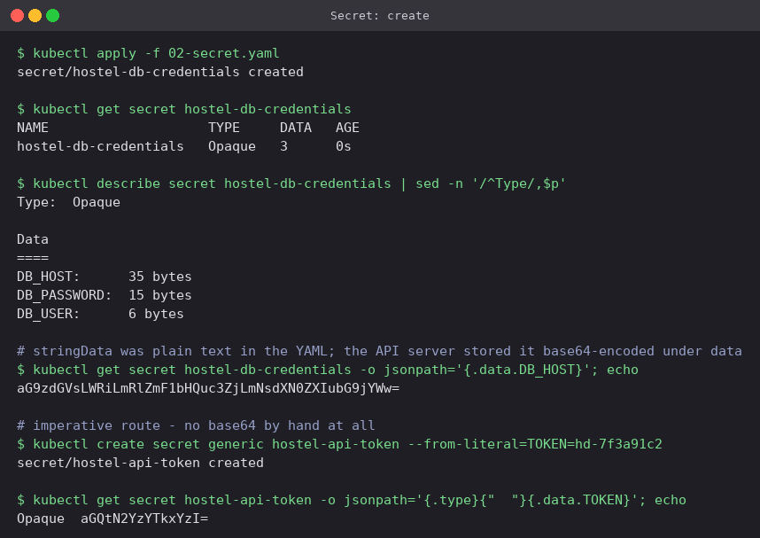

`DB_HOST` was written as plain text but comes back base64-encoded under `.data`.
`stringData` is write-only convenience, and a `get` never shows it.

### Consuming it

[`manifests/02-secret-pod.yaml`](manifests/02-secret-pod.yaml) mounts the same Secret two
ways:

```bash
kubectl apply -f 02-secret-pod.yaml
kubectl exec secret-reader -- sh -c 'echo "$DB_USER / $DB_PASSWORD"'
kubectl exec secret-reader -- ls -lL /run/secrets/db
kubectl exec secret-reader -- sh -c 'mount | grep /run/secrets/db'
```

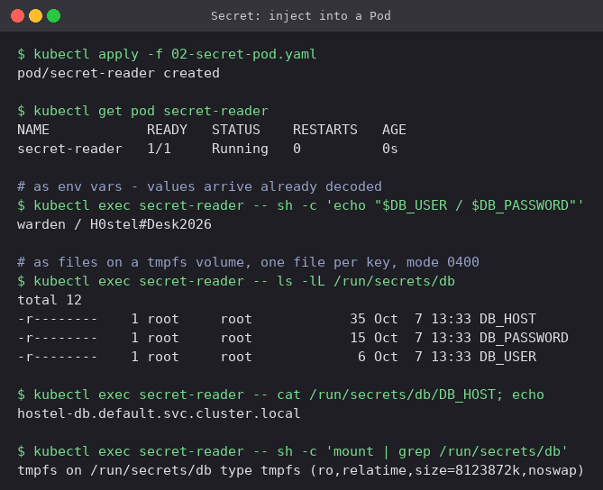

- Values arrive **decoded**. The application never deals with base64.
- The volume is a **tmpfs**, so Secret files live in node memory and are never written to
  the node's disk. `defaultMode: 0400` makes each file readable by its owner only.
- The volume form is the better choice: env vars get dumped by crash reporters, show up in
  `/proc/<pid>/environ`, and get inherited by every child process.

### Why base64 is not protection, and why Secrets stay out of Git

```bash
kubectl get secret hostel-db-credentials -o jsonpath='{.data.DB_PASSWORD}' | base64 -d
kubectl get secret hostel-db-credentials -o json | jq -r '.data | map_values(@base64d)'
kubectl -n kube-system exec etcd-minikube -- etcdctl ... get /registry/secrets/default/hostel-db-credentials | strings
```

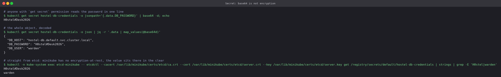

Three levels, each worse than the last:

1. Anyone allowed to `get` the Secret decodes the password with one pipe.
2. `jq`'s `@base64d` decodes the whole object in one go.
3. Reading **etcd directly**, the password `H0stel#Desk2026` sits in the stored bytes in
   plain text. Minikube runs without an `EncryptionConfiguration`, which is also the default
   on a self-built cluster. So anyone holding an etcd backup holds every Secret.

And Git makes the problem permanent:

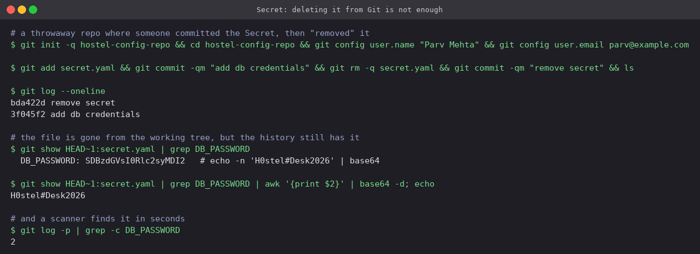

The file was committed and then removed in the next commit. `ls` shows an empty tree, but
`git show HEAD~1:secret.yaml` still prints the password, and so does every clone and fork of
that repo. Once a credential has been pushed it has to be **rotated**. Rewriting history
afterwards does not fix it. The workable patterns keep only encrypted or referenced secrets in
Git: Sealed Secrets, SOPS, or External Secrets Operator pulling from Vault or a cloud secret
manager. On the cluster side the matching controls are RBAC on `secrets` and encryption at
rest for etcd.

## 3. Ingress

### The application

[`manifests/03-frontend.yaml`](manifests/03-frontend.yaml) and
[`manifests/03-backend.yaml`](manifests/03-backend.yaml): two replicas each, both behind
ClusterIP Services. The frontend's HTML and the backend's source code both come from
ConfigMaps, so stock `nginx` and `python` images are enough.

```bash
kubectl apply -f 03-frontend.yaml -f 03-backend.yaml
kubectl get deploy,svc | grep hostel
kubectl get endpointslices -l 'kubernetes.io/service-name in (hostel-frontend,hostel-backend)'
kubectl exec deploy/hostel-frontend -- wget -qO- http://hostel-backend:8000/rooms
```

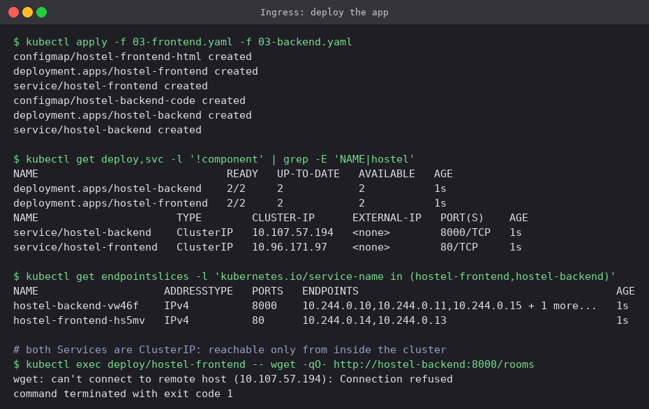

The backend's JSON already shows the whole configuration chain: `mode` and `blocks` from the
ConfigMap, `db_user` from the Secret.

### An Ingress with no controller does nothing

The ingress addon was turned off first (`minikube addons disable ingress`), and then
[`manifests/03-ingress.yaml`](manifests/03-ingress.yaml) was applied:

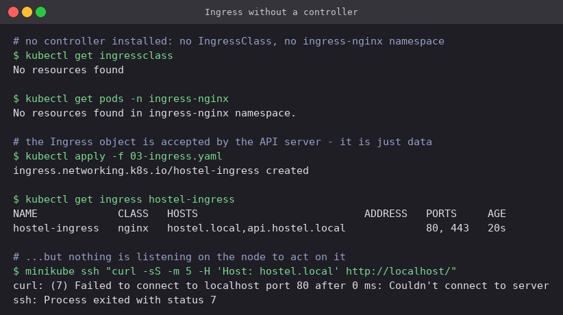

The API server accepted the Ingress without complaint, but it has no `ADDRESS`, and port 80
on the node refuses the connection. An Ingress is only a set of routing rules, and nothing
was running that reads them.

### Installing the controller

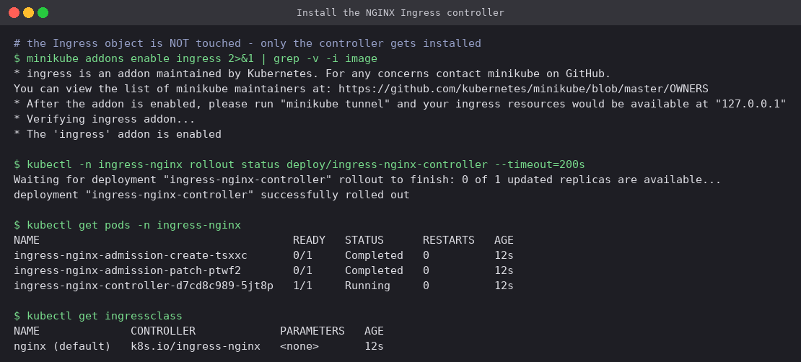

### The same Ingress now works, unchanged

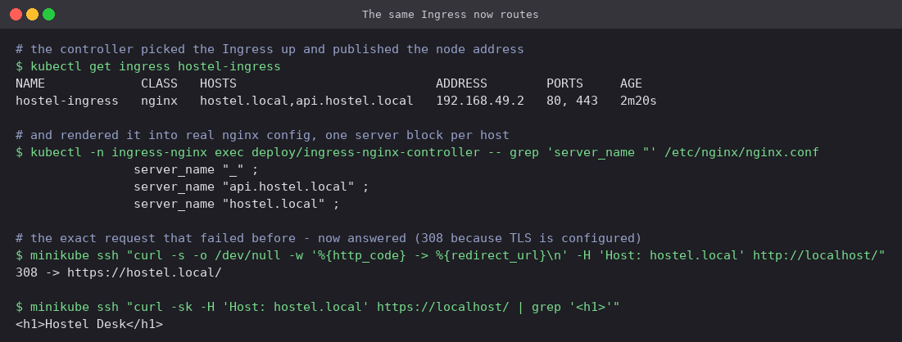

The controller found the existing object, filled in `ADDRESS 192.168.49.2`, and wrote one
`server { server_name ... }` block per host into its own `nginx.conf`. The request that was
refused a moment earlier now gets an answer. That answer is a `308` to HTTPS, because the
Ingress has a `tls:` section and ingress-nginx redirects to HTTPS by default in that case.

### Routing by path and by host

The rules in `03-ingress.yaml`:

| Host | Path | Service |
|---|---|---|
| `hostel.local` | `/api/...` | `hostel-backend:8000` (the `/api` prefix is stripped by `rewrite-target: /$2`) |
| `hostel.local` | `/...` | `hostel-frontend:80` |
| `api.hostel.local` | `/...` | `hostel-backend:8000` |

The controller was reached from the Mac through a port-forward, and curl's `--resolve` stood
in for `/etc/hosts`:

```bash
kubectl port-forward -n ingress-nginx svc/ingress-nginx-controller 8443:443 8080:80

curl --resolve hostel.local:8443:127.0.0.1 --cacert hostel.crt https://hostel.local:8443/
curl --resolve hostel.local:8443:127.0.0.1 --cacert hostel.crt https://hostel.local:8443/api/rooms
curl --resolve api.hostel.local:8443:127.0.0.1 --cacert hostel.crt https://api.hostel.local:8443/leave
for i in 1 2 3 4 5 6; do curl ... https://api.hostel.local:8443/ | jq -r .pod; done | sort | uniq -c
curl -H 'Host: library.local' http://localhost:8080/
```

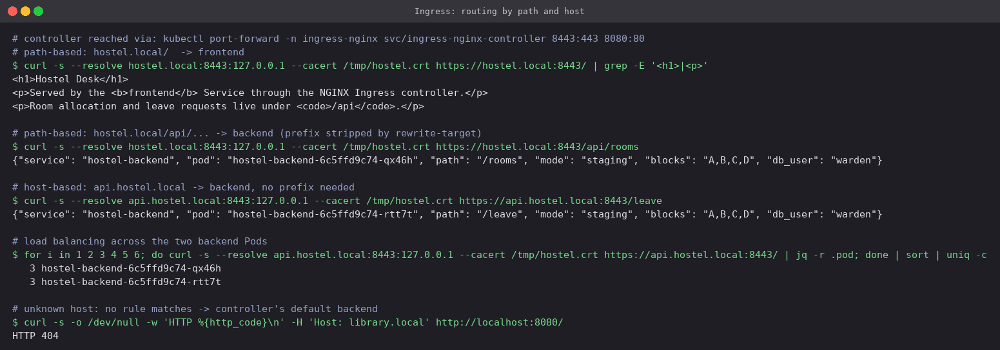

- `/` returns the frontend HTML. `/api/rooms` reaches the backend, which sees the path as
  `/rooms`.
- `api.hostel.local/leave` reaches the backend with no prefix at all. One controller and one
  IP serve two hostnames.
- Six requests were split **3 / 3** across the two backend Pods. The controller balances
  across Pod endpoints directly and bypasses the Service's ClusterIP.
- An unknown host fell through to the default backend and got **404**.

The same page in a real (headless Chrome) browser:

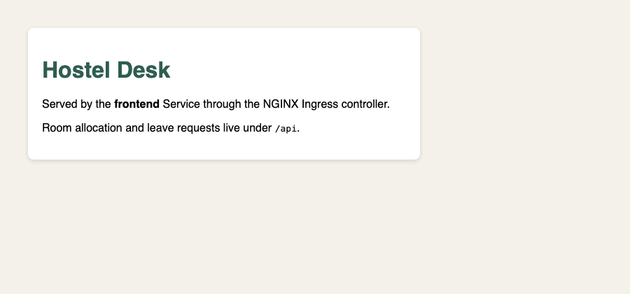

### TLS

```bash
openssl req -x509 -nodes -newkey rsa:2048 -days 30 -subj /CN=hostel.local \
  -addext "subjectAltName=DNS:hostel.local,DNS:api.hostel.local" -keyout hostel.key -out hostel.crt
kubectl create secret tls hostel-tls --cert=hostel.crt --key=hostel.key
```

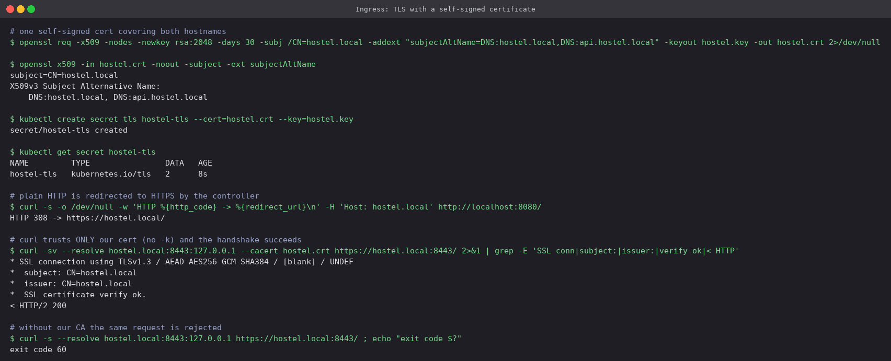

- The certificate's SAN covers both hostnames, so one `kubernetes.io/tls` Secret is enough
  for the whole `tls:` block.
- Plain HTTP gets a **308** to HTTPS.
- curl run with `--cacert hostel.crt` and **without `-k`** reports `SSL certificate verify
  ok` and `HTTP/2 200`, so the controller is really serving our certificate.
- Without our CA the same request fails with exit code **60** (cannot verify peer). A
  self-signed certificate encrypts the connection, but only clients told to trust it can
  verify it. In production cert-manager with Let's Encrypt would issue a certificate
  everyone trusts and renew it automatically.

## 4. Ingress vs Ingress Controller

See [`ingress-vs-ingress-controller/README.md`](ingress-vs-ingress-controller/README.md).

## 5. Troubleshooting

See [`troubleshooting/README.md`](troubleshooting/README.md): five broken → fixed scenarios
(trailing newline in a Secret, missing ConfigMap key, Ingress pointing at a wrong Service,
wrong `ingressClassName`, Service `targetPort` mismatch).

## Cleanup

```bash
kubectl delete -f manifests/ -f troubleshooting/ --recursive --ignore-not-found
kubectl delete secret hostel-tls hostel-api-token
kubectl delete configmap hostel-rules
```

## Cheat sheet

```bash
# ConfigMap
kubectl create configmap NAME --from-literal=K=V --from-file=path --from-env-file=.env
kubectl get cm NAME -o jsonpath='{.data}'
kubectl rollout restart deploy/NAME              # pick up env-var changes

# Secret
kubectl create secret generic NAME --from-literal=K=V
kubectl create secret tls NAME --cert=c.crt --key=c.key
kubectl get secret NAME -o jsonpath='{.data.K}' | base64 -d
echo -n 'value' | base64                         # always -n

# Ingress
kubectl get ingressclass
kubectl describe ingress NAME                    # resolves rules down to Pod endpoints
kubectl -n ingress-nginx logs deploy/ingress-nginx-controller
curl -H 'Host: x.local' http://<controller>/     # test host rules without DNS
```

---

**Prince Shakya** · Roll No. 24BCS10084
