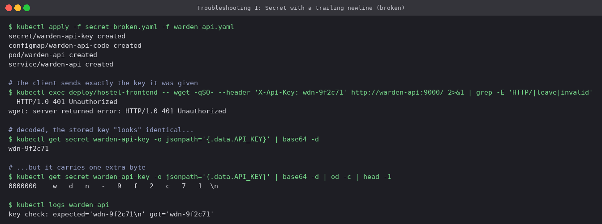
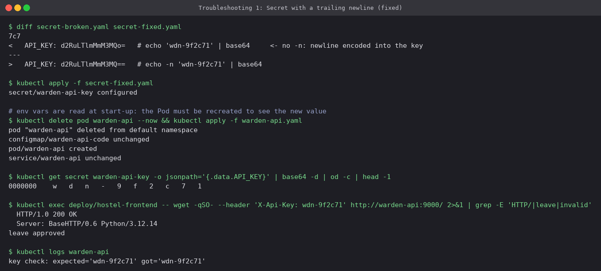
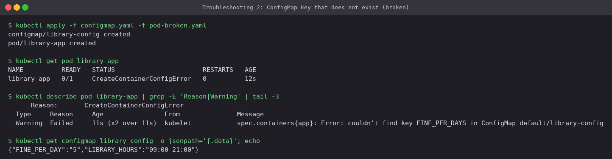
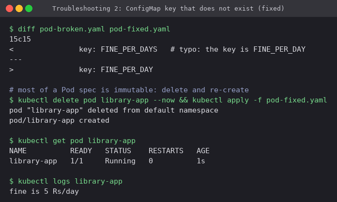
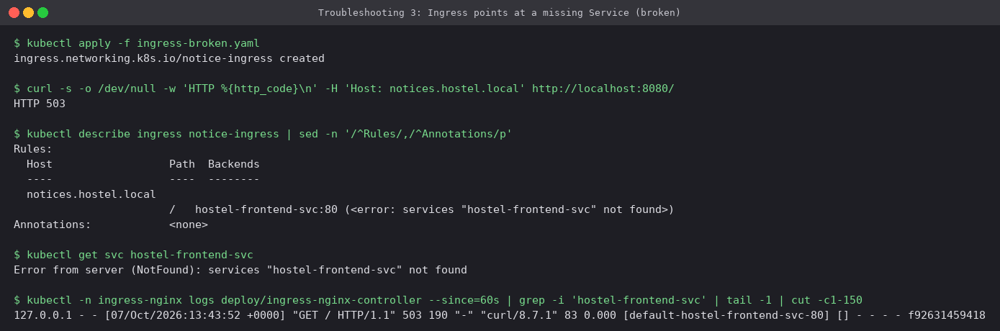
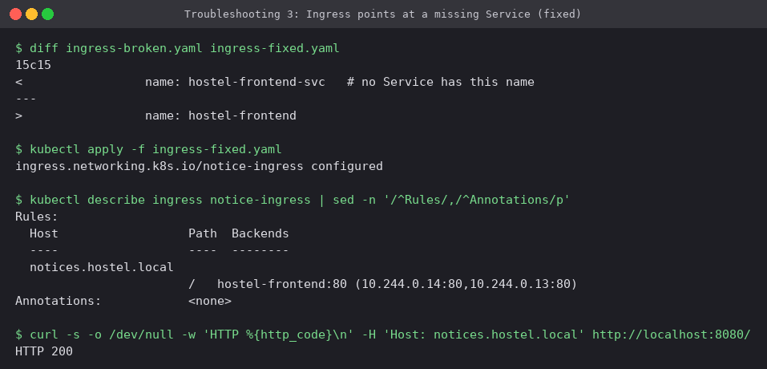
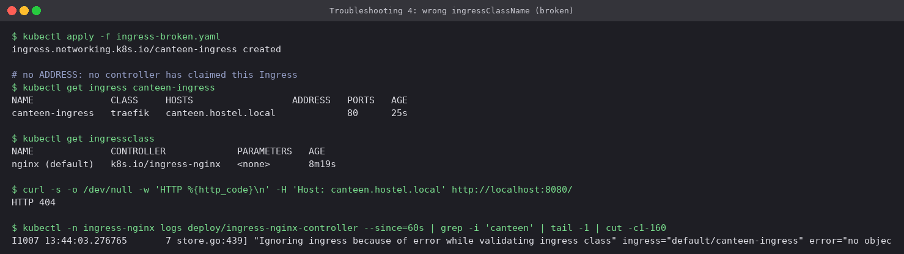
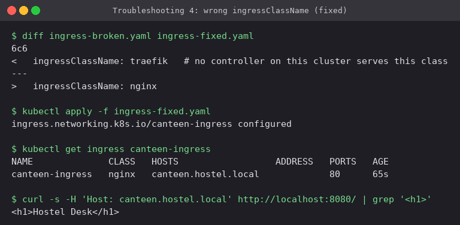
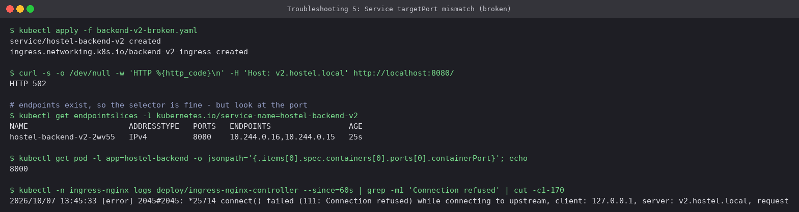
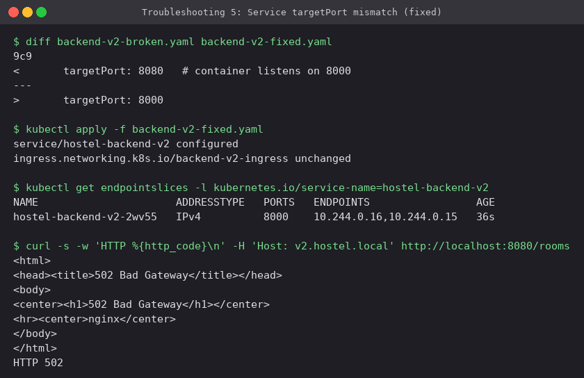

# Troubleshooting ConfigMaps, Secrets and Ingress

Five faults that are easy to make and do not always look like what they are. Each folder
has a `*-broken.yaml` and a `*-fixed.yaml`. Every scenario was applied on the Minikube
cluster with the Hostel Desk app from the [main README](../README.md) running. The Ingress
controller was reached on `localhost:8080` through a port-forward.

## 1. Secret with a trailing newline

[`01-secret-newline/`](01-secret-newline): `warden-api` only answers when the `X-Api-Key`
header matches its `API_KEY` exactly. The key in the broken Secret was encoded with
`echo 'wdn-9f2c71' | base64`, which leaves out `-n`.



**Symptom:** `401 Unauthorized` even though the client sends the right key, and decoding the
Secret prints exactly that key. **Diagnosis:** `od -c` shows an extra `\n` byte, and the app
log (`expected='wdn-9f2c71\n'`) confirms it. **Fix:** re-encode with `echo -n`, or use
`stringData` / `kubectl create secret --from-literal` so nobody encodes by hand. Then
**recreate the Pod**, because an env var is read only once at start-up.



The first attempt at this scenario used Postgres. It authenticated successfully even with the
newline, because the Postgres image's entrypoint trims the value before it sets the password.
That is why this one uses an app that compares the bytes as they are.

## 2. ConfigMap key that does not exist

[`02-configmap-missing-key/`](02-configmap-missing-key): the Pod asks for `FINE_PER_DAYS`,
but the ConfigMap has `FINE_PER_DAY`.



**Symptom:** `CreateContainerConfigError`, so the container is never started and there are no
logs to read. **Diagnosis:** the event says `couldn't find key FINE_PER_DAYS in ConfigMap
default/library-config`. Comparing that with `.data` shows the typo. **Fix:** correct the key.
If the value really is optional, `optional: true` on the `configMapKeyRef` lets the Pod start
without it.



## 3. Ingress points at a Service that does not exist

[`03-ingress-wrong-service/`](03-ingress-wrong-service): the backend is set to
`hostel-frontend-svc`, but the Service is called `hostel-frontend`.



**Symptom:** **503** from the controller. **Diagnosis:** `kubectl describe ingress` resolves
every backend and prints `<error: services "hostel-frontend-svc" not found>`, and the access
log shows the request going to an empty upstream `[default-hostel-frontend-svc-80] []`.
**Fix:** use the real Service name.



## 4. Wrong `ingressClassName`

[`04-wrong-ingress-class/`](04-wrong-ingress-class): `ingressClassName: traefik` on a cluster
that only has the `nginx` class.



**Symptom:** **404** from the default backend, plus a blank `ADDRESS`. No controller has
claimed the Ingress. **Diagnosis:** `kubectl get ingressclass` lists only `nginx`, and the
controller log says `Ignoring ingress because of error while validating ingress class`.
**Fix:** `ingressClassName: nginx`. In the fixed screenshot the route already works while
`ADDRESS` is still empty. The controller updates Ingress status on its own schedule, so an
empty ADDRESS for a few seconds does not mean the Ingress is broken.



## 5. Service `targetPort` does not match the container

[`05-service-wrong-targetport/`](05-service-wrong-targetport): `targetPort: 8080`, but the
Python API listens on `8000`.



**Symptom:** **502 Bad Gateway**. **Diagnosis:** the EndpointSlice *has* both Pod IPs, so the
selector is right, but it lists port `8080`, while the Pod spec says `containerPort: 8000`.
The controller log has `connect() failed (111: Connection refused) while connecting to
upstream`. **Fix:** `targetPort: 8000`. Naming the container port (`name: http`) and using
`targetPort: http` avoids this whole class of mistake.



## Which symptom means what

| You see | Most likely cause | First command |
|---|---|---|
| `CreateContainerConfigError` | Missing ConfigMap/Secret or key | `kubectl describe pod` (Events) |
| Auth fails, value "looks right" | Invisible byte (newline, space) in a Secret | `... \| base64 -d \| od -c` |
| Config change not picked up | Env vars are read once, at start-up | `kubectl rollout restart` |
| **404** from the controller | No rule matched: host, path or class | `kubectl get ingress` / `ingressclass` |
| **503** from the controller | Backend Service missing or has no endpoints | `kubectl describe ingress` |
| **502** from the controller | Endpoints exist but the port refuses | `kubectl get endpointslices` vs `containerPort` |
| Ingress has no ADDRESS | No controller claimed it (yet) | controller logs |

## Cleanup

```bash
kubectl delete -f . --recursive --ignore-not-found
```

---

**Prince Shakya** · Roll No. 24BCS10084
