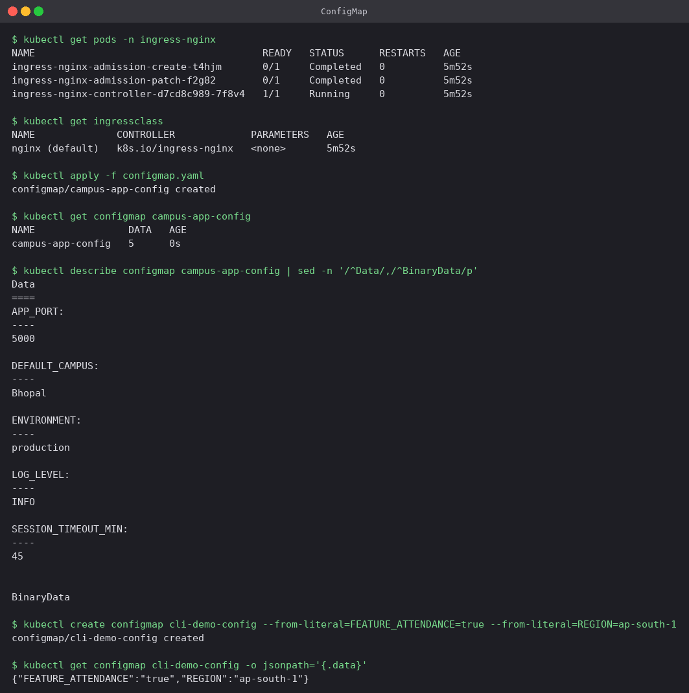
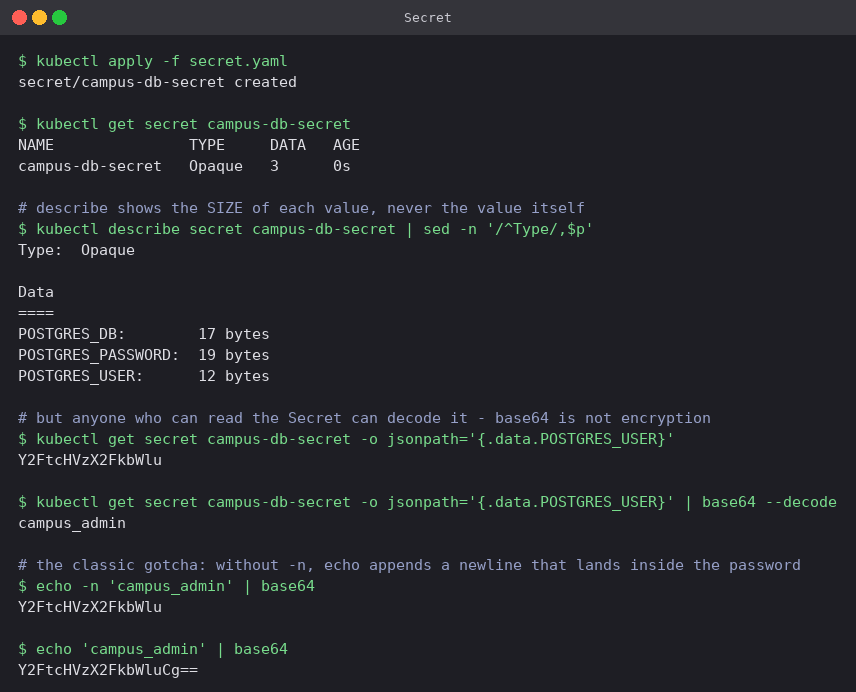

# Kubernetes Ingress, ConfigMaps and Secrets

Configuration pulled out of the image, credentials kept separate from it, and a single HTTP
entry point routing to two Services by path. Manifests are in [`manifests/`](manifests) and
everything below is from a real run on the Minikube cluster.

| Object | Purpose |
|---|---|
| **ConfigMap** | Non-sensitive settings as key-value pairs, stored outside the image |
| **Secret** | Sensitive values (passwords, tokens, TLS keys), base64-encoded |
| **Ingress** | HTTP routing rules — host and path — in front of many Services |
| **Ingress Controller** | The reverse proxy (NGINX here) that actually reads Ingress objects and serves traffic |

What gets built:

```text
                         Host: campus.local
  curl / browser ──────────► NGINX Ingress Controller
                                     │
                    path /           │           path /api/...
                    ▼                                ▼
       campus-frontend-service            campus-backend-service    (both ClusterIP)
                    ▼                                ▼
          2 × Nginx Pods                    2 × Python API Pods
                                             ▲                ▲
                                        ConfigMap           Secret
                                    campus-app-config   campus-db-secret
```

## 0. The Ingress controller

An Ingress object on its own does nothing at all — it is only data until a controller reads
it. On Minikube the NGINX controller comes as an addon:

```bash
minikube addons enable ingress
kubectl get pods -n ingress-nginx
kubectl get ingressclass
```

The `ingressclass` output shows `nginx (default)`, which is what `ingressClassName: nginx` in
the Ingress manifest selects.

## 1. ConfigMap

[`manifests/configmap.yaml`](manifests/configmap.yaml)

```bash
kubectl apply -f configmap.yaml
kubectl get configmap campus-app-config
kubectl describe configmap campus-app-config | sed -n '/^Data/,/^BinaryData/p'

# ConfigMaps can also be built straight from the CLI
kubectl create configmap cli-demo-config \
  --from-literal=FEATURE_ATTENDANCE=true --from-literal=REGION=ap-south-1
kubectl get configmap cli-demo-config -o jsonpath='{.data}'
```



A ConfigMap is plain text — `describe` prints every value in full, which is precisely the
difference from a Secret in the next section. The point of it is that the *same image* runs in
dev and in production with different ConfigMaps attached, so a config change never requires a
rebuild.

`--from-literal` (and `--from-file`, and `--from-env-file`) are the quick imperative routes;
for anything that lives in Git the YAML form is what you want.

## 2. Secret

[`manifests/secret.yaml`](manifests/secret.yaml)

```bash
kubectl apply -f secret.yaml
kubectl get secret campus-db-secret
kubectl describe secret campus-db-secret | sed -n '/^Type/,$p'

kubectl get secret campus-db-secret -o jsonpath='{.data.POSTGRES_USER}'
kubectl get secret campus-db-secret -o jsonpath='{.data.POSTGRES_USER}' | base64 --decode

echo -n 'campus_admin' | base64
echo 'campus_admin' | base64
```



Three things this run makes concrete:

- `kubectl describe secret` prints only the **size** of each value (`12 bytes`), never the
  value. That is a display convenience, not a security boundary.
- One `jsonpath` plus `base64 --decode` gets the password back in plain text. Values under
  `data:` are **encoded, not encrypted**. Anything that can read the Secret can read the
  secret. Real protection comes from RBAC restricting who can `get` it, encryption at rest for
  etcd, and keeping Secret YAML out of Git entirely (Sealed Secrets, SOPS, or an external
  vault).
- **The `echo -n` trap**, visible in the last two lines: `echo -n 'campus_admin' | base64`
  gives `Y2FtcHVzX2FkbWlu`, but dropping `-n` gives `Y2FtcHVzX2FkbWluCg==`. The extra `Cg==`
  is an encoded newline that becomes part of the password, producing authentication failures
  that look inexplicable because the value *looks* right everywhere you print it. Use
  `echo -n`, or sidestep it completely by writing plain text under `stringData:` and letting
  Kubernetes do the encoding.

## 3. Injecting both into the applications

[`manifests/frontend.yaml`](manifests/frontend.yaml),
[`manifests/backend.yaml`](manifests/backend.yaml)

The backend deliberately uses both injection styles so the difference is visible in one place:

```yaml
envFrom:
  - configMapRef:
      name: campus-app-config      # every key becomes an env var
env:
  - name: POSTGRES_USER
    valueFrom:
      secretKeyRef:                # one named key, chosen explicitly
        name: campus-db-secret
        key: POSTGRES_USER
```

```bash
kubectl apply -f frontend.yaml -f backend.yaml
kubectl rollout status deployment/campus-frontend --timeout=300s
kubectl rollout status deployment/campus-backend --timeout=300s
kubectl get pods,svc | grep -E 'NAME|campus'
kubectl exec deploy/campus-backend -- env | grep -E 'ENVIRONMENT|POSTGRES_USER' | sort
```


Inside the container both sources have collapsed into ordinary environment variables, and the
Secret values arrive **already decoded** (`POSTGRES_USER=campus_admin`). The application code
needs to know nothing about Kubernetes — it just reads its environment.

One caveat worth remembering: environment variables are read once at process start, so editing
a ConfigMap does **not** update running Pods. They need `kubectl rollout restart
deployment/<name>`. A ConfigMap mounted as a *volume* does get refreshed in place, which is
the reason to prefer volumes for anything that changes often.

## 4. Ingress

[`manifests/ingress.yaml`](manifests/ingress.yaml): host `campus.local`, with
`/api(/|$)(.*)` → backend (rewritten by `rewrite-target: /$2`) and `/` → frontend.

Rather than editing `/etc/hosts`, the controller was reached through a port-forward and the
hostname supplied as a header — routing is decided by the `Host` header either way, so the
result is identical:

```bash
kubectl port-forward -n ingress-nginx svc/ingress-nginx-controller 8081:80

kubectl apply -f ingress.yaml
kubectl get ingress campus-ingress
kubectl describe ingress campus-ingress | sed -n '/^Rules/,/^Annotations/p'

curl -s -H 'Host: campus.local' http://localhost:8081/        | head -9
curl -s -H 'Host: campus.local' http://localhost:8081/api/
curl -s -o /dev/null -w 'HTTP %{http_code}\n' -H 'Host: nowhere.local' http://localhost:8081/
```


- **One entry point, two Services.** `/` returned the frontend HTML and `/api/` returned the
  backend's plain-text response, both on the same port. Neither Service is exposed outside the
  cluster — they are both plain ClusterIP.
- `describe ingress` resolves each rule down to actual Pod endpoints
  (`10.244.0.31:5000,10.244.0.32:5000`), which makes it the fastest way to tell "the Ingress
  is wrong" apart from "the Service has no Pods".
- The backend response carries `ENVIRONMENT: production` and `DEFAULT_CAMPUS: Bhopal` from the
  **ConfigMap** and `POSTGRES_USER: campus_admin` from the **Secret**. That single body proves
  the entire chain end to end: Ingress → Service → Pod → injected configuration.
- `rewrite-target: /$2` strips the `/api` prefix, so the backend sees `/` and does not need to
  know the public path it is mounted at.
- `Host: nowhere.local` returned **404** from the controller's default backend. No rule
  matched, so routing really is host-based — one controller can serve many unrelated
  hostnames.

Compared with giving every Service its own LoadBalancer, an Ingress needs one external address
total and adds path routing, host routing and TLS termination in a single object.

## Resource Teardown

```bash
kubectl delete -f manifests/
kubectl delete configmap cli-demo-config
```

---

**Prince Shakya** · Roll No. DevOps Student
