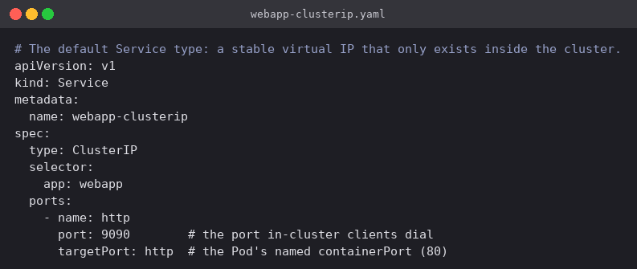
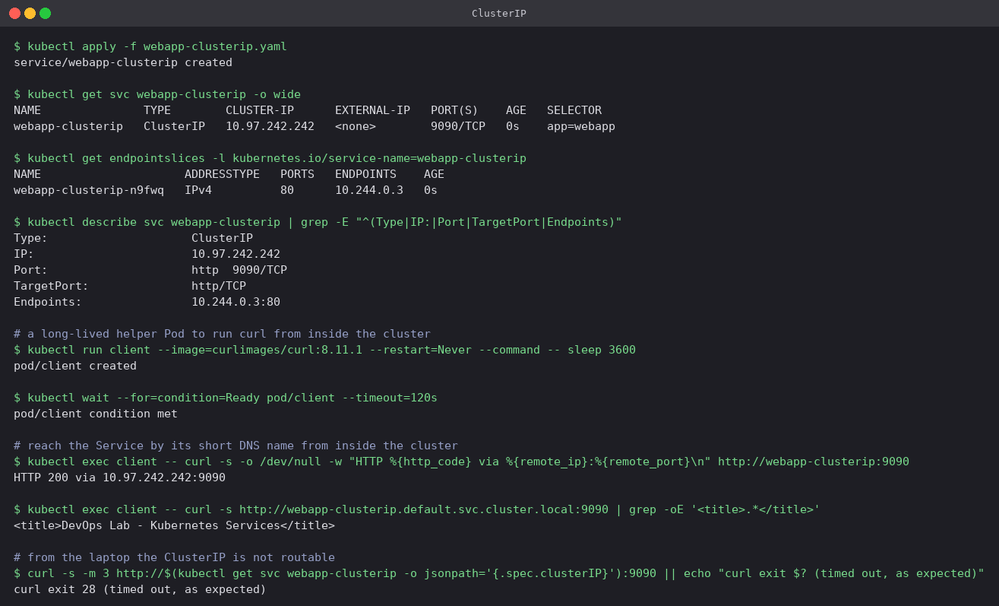
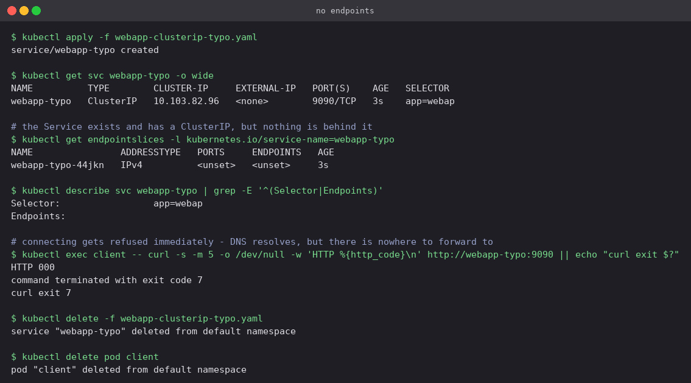

# ClusterIP

This is what you get when you write `kind: Service` and say nothing about the type. Kubernetes
picks a free address out of the service CIDR, and kube-proxy programs the node so that packets
sent to that address and port land on one of the Pods matched by the selector. The address is
not attached to any network interface — it only means something to the forwarding rules inside
the cluster, which is exactly why nothing outside can reach it.

That makes it the right choice for everything that only other Pods need to talk to: a backend
sitting behind a frontend, a Redis cache, an internal API.

## Manifest

[`webapp-clusterip.yaml`](webapp-clusterip.yaml): selects `app: webapp`, listens on port
`9090`, and forwards to the Pod's named `http` port (80). The Service port and the container
port deliberately differ here so it is obvious which is which in the output.



## Commands

```bash
kubectl apply -f webapp-clusterip.yaml
kubectl get svc webapp-clusterip -o wide
kubectl get endpointslices -l kubernetes.io/service-name=webapp-clusterip
kubectl describe svc webapp-clusterip | grep -E "^(Type|IP:|Port|TargetPort|Endpoints)"

# a long-lived helper Pod to run curl from inside the cluster
kubectl run client --image=curlimages/curl:8.11.1 --restart=Never --command -- sleep 3600
kubectl wait --for=condition=Ready pod/client --timeout=120s

kubectl exec client -- curl -s -o /dev/null -w "HTTP %{http_code} via %{remote_ip}:%{remote_port}\n" http://webapp-clusterip:9090
kubectl exec client -- curl -s http://webapp-clusterip.default.svc.cluster.local:9090 | grep -oE '<title>.*</title>'

# from the laptop
curl -s -m 3 http://$(kubectl get svc webapp-clusterip -o jsonpath='{.spec.clusterIP}'):9090
```

## What happened

- The Service was given ClusterIP `10.97.242.242`. Its EndpointSlice lists `10.244.0.3` on
  port 80 — that is the `webapp` Pod, so the label selector matched as intended. Note that the
  EndpointSlice records the *container* port, not the Service port: `targetPort: http` has
  already been resolved to 80 by this stage.
- From the `client` Pod, `curl http://webapp-clusterip:9090` returned `HTTP 200`, and curl's
  own `%{remote_ip}` reports that it connected to `10.97.242.242:9090` — the virtual IP, not
  the Pod IP. The client never learns which Pod served it.
- The fully qualified name `webapp-clusterip.default.svc.cluster.local` resolves the same way
  and returned the page, `<title>DevOps Lab - Kubernetes Services</title>`. The short name
  works only because both Pods are in the `default` namespace and the search domain fills in
  the rest.
- Running the same request from the laptop against `10.97.242.242:9090` hung and curl gave up
  with exit code 28 after the three second timeout. That is not a misconfiguration — it is the
  entire point of this Service type.



## What a broken selector looks like

The selector is the only thing connecting a Service to its Pods, and a typo in it fails
quietly — the Service is created successfully and looks healthy at a glance.
[`webapp-clusterip-typo.yaml`](webapp-clusterip-typo.yaml) is the same manifest with
`app: webap`, one letter short.

```bash
kubectl apply -f webapp-clusterip-typo.yaml
kubectl get svc webapp-typo -o wide
kubectl get endpointslices -l kubernetes.io/service-name=webapp-typo
kubectl describe svc webapp-typo | grep -E '^(Selector|Endpoints)'
kubectl exec client -- curl -s -m 5 -o /dev/null -w 'HTTP %{http_code}\n' http://webapp-typo:9090
```



- `kubectl get svc` looks completely normal: a type, a ClusterIP, a port. Nothing here says
  anything is wrong.
- The tell is `Endpoints:` being **empty** in `describe`, and the EndpointSlice existing but
  listing `<unset>` addresses. The Service was created, it just matches nothing.
- `curl` failed instantly with exit code 7 (connection refused) rather than hanging. That is
  the useful distinction when debugging: a *timeout* usually means a network or firewall
  problem, while an *immediate refusal* on a name that resolves usually means the Service has
  no endpoints behind it.

`kubectl get endpointslices` is therefore the first command to run whenever a Service "exists
but doesn't work" — it answers "is anything actually behind this?" in one line.
