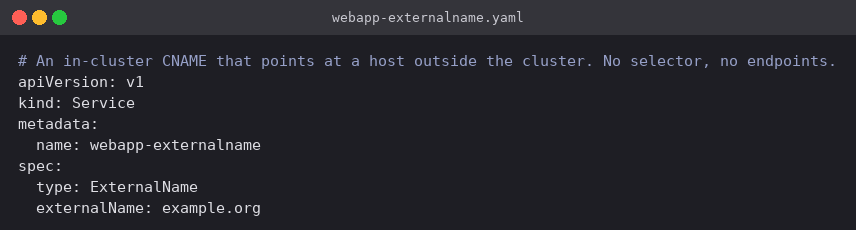
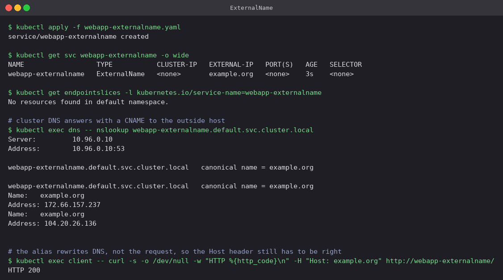

# ExternalName

An ExternalName Service is the odd one out: no selector, no ClusterIP, no EndpointSlice, no
Pods involved anywhere. All it does is tell cluster DNS to answer
`webapp-externalname.default.svc.cluster.local` with a CNAME record pointing at whatever
`externalName` is set to. There is no proxying and no traffic path — CoreDNS is the only
component that ever knows the Service exists.

What it buys you is indirection. A managed database, a payment API, an S3 endpoint can be
referred to by a stable in-cluster name, and when the real hostname changes you edit one
Service instead of redeploying every application that had the hostname baked into its config.

## Manifest

[`webapp-externalname.yaml`](webapp-externalname.yaml): `type: ExternalName` and
`externalName: example.org`. There is nothing else to write — a `ports` block would be ignored.



## Commands

```bash
kubectl apply -f webapp-externalname.yaml
kubectl get svc webapp-externalname -o wide
kubectl get endpointslices -l kubernetes.io/service-name=webapp-externalname
kubectl exec dns -- nslookup webapp-externalname.default.svc.cluster.local
kubectl exec client -- curl -s -o /dev/null -w "HTTP %{http_code}\n" -H "Host: example.org" http://webapp-externalname/
```

## What happened

- `TYPE` is `ExternalName`, `CLUSTER-IP` is `<none>`, `EXTERNAL-IP` holds `example.org` and
  `SELECTOR` is `<none>`. Asking for its EndpointSlices returns `No resources found` — there
  is nothing to enumerate, because no Pod is being tracked.
- `nslookup` returned `canonical name = example.org` and then example.org's real A records
  (`172.66.157.237` and `104.20.26.136`). CoreDNS supplied the CNAME and the upstream resolver
  completed the chain, which is why the answer contains addresses CoreDNS knows nothing about.
- `curl http://webapp-externalname/` returned `HTTP 200`, but only with an explicit
  `Host: example.org` header. This is the classic gotcha with ExternalName and HTTP: the alias
  rewrites **DNS**, not the request. The connection genuinely ends up at example.org's servers,
  and they have no idea what `webapp-externalname` is, so a request carrying that Host header
  gets rejected or misrouted. The same problem shows up with TLS, where the certificate is
  issued for the real hostname and SNI has to match it.


