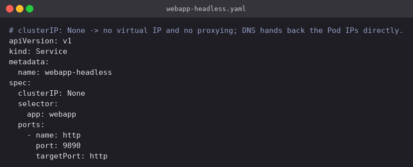
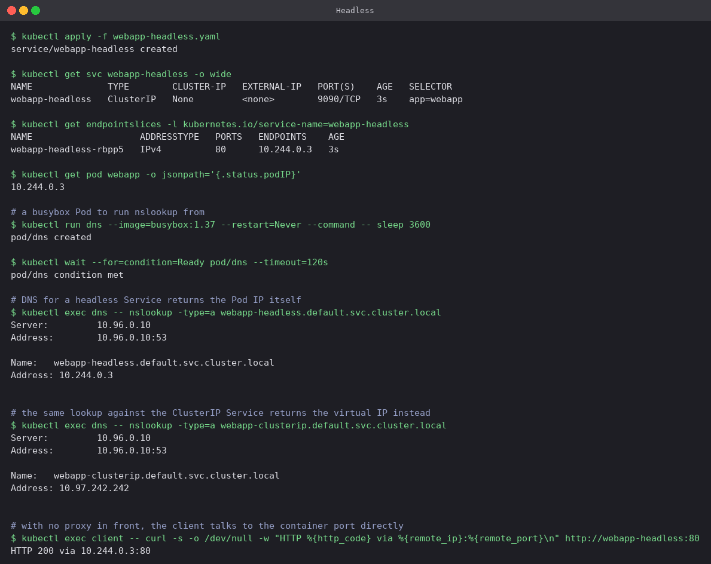

# Headless

Setting `clusterIP: None` switches off the virtual IP and takes kube-proxy out of the path
completely. The Service still watches the selector and still maintains an EndpointSlice, but
DNS now answers a lookup of the Service name with the **Pod IPs themselves** rather than with
one virtual address. Clients connect straight to a Pod, and nothing sits in between doing
load balancing.

That sounds like a downside until you need it. StatefulSets depend on it: each replica gets
its own stable DNS name (`db-0`, `db-1`, …) so that a client which must reach one specific
member — a database primary, a particular Kafka broker, a peer in a cluster that does its own
replication — is able to do so.

## Manifest

[`webapp-headless.yaml`](webapp-headless.yaml): no `type` field at all, `clusterIP: None`, and
the same selector as everything else.



## Commands

```bash
kubectl apply -f webapp-headless.yaml
kubectl get svc webapp-headless -o wide
kubectl get endpointslices -l kubernetes.io/service-name=webapp-headless
kubectl get pod webapp -o jsonpath='{.status.podIP}'

# a busybox Pod to run nslookup from
kubectl run dns --image=busybox:1.37 --restart=Never --command -- sleep 3600
kubectl wait --for=condition=Ready pod/dns --timeout=120s

kubectl exec dns -- nslookup -type=a webapp-headless.default.svc.cluster.local
kubectl exec dns -- nslookup -type=a webapp-clusterip.default.svc.cluster.local   # for comparison
kubectl exec client -- curl -s -o /dev/null -w "HTTP %{http_code} via %{remote_ip}:%{remote_port}\n" http://webapp-headless:80
```

## What happened

- `CLUSTER-IP` is literally `None`. The EndpointSlice still exists and still lists
  `10.244.0.3`, so the Service is tracking Pods normally — it just has no address of its own.
- `nslookup webapp-headless.default.svc.cluster.local` answered `10.244.0.3`. The same lookup
  against `webapp-clusterip` answered `10.97.242.242`. Running those two commands back to back
  is the clearest way to see the difference: one returns a Pod, the other returns a virtual IP.
  With several replicas the headless lookup would return an A record per Pod.
- `curl http://webapp-headless:80` connected to `10.244.0.3:80` — the Pod itself. The port is
  worth dwelling on: because no proxy is involved, the Service's `port: 9090` does not apply to
  an ordinary connection and the client has to use the container's real port. `port` on a
  headless Service only really matters for SRV records.
- `nslookup` is given `-type=a` and the fully qualified name on purpose. Without them busybox
  also tries AAAA and walks the search domains, which buries the answer in NXDOMAIN noise.


