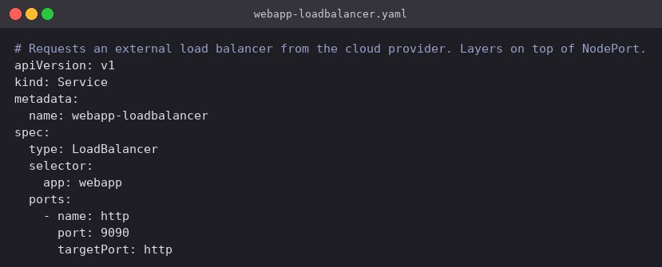
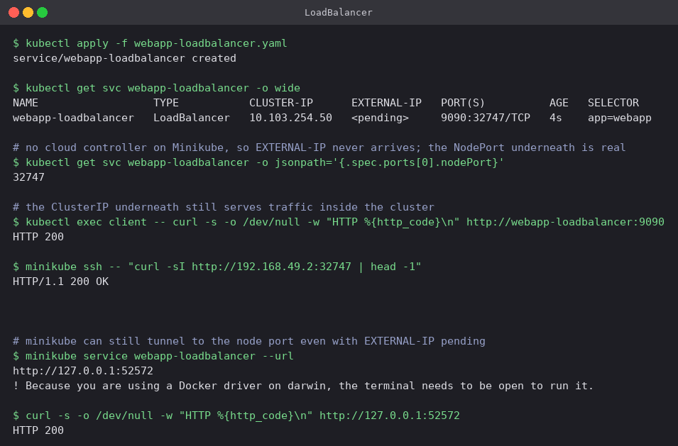

# LoadBalancer

`type: LoadBalancer` is the normal way a Service gets a public address on a managed cloud.
Kubernetes sets up the ClusterIP and the NodePort exactly as before, and then the cloud
controller manager asks the provider for a load balancer that forwards to that node port
across the nodes. On AWS that is an NLB or ELB, on GCP a forwarding rule, on Azure a public
Load Balancer.

The important consequence: the cloud resource is created by a controller running *in* the
cluster. No controller, no load balancer.

## Manifest

[`webapp-loadbalancer.yaml`](webapp-loadbalancer.yaml): same selector, same ports, only the
type changes. No `nodePort` is specified, so Kubernetes allocates one.



## Commands

```bash
kubectl apply -f webapp-loadbalancer.yaml
kubectl get svc webapp-loadbalancer -o wide
kubectl get svc webapp-loadbalancer -o jsonpath='{.spec.ports[0].nodePort}'

kubectl exec client -- curl -s -o /dev/null -w "HTTP %{http_code}\n" http://webapp-loadbalancer:9090
minikube ssh -- "curl -sI http://192.168.49.2:32747 | head -1"
minikube service webapp-loadbalancer --url
```

## What happened

- `EXTERNAL-IP` shows `<pending>`, and it stays that way indefinitely. Minikube ships no cloud
  controller manager, so the request is recorded and never fulfilled by anybody. This is the
  expected result on a local cluster, not an error, and the Service is not broken because of
  it.
- Everything beneath the missing external IP was built anyway, which is the useful thing to
  see here. The Service has ClusterIP `10.103.254.50`, Kubernetes automatically allocated node
  port `32747`, `curl` from the `client` Pod returned `HTTP 200`, and `curl` from inside the
  node against port 32747 returned `HTTP/1.1 200 OK`.
- That is the layering made concrete: a LoadBalancer Service *is* a NodePort Service *is* a
  ClusterIP Service, with one more thing bolted on top that happens to be unavailable here.
- `minikube service --url` tunnels to the node port the same way it did for NodePort, and the
  page loaded in the browser. (`minikube tunnel`, run in a second terminal, would go further
  and assign a real `EXTERNAL-IP` by emulating the cloud side — it needs `sudo` and was not
  necessary to show the point.)



