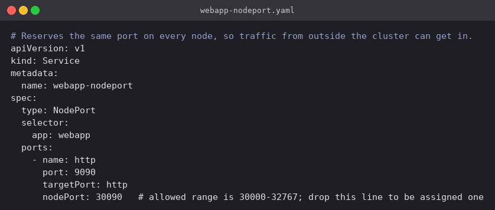
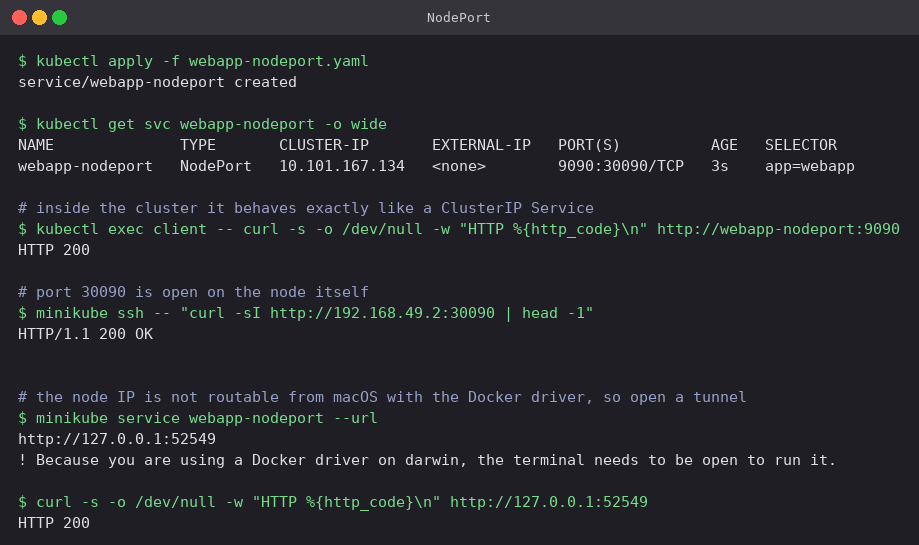

# NodePort

A NodePort Service is a ClusterIP Service with one addition: kube-proxy reserves the same
high-numbered port on **every node in the cluster** and forwards anything arriving there to
the Service. Reach any node's IP on that port and you reach the app — it does not matter
whether the Pod happens to be running on that particular node, because the node will forward
the traffic on if it is not.

The port has to fall in the 30000–32767 range. Pinning it, as done here, keeps the URL
predictable; leaving `nodePort` out lets Kubernetes allocate one.

## Manifest

[`webapp-nodeport.yaml`](webapp-nodeport.yaml): the same selector and ports as the ClusterIP
Service, with `type: NodePort` and a fixed `nodePort: 30090`.



## Commands

```bash
kubectl apply -f webapp-nodeport.yaml
kubectl get svc webapp-nodeport -o wide

# it is still a ClusterIP Service underneath
kubectl exec client -- curl -s -o /dev/null -w "HTTP %{http_code}\n" http://webapp-nodeport:9090

# port 30090 is open on the node itself
minikube ssh -- "curl -sI http://192.168.49.2:30090 | head -1"

# from the laptop
minikube service webapp-nodeport --url
```

## What happened

- `PORT(S)` reads `9090:30090/TCP`, which is the whole Service type in one column: 9090 on the
  ClusterIP, 30090 on the node. The ClusterIP (`10.101.167.134`) is still there and still
  works.
- From the `client` Pod, `webapp-nodeport:9090` returned `HTTP 200` exactly as the ClusterIP
  Service did. Nothing about in-cluster access changed.
- `minikube ssh` puts the shell on the node itself, and from there
  `curl http://192.168.49.2:30090` returned `HTTP/1.1 200 OK` — the node port is genuinely
  listening.
- From macOS, `192.168.49.2` is not routable. With the Docker driver the "node" is a container
  on Docker's own bridge network, which lives inside the Docker VM and has no route from the
  host. This is a macOS/Docker-driver limitation, not something about NodePort: on a real
  cluster, or on Linux, the node IP would be reachable directly.
- `minikube service webapp-nodeport --url` works around it by publishing a tunnel on
  `127.0.0.1` and printing the URL. `curl` against that URL returned 200 and the page loaded in
  the browser. The tunnel only lives as long as that command keeps running, which is what the
  warning in the output is about.



