# Kubernetes Storage, HPA and Probes

Three things a Deployment needs before it is production-ready: data that outlives Pods,
replica counts that follow load, and health checks that let Kubernetes route around (or
restart) unhealthy containers. Everything below was run on the single-node Minikube cluster
(Docker driver) with the `metrics-server` addon enabled (`minikube addons enable
metrics-server`).

```text
Kubernetes Storage HPA and Probes/
├── volumes/        emptyDir, hostPath, static PV/PVC, dynamic PVC
├── hpa/            CPU-bound Deployment, Service, HPA, load generator
├── probes/         liveness, readiness, startup - healthy and broken
├── mini-project/   namespace + PVC + Deployment (resources, 3 probes) + Service + HPA
└── screenshots/
```

## 1. Volumes

A container's filesystem is thrown away on every restart. Volumes are how a Pod gets
storage with a different lifetime:

| Type | Lives as long as | Typical use |
|---|---|---|
| `emptyDir` | the Pod | scratch space, sharing files between containers of one Pod |
| `emptyDir.medium: Memory` | the Pod (RAM-backed tmpfs) | fast cache, counts against memory |
| `hostPath` | the node | node agents, logs; ties the Pod to one node |
| PersistentVolume + Claim | independent of any Pod | databases, uploads, anything that must survive |

### emptyDir

[`volumes/emptydir-shared.yaml`](volumes/emptydir-shared.yaml): a `writer` container appends
roll-call lines to `/shared/attendance.log`, and an `nginx` container serves the same
directory. [`volumes/emptydir-memory.yaml`](volumes/emptydir-memory.yaml) is a 64Mi tmpfs.

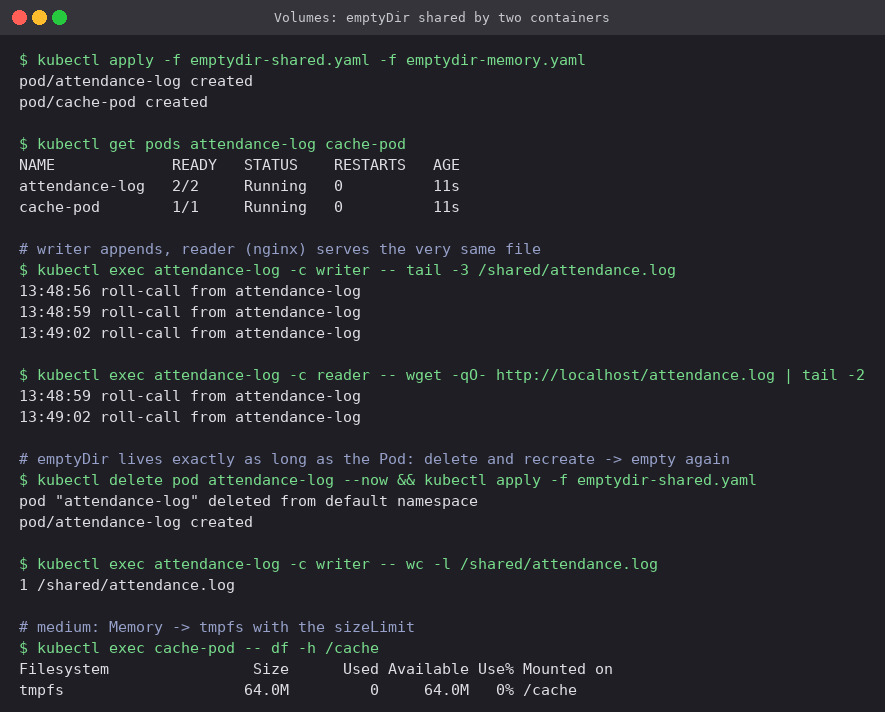

The reader served the very lines the writer had just appended, so two containers shared
one directory. After the Pod was deleted and recreated, the log was back to **1 line**: an
emptyDir is created with the Pod and wiped with it. (A *container* restart inside the same Pod
keeps it.) The Memory variant shows up as `tmpfs 64.0M`.

### hostPath

[`volumes/hostpath-pod.yaml`](volumes/hostpath-pod.yaml) mounts `/data/exam-cell` of the
node.

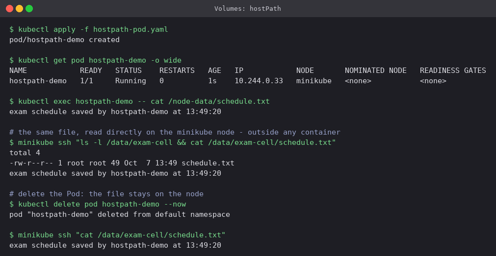

`minikube ssh` reads the same file directly on the node, and it is still there after the Pod
is gone. The catch is that the data belongs to **that node**. On a multi-node cluster a
rescheduled Pod lands on a different node and finds nothing. It also gives the Pod access to
the host filesystem, which is why Pod Security standards block it for normal workloads.

### Static provisioning: PV + PVC

An admin creates the PersistentVolume ([`volumes/pv.yaml`](volumes/pv.yaml): 1Gi, RWO,
`Retain`, class `manual`). A developer creates a claim ([`volumes/pvc.yaml`](volumes/pvc.yaml):
500Mi, RWO, class `manual`, label selector).

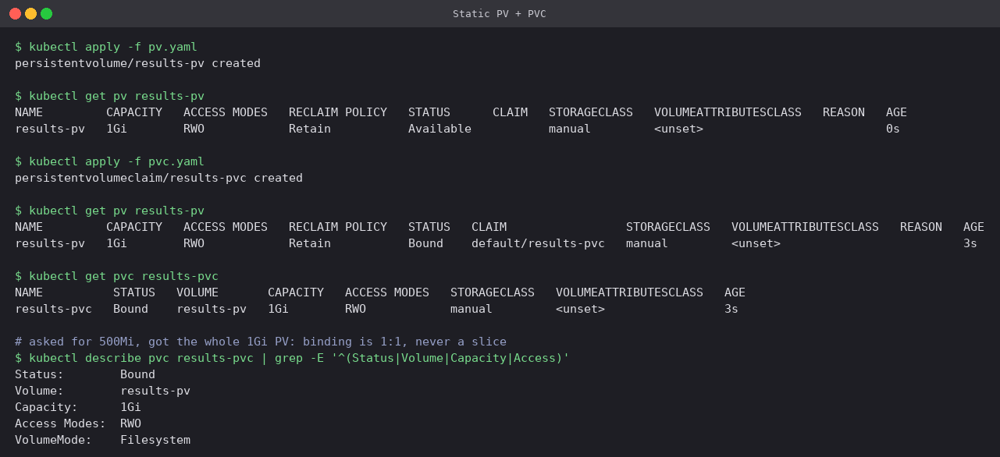

The PV went `Available` → `Bound`. The claim asked for 500Mi but shows **1Gi**: binding is
one PV to one PVC, never a slice, so the claim gets the whole volume.

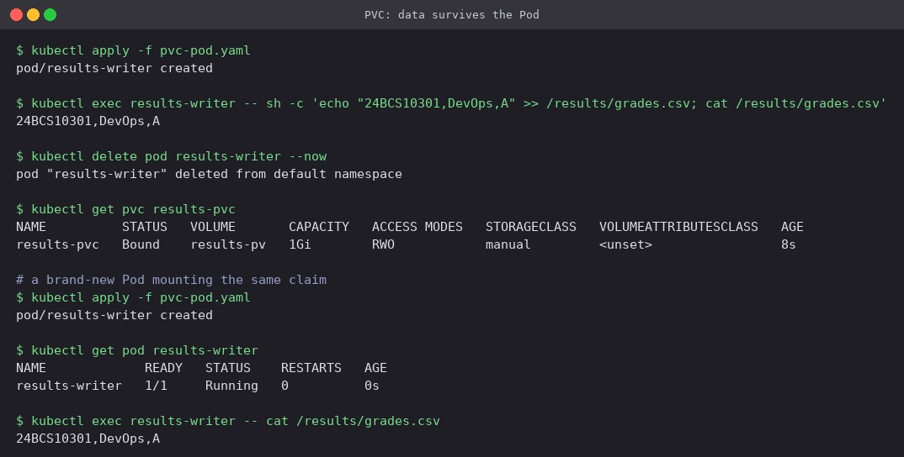

A row was written into `grades.csv`, then the Pod was deleted (the PVC stayed `Bound`). A
completely new Pod mounting the same claim read the row back.

### Dynamic provisioning: StorageClass

[`volumes/dynamic-pvc.yaml`](volumes/dynamic-pvc.yaml) only has a claim. No PV is written.

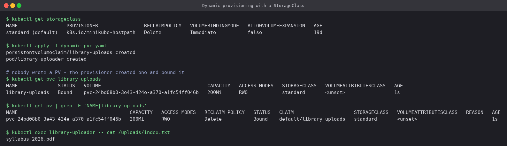

Minikube's default StorageClass `standard` (provisioner `k8s.io/minikube-hostpath`) created
`pvc-24bd08b0-...` of exactly 200Mi and bound it within a second. On a cloud the same YAML
would create an EBS volume or a Persistent Disk. That is why application manifests should
only ever contain claims.

### Reclaim policy and access modes

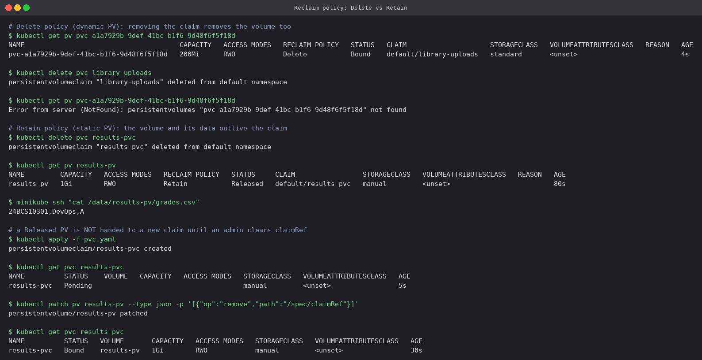

- **Delete** (the default for dynamic PVs): deleting `library-uploads` deleted its PV, and
  `kubectl get pv` returns NotFound.
- **Retain**: deleting `results-pvc` left `results-pv` in **Released** with the data still on
  disk (`grades.csv` printed via `minikube ssh`).
- A Released PV is **not** reused automatically. A new claim stayed `Pending` until the old
  `claimRef` was removed by hand, and then it bound again. This is deliberate: it stops one
  team's leftover data from silently turning up in another team's claim.

Access modes: **RWO** (read-write by one *node*), **ROX** (read-only by many nodes), **RWX**
(read-write by many nodes, needs NFS/EFS/CephFS-type storage), **RWOP** (one *Pod* only).

## 2. Horizontal Pod Autoscaler

[`hpa/`](hpa): `result-calculator` runs `registry.k8s.io/hpa-example`, which burns CPU on
every request, with `requests.cpu: 200m`. The HPA keeps average CPU at **50% of the
request** with 1-6 replicas. Scale-down stabilisation is cut from 300s to 60s so the lab does
not take ten minutes.

```bash
kubectl apply -f deployment.yaml -f service.yaml -f hpa.yaml
kubectl get hpa result-calculator
kubectl apply -f load-generator.yaml        # 3 busybox Pods in a wget loop
kubectl get hpa result-calculator -w
kubectl delete -f load-generator.yaml
```

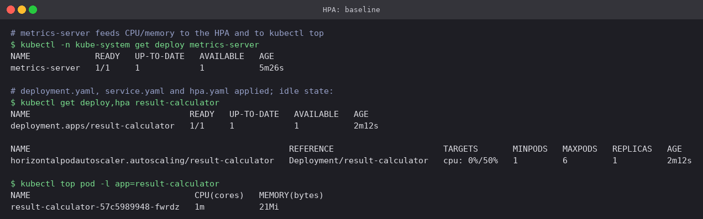

Idle: `cpu: 0%/50%`, 1 replica. Right after creation the target showed `<unknown>` for
about a minute, which is how long metrics-server takes to scrape a new Pod. The HPA cannot
act without that number.

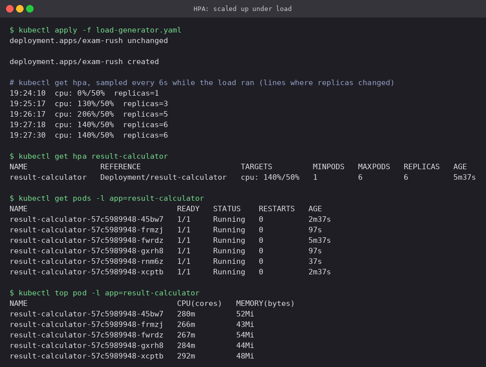

Under load CPU jumped to 130% of the request and the HPA went **1 → 3 → 5 → 6** in steps
about a minute apart. Each step uses `desired = ceil(current × currentCPU / targetCPU)`. With
1 replica at 130% that gives `ceil(1 × 130/50) = 3`. Scale-up is also rate-limited per
period, which is why it did not jump straight to 6. Even at 6 replicas utilisation stayed
above target, and the HPA reported `ScalingLimited: TooManyReplicas` because `maxReplicas`
is a hard cap:

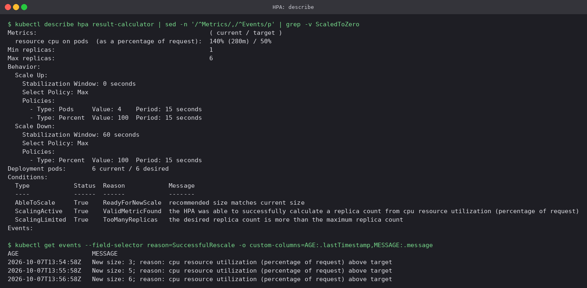

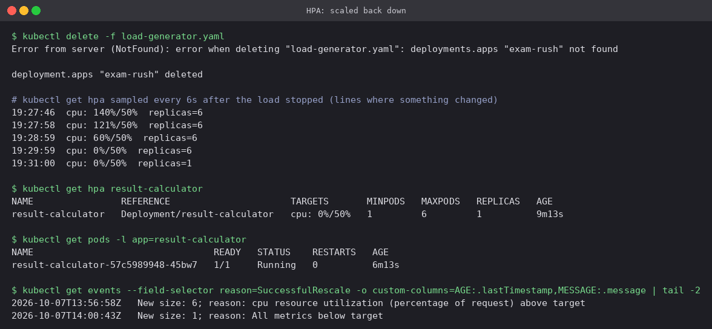

After the load stopped, CPU fell to 0% within two minutes, but replicas stayed at 6 for the
stabilisation window and then dropped **6 → 1** in one step (`All metrics below target`).
Scaling down slowly is on purpose: a short lull should not throw away capacity that will be
needed again moments later.

Without a CPU `request` the HPA has nothing to compute a percentage against, and the target
stays `<unknown>` for good.

## 3. Probes

| Probe | Question | On failure |
|---|---|---|
| **liveness** | Is the process stuck? | container is **restarted** |
| **readiness** | Should it receive traffic now? | removed from Service endpoints, **not** restarted |
| **startup** | Has it finished starting? | liveness/readiness wait; restart once the budget runs out |

Each can be `httpGet`, `tcpSocket`, `exec` or `grpc`.

### Healthy

[`probes/liveness.yaml`](probes/liveness.yaml) (HTTP `/` on nginx) and
[`probes/readiness.yaml`](probes/readiness.yaml). Readiness here is `test -f /tmp/ready`, so it
can be switched off from outside without changing the image.

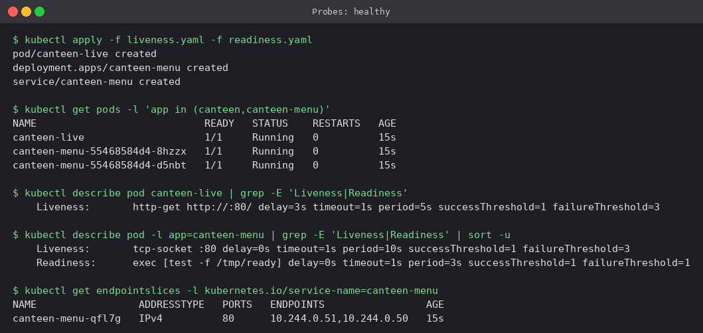

### Broken liveness → restarts → CrashLoopBackOff

[`probes/liveness-broken.yaml`](probes/liveness-broken.yaml) probes `/healthz`, which nginx
answers with 404.

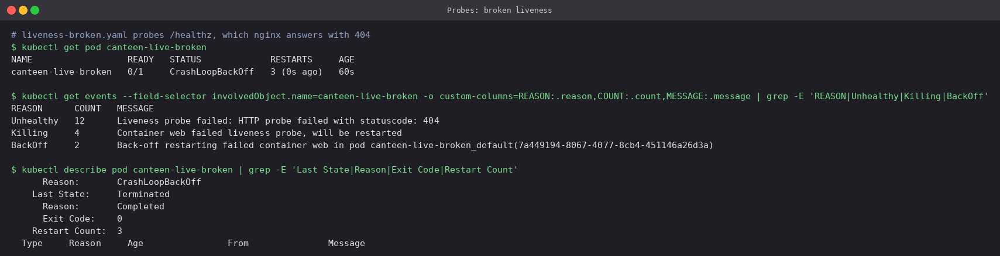

Every 3 failures (`failureThreshold: 3`, 5s apart) the kubelet killed the container: `Killing
... failed liveness probe, will be restarted`. After a few rounds the Pod was in
**CrashLoopBackOff**, with each restart delayed longer. The exit code is **0**
(`Completed`): nginx itself was fine and was shut down cleanly. A bad liveness probe can take
down a perfectly healthy app, which is why liveness checks should be cheap and should never
depend on things like the database.

### Broken readiness → removed from the Service

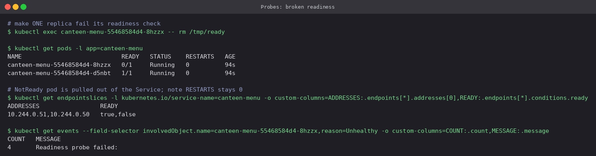

With `/tmp/ready` removed from one replica, that Pod went `0/1` **with RESTARTS still 0**.
The EndpointSlice still lists both IPs but marks one `ready=false`, and kube-proxy only sends
traffic to ready endpoints. The other replica took all the traffic.

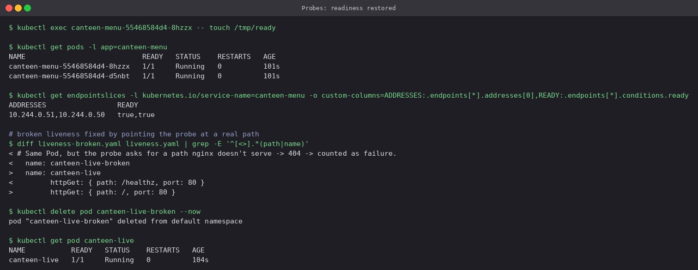

Recreating the file brought it back to `1/1` and `ready=true` within one probe period, still
without a restart. The liveness fix is the one-line path change shown in the `diff`.

### Startup probe: enough budget vs too little

Both Pods ([`probes/startup.yaml`](probes/startup.yaml),
[`probes/startup-too-short.yaml`](probes/startup-too-short.yaml)) need about 30 seconds of
warm-up. The only difference is the startup budget, `failureThreshold × periodSeconds`:
**12 × 5 = 60s** against **3 × 5 = 15s**.

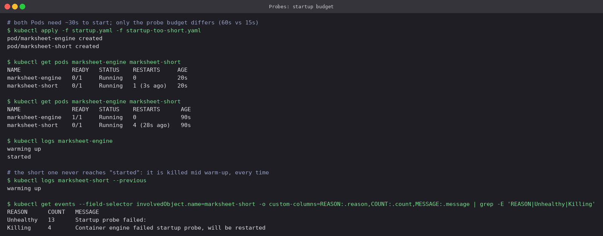

`marksheet-engine` became Ready after warm-up with 0 restarts. `marksheet-short` was killed
at the 15-second mark every time. The previous container's log stops at `warming up` and the
restart count keeps climbing, so it can never start. That is what a startup probe is for: give
slow starters a generous one-off budget instead of a lax liveness probe that would take
equally long to notice a real hang later.

`terminationGracePeriodSeconds: 2` is set because `sh` as PID 1 ignores SIGTERM. With the
default 30s grace period the "killed" container would have finished its warm-up during the
shutdown wait and confused the result.

## 4. Mini project: a production-ready web app

[`mini-project/`](mini-project) has everything in its own `notice-board` namespace:

| File | What |
|---|---|
| `namespace.yaml` | `notice-board` |
| `pvc.yaml` | 256Mi RWO claim, dynamically provisioned |
| `deployment.yaml` | nginx ×2, requests/limits, startup + readiness + liveness probes, PVC mounted as the web root, an init container that seeds the page |
| `service.yaml` | ClusterIP, `targetPort: http` (named port) |
| `hpa.yaml` | 2-5 replicas at 60% CPU |

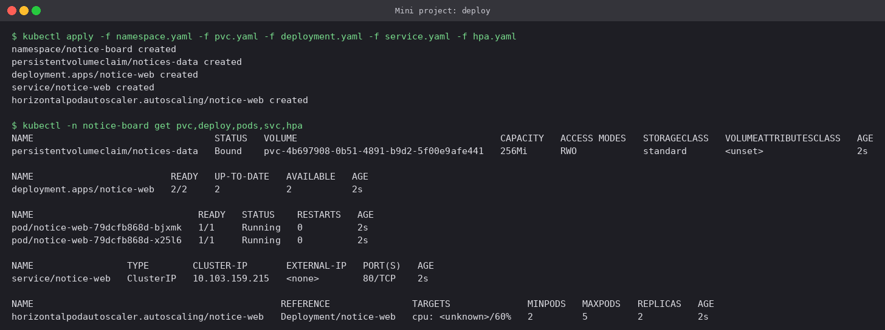

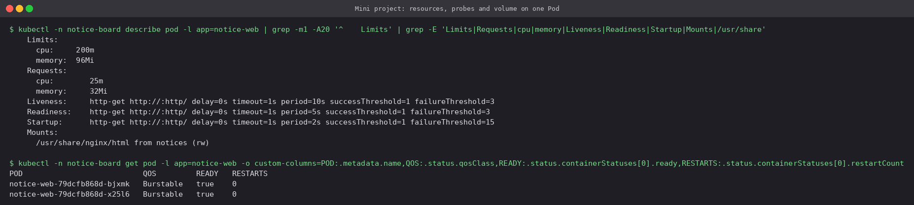

QoS class **Burstable** because requests are lower than limits. Requests are what the
scheduler and the HPA use. Limits are where CPU gets throttled and memory gets OOM-killed.

**Storage persistence.** A notice was appended to `index.html`, **all** Pods were deleted,
and the new Pods served it:

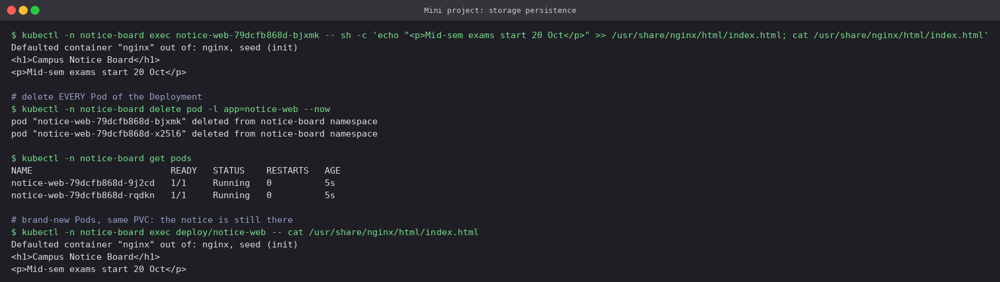

**Service reachability**, both by cluster DNS from another namespace and from the Mac through
a port-forward:

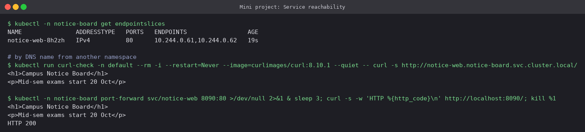

**Elastic scaling.** Four wget loops pushed CPU to 170% of the 25m request, and the HPA went
2 → 5 (the max). With the load removed it settled back at the minimum of 2, not 1:

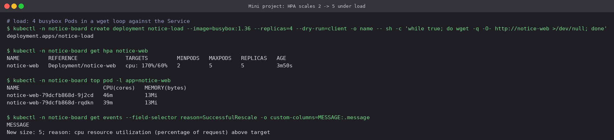
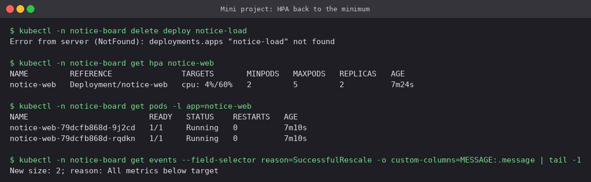

Two RWO replicas share the claim here only because Minikube has a single node. RWO is
enforced per node, so on a multi-node cluster a shared web root would need RWX storage. A
database would use a StatefulSet with one claim per replica.

## Cleanup

```bash
kubectl delete -f volumes/ -f hpa/ -f probes/ --ignore-not-found
kubectl delete namespace notice-board
```

## Cheat sheet

```bash
kubectl get pv,pvc,storageclass
kubectl describe pvc NAME                 # why is it Pending?
kubectl top pod / kubectl top node        # needs metrics-server
kubectl get hpa -w
kubectl describe hpa NAME                 # conditions + rescale events
kubectl autoscale deploy NAME --cpu-percent=50 --min=1 --max=5
kubectl describe pod NAME | grep -E 'Liveness|Readiness|Startup'
kubectl get events --field-selector reason=Unhealthy
kubectl logs POD --previous               # output of the container that was killed
```

---

**Prince Shakya** · Roll No. 24BCS10084
