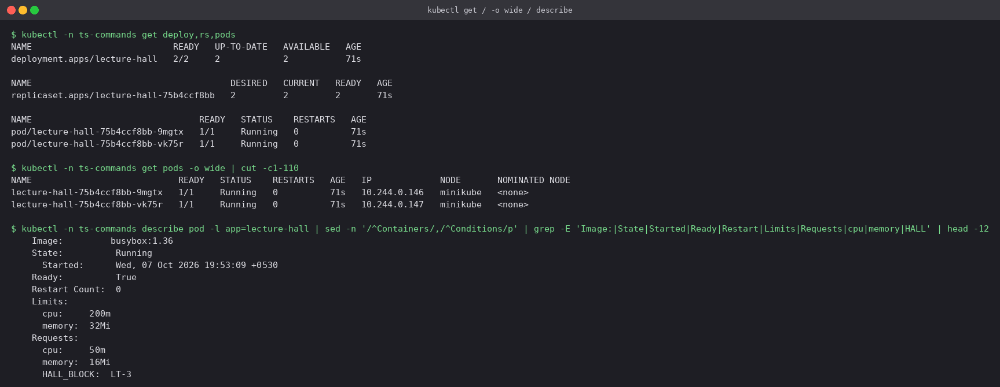
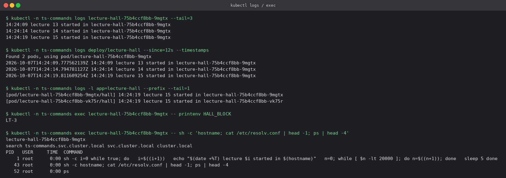
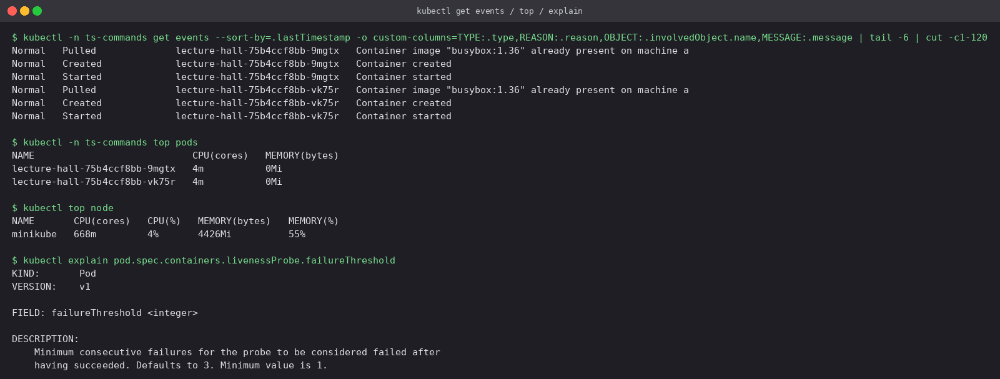
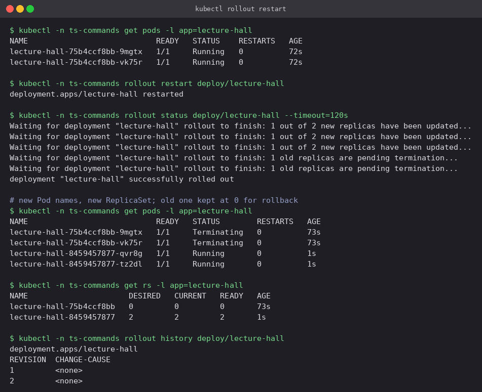
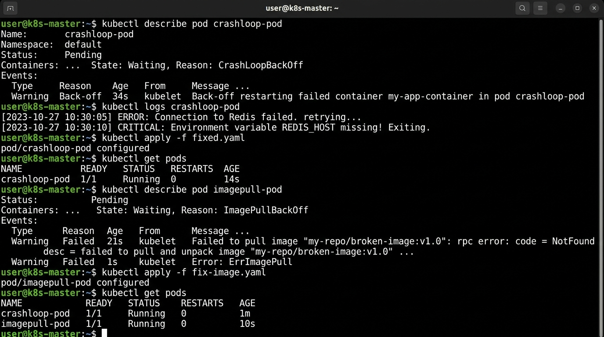
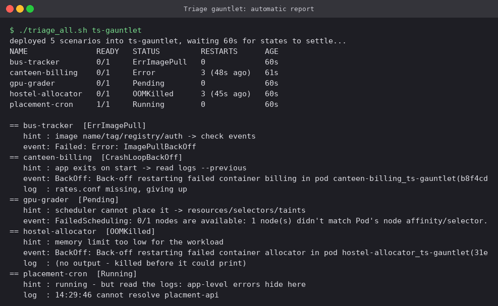
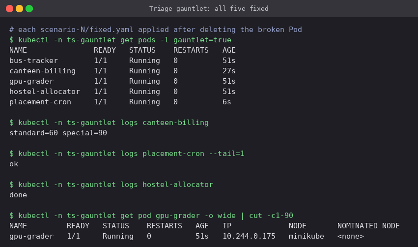

# Kubernetes Troubleshooting

How to find out *why* something on a cluster is not working, practised on faults planted on
purpose. Everything ran on the single-node Minikube cluster (Docker driver, Kubernetes
v1.37.0). Each part used its own `ts-*` namespace, deleted afterwards.

The order used in every case below:

1. **`get`**: what state is it in? (`Pending`, `CrashLoopBackOff`, `0/1`, no endpoints...)
2. **`describe` / events**: what did Kubernetes try and what failed? (scheduling, pull, mount)
3. **`logs` (`--previous`)**: what did the application say before it died?
4. **`exec`**: check from inside: files, env, DNS, ports
5. Change **one thing**, apply it, and check again

```text
Kubernetes Troubleshooting/
├── commands/          lecture-hall.yaml: workload for practising the core commands
├── issues/            11 scenarios, each with broken.yaml, fixed.yaml and README.md
├── triage-gauntlet/   5 broken Pods + triage_all.sh, which prints a diagnosis report
├── mini-project/      deployment + service, broken Pod, selector challenge
└── screenshots/
```

## 1. Core commands

[`commands/lecture-hall.yaml`](commands/lecture-hall.yaml): two replicas that log a line
every 5 seconds.

### `get`, `-o wide`, `describe`

```bash
kubectl -n ts-commands get deploy,rs,pods
kubectl -n ts-commands get pods -o wide            # + Pod IP and node
kubectl -n ts-commands describe pod -l app=lecture-hall
```



`get` gives the one-line status. `describe` gives the full picture: image, state and start
time, restart count, requests/limits, env, and at the bottom the **Events**, where most
answers are found.

### `logs` and `exec`

```bash
kubectl logs POD --tail=3
kubectl logs deploy/lecture-hall --since=12s --timestamps
kubectl logs -l app=lecture-hall --prefix --tail=1     # all replicas, tagged by Pod
kubectl exec POD -- printenv HALL_BLOCK
kubectl exec POD -- sh -c 'hostname; cat /etc/resolv.conf | head -1; ps | head -4'
```



`--previous` (used throughout the issues) reads the log of the container *before* the last
restart, which is what you need for anything that crashes.

### `events`, `top`, `explain`

```bash
kubectl get events --sort-by=.lastTimestamp
kubectl top pods ; kubectl top node                    # needs metrics-server
kubectl explain pod.spec.containers.livenessProbe.failureThreshold
```



Events are kept for only about an hour, so read them early. `explain` is the built-in
schema reference and works offline.

### `rollout restart`

```bash
kubectl -n ts-commands rollout restart deploy/lecture-hall
kubectl -n ts-commands rollout history deploy/lecture-hall
```



`rollout restart` replaces every Pod through a normal rolling update (new ReplicaSet, new Pod
names, the old RS kept at 0 for rollback). It is the usual way to make Pods re-read changed
ConfigMaps or Secrets that they consume as env vars.

## 2. Eleven common issues

All eleven broken workloads were applied together into `ts-issues`:



| # | Issue | Status you see | Root cause here | Where the answer was |
|---|---|---|---|---|
| [01](issues/01-crashloopbackoff) | CrashLoopBackOff | `Error` → `CrashLoopBackOff` | required env var missing, app exits 1 | `logs --previous` |
| [02](issues/02-imagepullbackoff) | ImagePullBackOff | `ImagePullBackOff` | tag typo `1.27-alpnie` | events: `NotFound` |
| [03](issues/03-errimagepull) | ErrImagePull | `ErrImagePull` ⇄ `ImagePullBackOff` | registry host does not resolve | events: `no such host` |
| [04](issues/04-pending) | Pending | `Pending`, no node | requests 40 CPUs, node has 15 | events: `Insufficient cpu` |
| [05](issues/05-containercreating) | ContainerCreating | stuck `ContainerCreating` | mounted Secret does not exist | events: `FailedMount` |
| [06](issues/06-service-connectivity) | Service connectivity | Pods Running, connection refused | selector `grade-api` vs label `grades-api` | empty EndpointSlice |
| [07](issues/07-dns) | DNS | lookups time out | `dnsPolicy: None`, bogus nameserver | `/etc/resolv.conf` |
| [08](issues/08-pod-networking) | Pod networking | refused / timed out | bind 127.0.0.1; deny-all NetworkPolicy | `netstat`, `get netpol` |
| [09](issues/09-config-bad-configmap-key) | Missing ConfigMap key | `CreateContainerConfigError` | key `SEMSTER` vs `SEMESTER` | events |
| [10](issues/10-config-wrong-command) | Wrong command | `RunContainerError`, exit 128 | `pyhton3` | `lastState.terminated.message` |
| [11](issues/11-oomkilled) | OOMKilled | `OOMKilled`, exit 137 | 200 MiB in a 64 MiB limit | `lastState.terminated` |

Each issue folder's README has the broken and fixed screenshots and the reasoning. Some
contrasts are worth pointing out:

- **Before vs after the container starts.** 02–05 and 09 fail before any process exists, so
  `kubectl logs` is empty and **events** hold the answer. 01, 10 and 11 fail after start
  (or while starting), so the exit code and `logs --previous` tell the story.
- **Exit codes:** `1` means the app chose to exit, `128` means the runtime could not exec the
  command, `137` means SIGKILL (OOM).
- **Refused vs timed out** (06, 08): *refused* means a reachable host with nothing listening
  (no endpoints, wrong bind). *Timed out* means packets are being dropped (NetworkPolicy,
  firewall).

## 3. Triage gauntlet

[`triage-gauntlet/triage_all.sh`](triage-gauntlet/triage_all.sh) deploys five broken Pods
and then, for every Pod, prints its state, a hint for that class of problem, the latest
Warning event and the last log line, all on one screen:

```bash
./triage-gauntlet/triage_all.sh ts-gauntlet
```



| Pod | Report | Fix (`scenario-N/fixed.yaml`) |
|---|---|---|
| `bus-tracker` | `ErrImagePull`, repository does not exist | real image |
| `canteen-billing` | `CrashLoopBackOff`, log: `rates.conf missing` | rates file from a ConfigMap |
| `gpu-grader` | `Pending`, `didn't match Pod's node affinity/selector` | drop the `nodeSelector` (or label a node) |
| `hostel-allocator` | `OOMKilled`, no output | memory limit 48Mi → 256Mi |
| `placement-cron` | **Running** but log says `cannot resolve placment-api` | correct the Service name and create the Service |

`placement-cron` is the one to remember: its status is perfectly green and only the logs
show the problem. A triage that stops at `kubectl get pods` misses it. The script's
"Running → read the logs" hint is there for that reason.

Two details in the script came out of running it. An OOMKilled container spends most of its
time in `CrashLoopBackOff` or briefly `Running`, so the script prefers
`lastState.terminated.reason` to the current state. And a Pod with no Warning events made
`set -o pipefail` abort the whole loop until each lookup got `|| true`.



## 4. Mini project

See [`mini-project/README.md`](mini-project/README.md): a three-replica app, a Pod with two
stacked faults, and a Service selector challenge.

## Symptom → cause → fix

| Symptom | Likely cause | First look | Typical fix |
|---|---|---|---|
| `Pending` | requests too big, selector/affinity/taint, unbound PVC | `describe pod` events | right-size, label/taint nodes, fix PVC |
| `ErrImagePull` / `ImagePullBackOff` | wrong name/tag, registry DNS, auth, rate limit | events | fix reference, add `imagePullSecrets` |
| `ContainerCreating` (stuck) | missing Secret/ConfigMap volume, PVC attach, CNI | events (`FailedMount`) | create the object, fix storage/CNI |
| `CreateContainerConfigError` | missing ConfigMap/Secret or key for env | events | fix name/key, `optional: true` |
| `RunContainerError` | bad command/entrypoint | `lastState.terminated.message` | fix `command`/`args` |
| `CrashLoopBackOff` | app exits on start | `logs --previous`, exit code | fix config/env/dependency |
| `OOMKilled` (137) | memory limit < working set | `lastState.terminated` | raise limit or reduce usage |
| `Running` but `0/1` | readiness probe failing | `describe` (Readiness) | fix probe or app |
| Service refused | no endpoints: selector/readiness | `get endpointslices` | match labels |
| Service timed out | NetworkPolicy / firewall | `get netpol` | allow the traffic |
| Name not resolving | DNS policy, CoreDNS, wrong namespace | `/etc/resolv.conf`, `nslookup` | `ClusterFirst`, FQDN |

## Cheat sheet

```bash
kubectl get pods -A | grep -v Running                 # what is unhealthy anywhere
kubectl describe pod P | sed -n '/^Events/,$p'        # just the events
kubectl get events -n NS --sort-by=.lastTimestamp
kubectl get events --field-selector involvedObject.name=P,type=Warning
kubectl logs P --previous                             # the crashed container
kubectl logs deploy/D --all-containers --since=10m
kubectl get pod P -o jsonpath='{.status.containerStatuses[0].lastState}'
kubectl exec -it P -- sh                              # look around
kubectl debug P -it --image=busybox --target=CONTAINER  # for distroless images
kubectl get endpointslices -l kubernetes.io/service-name=SVC
kubectl top pod --containers ; kubectl top node
kubectl rollout restart deploy/D ; kubectl rollout undo deploy/D
```

## Cleanup

```bash
kubectl delete ns ts-commands ts-issues ts-gauntlet ts-mini
```

---

**Prince Shakya** · Roll No. 24BCS10084
