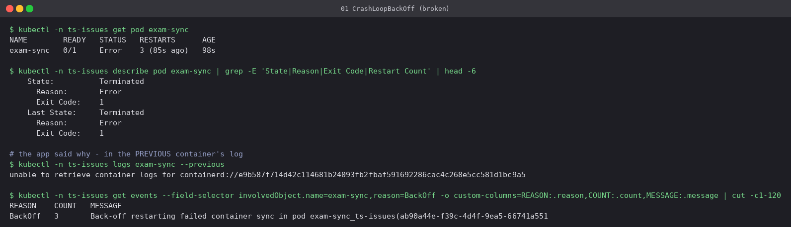
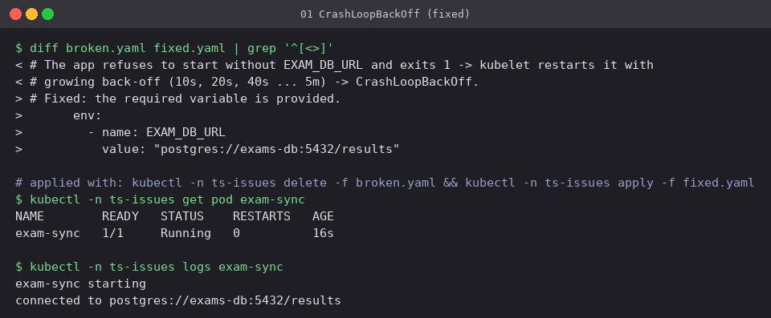

# 01 CrashLoopBackOff

**Workload:** `exam-sync`, which refuses to start unless `EXAM_DB_URL` is set.

- **Symptom:** `STATUS Error` / `CrashLoopBackOff` with a growing `RESTARTS` count.
- **Diagnosis:** the container *starts* and then exits on its own (exit code 1). That makes it
  an application problem, not a Kubernetes one, and the application explains itself in
  `kubectl logs --previous`: `FATAL: EXAM_DB_URL is not set`. Without `--previous` you may get
  the log of a container that has only just restarted and has not printed anything yet.
- **Fix:** supply the variable ([`fixed.yaml`](fixed.yaml)).

CrashLoopBackOff is a **waiting state**, not an error in itself. The kubelet restarts the
container with a back-off that doubles each time (10s, 20s, 40s, up to 5 min) so that a
broken app does not spin at full speed.
