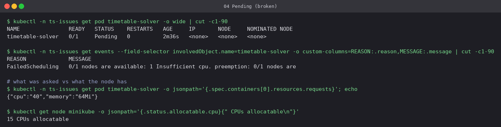
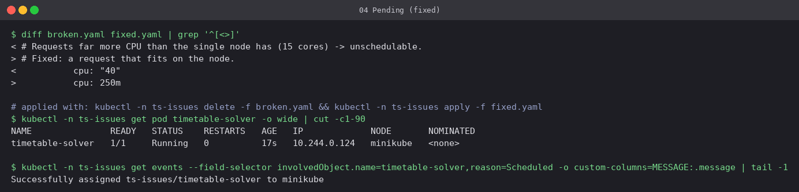

# 04 Pending

**Workload:** `timetable-solver`, which requests `cpu: "40"` on a node with 15 allocatable CPUs.

- **Symptom:** `Pending` with no IP and no node. No container exists, so there are no logs.
- **Diagnosis:** the scheduler's `FailedScheduling` event: `0/1 nodes are available: 1
  Insufficient cpu`. The scheduler only considers **requests**, never actual usage. Other
  messages you can see here are `didn't match Pod's node affinity/selector`, `untolerated
  taint`, and `unbound immediate PersistentVolumeClaims`.
- **Fix:** request what the workload needs (`250m`). Alternatives are adding nodes or
  letting a cluster autoscaler do it.

