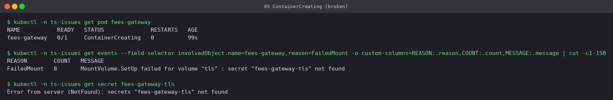
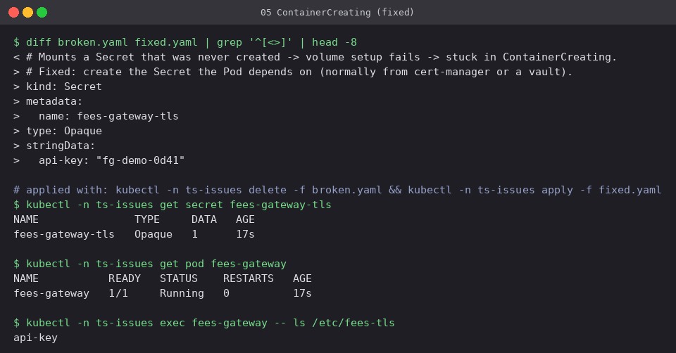

# 05 Stuck in ContainerCreating

**Workload:** `fees-gateway`, which mounts Secret `fees-gateway-tls` that was never created.

- **Symptom:** `ContainerCreating` that never ends. The Pod is scheduled, but the kubelet
  cannot finish preparing it.
- **Diagnosis:** a `FailedMount` event: `secret "fees-gateway-tls" not found`. The same
  status also appears with missing ConfigMap volumes, PVCs that cannot attach, and CNI
  failures (`failed to set up sandbox`). The events always name the reason.
- **Fix:** create the Secret (here it is included in [`fixed.yaml`](fixed.yaml)). The kubelet
  retries the mount on its own, so the Pod would also recover without being recreated.

Compare with [09](../09-config-bad-configmap-key): a missing **volume** source gives
`ContainerCreating`, while a missing **env** source gives `CreateContainerConfigError`.
