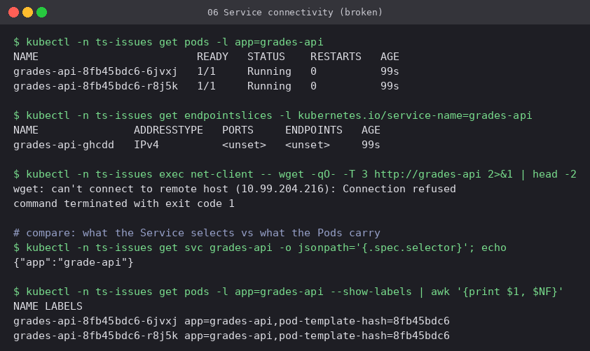
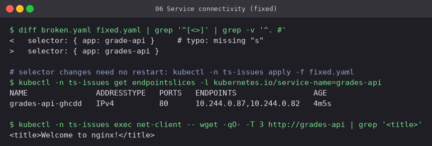

# 06 Service connectivity: empty endpoints

**Workload:** Deployment `grades-api` (label `app=grades-api`) and a Service whose
selector says `app=grade-api`.

- **Symptom:** every Pod is `Running 1/1`, yet `wget http://grades-api` gets **connection
  refused**. The Service IP exists, but there is nothing behind it.
- **Diagnosis:** the EndpointSlice has **no endpoints**. Printing the Service selector next
  to the Pod labels shows the missing `s`. An empty endpoints list always means one of three
  things: the selector does not match, the Pods are not Ready, or there are no Pods.
- **Fix:** match the selector. A Service is only a label query, so the change takes effect
  immediately without restarting anything.

