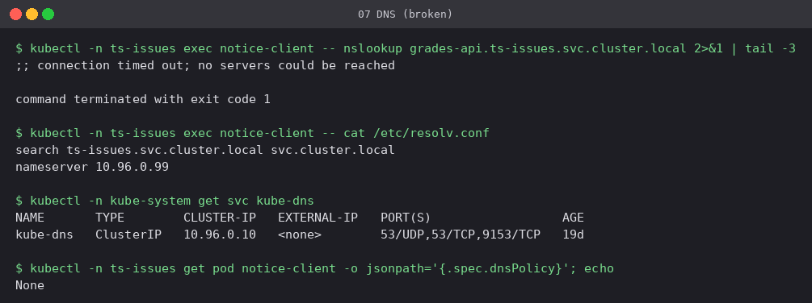
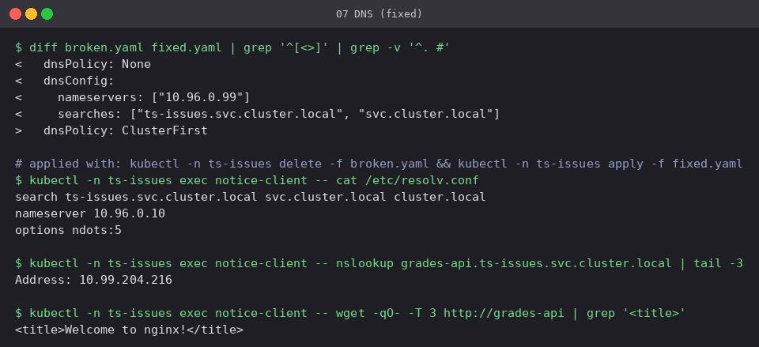

# 07 DNS failure

**Workload:** `notice-client` with `dnsPolicy: None` and a nameserver (`10.96.0.99`) that
does not exist.

- **Symptom:** `nslookup` of a Service that definitely exists times out, so the app sees
  "host not found" for every name.
- **Diagnosis:** `/etc/resolv.conf` inside the Pod points at `10.96.0.99`, while CoreDNS
  (`kube-dns`) is at `10.96.0.10`. The Pod spec shows `dnsPolicy: None`. Other things to
  check: CoreDNS Pods running (`kubectl -n kube-system get pods -l k8s-app=kube-dns`), the
  name and namespace (a short name only works inside the same namespace), and NetworkPolicies
  blocking UDP/TCP 53.
- **Fix:** default `dnsPolicy: ClusterFirst`. The Pod then gets the kube-dns nameserver and
  the `<ns>.svc.cluster.local` search list, so the short name `grades-api` resolves too.

