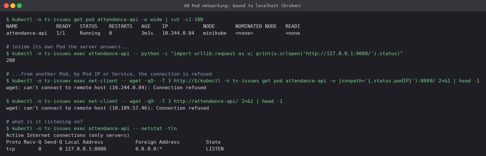
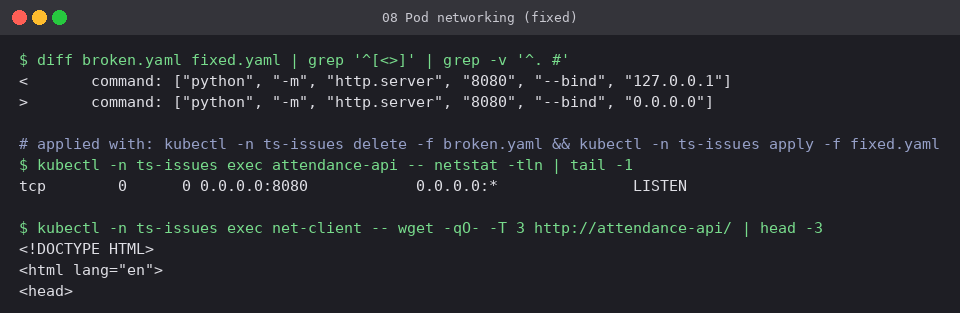
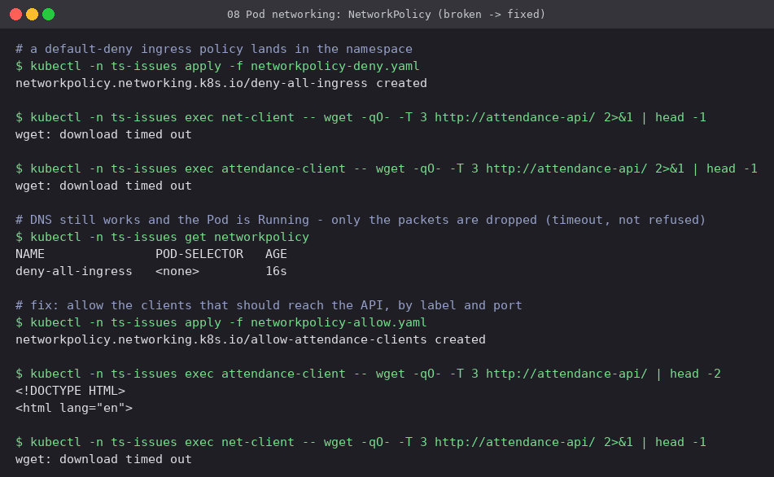

# 08 Pod networking

Two separate network faults, both showing up as "the Pod is Running but I cannot reach it".

## a) Server bound to 127.0.0.1

**Workload:** `attendance-api`, `python -m http.server --bind 127.0.0.1`.

- From **inside** the Pod the server answers `200`. From any other Pod, whether by Pod IP or
  by Service, the connection is **refused** right away.
- `netstat -tln` shows `127.0.0.1:8080`: the socket is only on the loopback interface,
  which every container in the Pod shares and nothing outside can reach.
- **Fix:** bind to `0.0.0.0`.

## b) NetworkPolicy default-deny

Minikube's CNI here (kindnet) enforces NetworkPolicy, so this was tested for real:

- After [`networkpolicy-deny.yaml`](networkpolicy-deny.yaml), every client **times out**
  rather than being refused. Dropped packets look different from a closed port, and that
  difference is the quickest hint that a policy is involved.
- [`networkpolicy-allow.yaml`](networkpolicy-allow.yaml) allows only Pods labelled
  `role=attendance-client` on TCP 8080. That client gets the page and `net-client` is still
  blocked. Policies are additive allow-lists: once any policy selects a Pod, only what some
  policy allows gets in.
