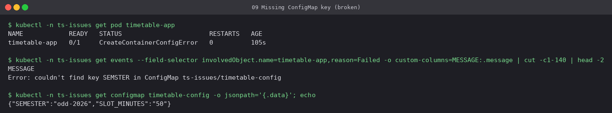
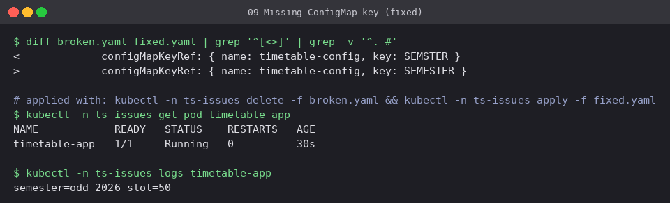

# 09 Configuration: missing ConfigMap key

**Workload:** `timetable-app`, which reads key `SEMSTER` from ConfigMap `timetable-config`
(the real key is `SEMESTER`).

- **Symptom:** `CreateContainerConfigError`. The container is never created, so there are no
  logs.
- **Diagnosis:** the event says `couldn't find key SEMSTER in ConfigMap
  ts-issues/timetable-config`, and listing `.data` shows the correct spelling.
- **Fix:** correct the key (or set `optional: true` if the value really is optional).

