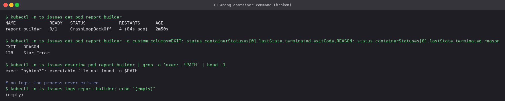
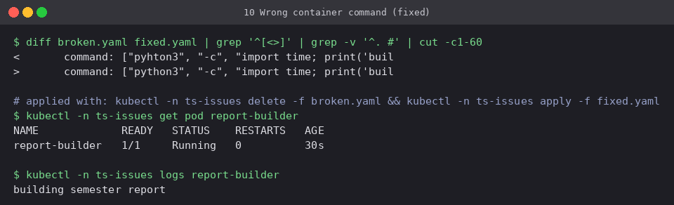

# 10 Configuration: wrong container command

**Workload:** `report-builder`, `command: ["pyhton3", ...]`.

- **Symptom:** `RunContainerError`, then `CrashLoopBackOff`, with restarts climbing.
- **Diagnosis:** exit code **128** (not 1) and the message `exec: "pyhton3": executable file
  not found in $PATH`. The runtime could not start the process at all, which is why
  `kubectl logs` is empty. With crashes, an empty log plus exit code 126/127/128 points at
  the command; a non-empty log plus exit 1 points at the app.
- **Fix:** spell the executable correctly.

