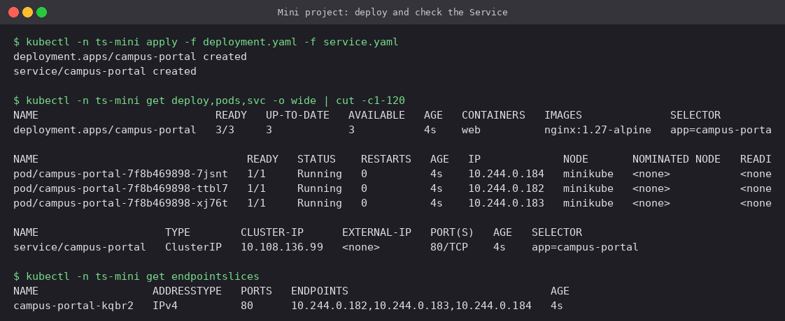
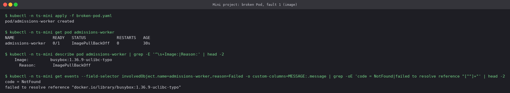
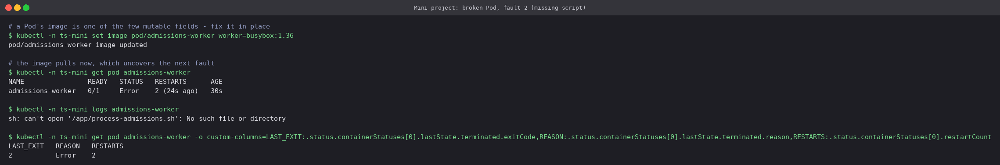
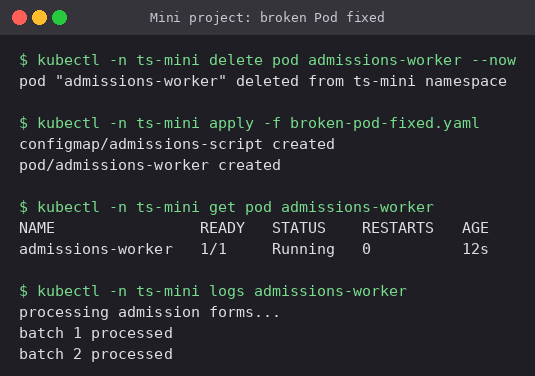
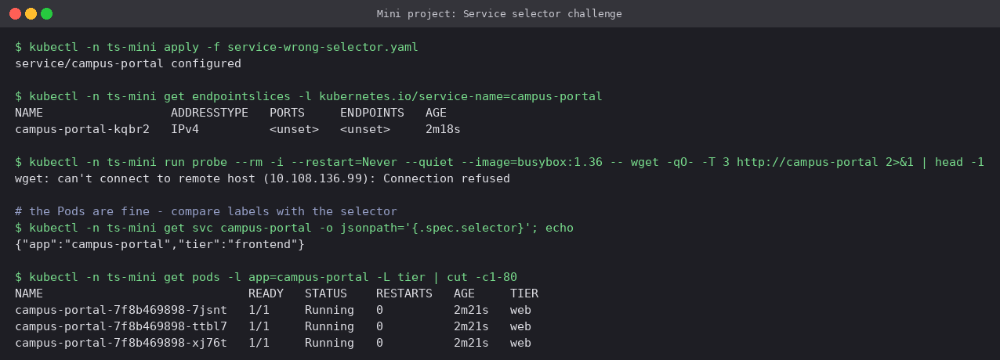
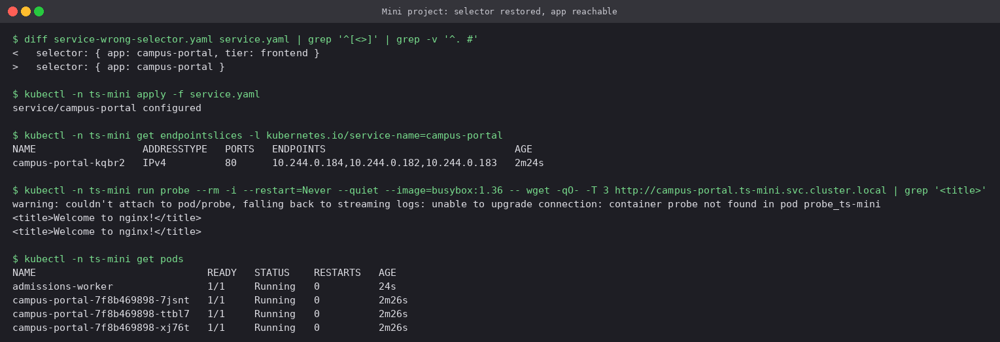

# Mini Project: Troubleshooting Challenge

A healthy three-replica `campus-portal` web app plus two planted problems: a Pod with two
faults stacked on top of each other, and a Service whose selector gets broken. Everything ran
in namespace `ts-mini` on the Minikube cluster.

| File | Purpose |
|---|---|
| [`deployment.yaml`](deployment.yaml) | 3 × nginx, labels `app=campus-portal, tier=web`, readiness probe, requests/limits |
| [`service.yaml`](service.yaml) | ClusterIP Service, selector `app=campus-portal` |
| [`broken-pod.yaml`](broken-pod.yaml) | `admissions-worker`: bad image tag **and** a missing start script |
| [`broken-pod-fixed.yaml`](broken-pod-fixed.yaml) | real tag + the script delivered by a ConfigMap |
| [`service-wrong-selector.yaml`](service-wrong-selector.yaml) | selector adds `tier=frontend`, which no Pod has |

## 1. Deploy and check the Service

```bash
kubectl -n ts-mini apply -f deployment.yaml -f service.yaml
kubectl -n ts-mini get deploy,pods,svc -o wide
kubectl -n ts-mini get endpointslices
```



Three Ready Pods, and all three IPs show up in the Service's EndpointSlice. This is the
baseline to compare against later.

## 2. The broken Pod

### Fault 1: the image

```bash
kubectl -n ts-mini apply -f broken-pod.yaml
kubectl -n ts-mini get pod admissions-worker
kubectl -n ts-mini describe pod admissions-worker
kubectl -n ts-mini get events --field-selector involvedObject.name=admissions-worker
```



`ErrImagePull`/`ImagePullBackOff`. The registry answers `NotFound` for
`busybox:1.36.9-uclibc-typo`.

### Fault 2: shows up only after fault 1 is fixed

```bash
kubectl -n ts-mini set image pod/admissions-worker worker=busybox:1.36
kubectl -n ts-mini logs admissions-worker
```



With the image fixed in place, the container now starts and immediately exits with code
**2**: `sh: can't open '/app/process-admissions.sh'`. Faults often come in layers like this:
each fix moves the Pod one step further through its lifecycle (schedule → pull → mount →
start → run) and uncovers the next problem.

### Fix

```bash
kubectl -n ts-mini delete pod admissions-worker
kubectl -n ts-mini apply -f broken-pod-fixed.yaml
```



The script now arrives through the `admissions-script` ConfigMap mounted at `/app`, and the
worker processes batches.

**Answers for the broken Pod**

| Question | Answer |
|---|---|
| What was wrong? | (1) non-existent image tag; (2) start command ran a script that was not in the image |
| Which command showed it? | (1) `kubectl get events` / `describe` → `Failed to pull image ... NotFound`; (2) `kubectl logs` → `can't open '/app/process-admissions.sh'` |
| How was it fixed? | (1) `kubectl set image` to `busybox:1.36`; (2) recreated the Pod with the script mounted from a ConfigMap |

## 3. Service selector challenge

```bash
kubectl -n ts-mini apply -f service-wrong-selector.yaml
kubectl -n ts-mini get endpointslices -l kubernetes.io/service-name=campus-portal
kubectl -n ts-mini get svc campus-portal -o jsonpath='{.spec.selector}'
kubectl -n ts-mini get pods -l app=campus-portal -L tier
```



The Pods did not change and are all still `Running 1/1`, yet the EndpointSlice is
`<unset>` and clients get *connection refused*. A selector is an AND of all its labels, and
`-L tier` shows every Pod carries `tier=web`, never `tier=frontend`.

### Fix: restore the selector



Three endpoints come back immediately, and the app answers by its full DNS name
`campus-portal.ts-mini.svc.cluster.local`.

## Troubleshooting table

| Problem | Symptom | Command that found it | Fix |
|---|---|---|---|
| Bad image tag | `ErrImagePull` / `ImagePullBackOff` | `kubectl get events` | Real tag (`kubectl set image`) |
| Missing script | `Error`, exit 2, restarts | `kubectl logs` | Mount script from ConfigMap |
| Selector mismatch | Pods fine, Service has no endpoints | `get endpointslices` + `get pods -L tier` | Selector matches Pod labels |

## Questions

**Why can a Service have no endpoints while its Pods are Running?** Endpoints are chosen
by label selector *and* readiness. A selector that does not match (as here), or Pods
failing their readiness probe, both leave the list empty, and neither one stops the Pods
from running.

**Why check events before logs?** Logs only exist after a container process has started.
Scheduling, image pulling and volume mounting all fail *before* that point, and only events
record those failures.

**Why can't most Pod fields be edited in place?** A Pod is a single, immutable unit of
scheduling. Apart from a few fields (image, some tolerations, activeDeadlineSeconds), a
change means a new Pod. This is one reason real workloads run under Deployments, which
handle the replacement.

## Final architecture

```text
            ts-mini namespace
  ┌─────────────────────────────────────────────┐
  │  Service campus-portal (ClusterIP :80)       │
  │      selector app=campus-portal              │
  │           │                                  │
  │   ┌───────┼────────┐                         │
  │   ▼       ▼        ▼                         │
  │  web     web      web    Deployment, 3 × nginx│
  │                                              │
  │  admissions-worker  ◄── ConfigMap admissions-script
  └─────────────────────────────────────────────┘
```

## Cleanup

```bash
kubectl delete ns ts-mini
```

---

**Prince Shakya** · Roll No. 24BCS10084
