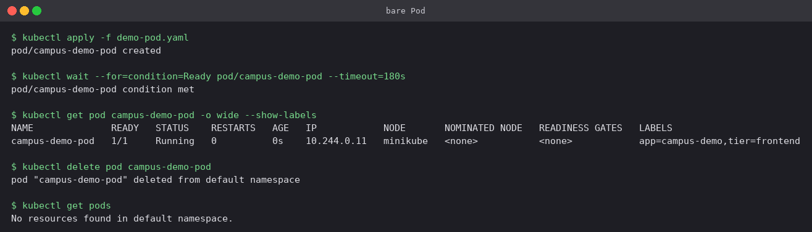
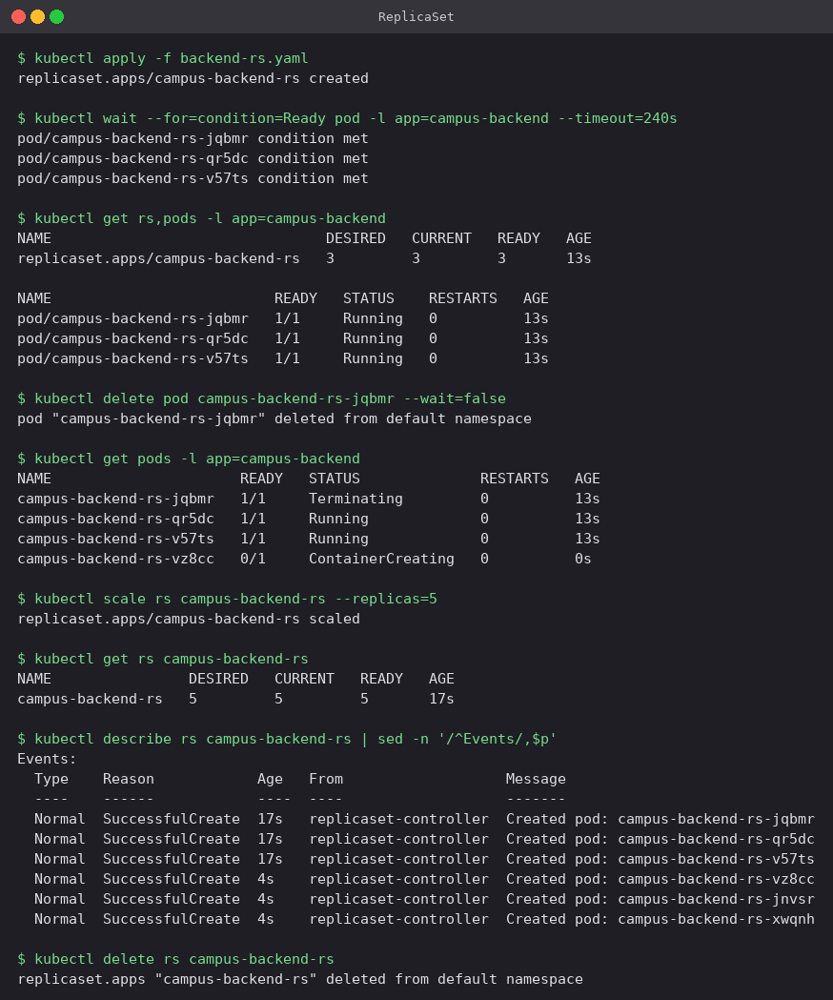
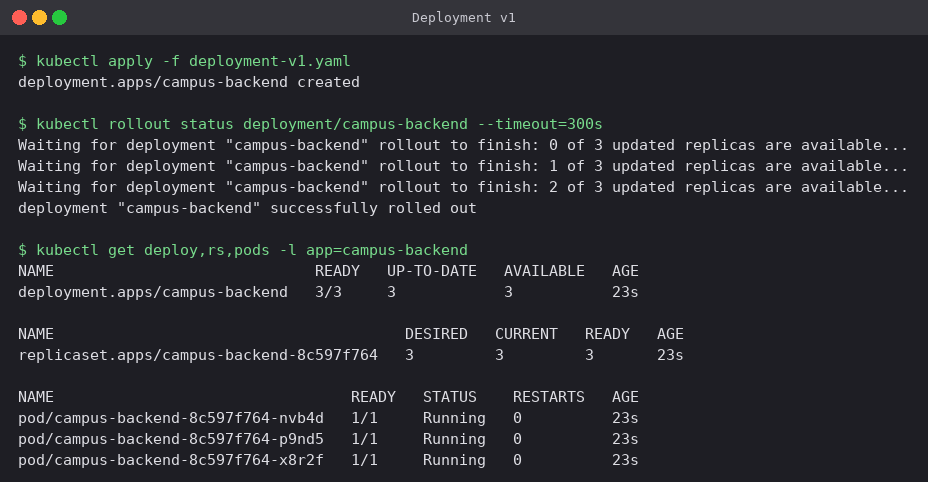
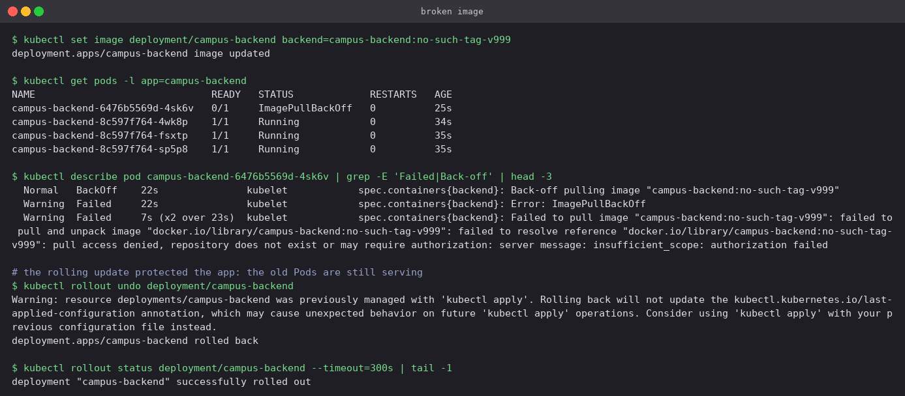
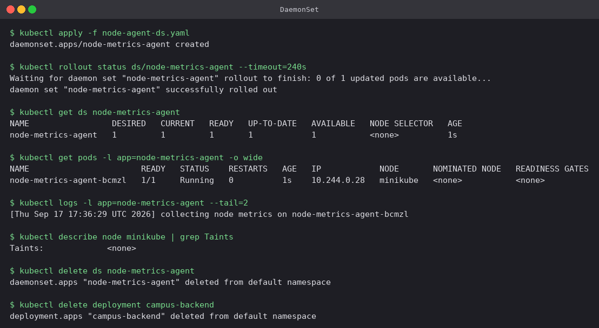

# Kubernetes Workloads

Pods, ReplicaSets, Deployments and DaemonSets, run in that order on the Minikube cluster so
that each one shows what the previous one could not do. Manifests are in
[`manifests/`](manifests); the screenshots are the real terminal output of the run.

| Object | What it adds over the one above |
|---|---|
| **Pod** | The smallest unit — one or more containers sharing an IP and volumes. Nothing restarts it if it dies |
| **ReplicaSet** | Keeps N matching Pods alive at all times: self-healing and scaling |
| **Deployment** | Manages ReplicaSets, which buys rolling updates, revision history and rollback |
| **DaemonSet** | One Pod per node, regardless of how many nodes there are |

## 1. A bare Pod is not protected

[`manifests/demo-pod.yaml`](manifests/demo-pod.yaml)

```bash
kubectl apply -f demo-pod.yaml
kubectl wait --for=condition=Ready pod/campus-demo-pod --timeout=180s
kubectl get pod campus-demo-pod -o wide --show-labels
kubectl delete pod campus-demo-pod
kubectl get pods
```



The last command is the whole lesson: after deleting the Pod, `No resources found`. Nobody
brought it back, because nothing was watching it. This is why Pods are essentially never
created directly outside of debugging — something has to own them.

## 2. ReplicaSet — self-healing and scaling

[`manifests/backend-rs.yaml`](manifests/backend-rs.yaml) asks for `replicas: 3` matching
`app=campus-backend`.

```bash
kubectl apply -f backend-rs.yaml
kubectl wait --for=condition=Ready pod -l app=campus-backend --timeout=240s
kubectl get rs,pods -l app=campus-backend

kubectl delete pod campus-backend-rs-jqbmr --wait=false   # kill one on purpose
kubectl get pods -l app=campus-backend

kubectl scale rs campus-backend-rs --replicas=5
kubectl describe rs campus-backend-rs | sed -n '/^Events/,$p'
```



What the output shows:

- One Pod (`campus-backend-rs-jqbmr`) was deleted deliberately. The very next command already
  shows a replacement, `campus-backend-rs-vz8cc`, in `ContainerCreating` **while the old one
  is still `Terminating`**. The controller does not wait for the deletion to finish; it
  reacts as soon as the observed count drops below 3.
- The ReplicaSet finds its Pods purely through the **label selector**. It has no list of Pod
  names — names carry a random suffix precisely because they are disposable.
- `kubectl scale --replicas=5` added two more, and the `Events` list records a
  `SuccessfulCreate` for every single Pod it has ever made.
- What a ReplicaSet *cannot* do is change the image in a controlled way. Editing the template
  does not touch the Pods that already exist. That gap is exactly what a Deployment fills.

## 3. Deployment — rolling update, history, rollback

[`deployment-v1.yaml`](manifests/deployment-v1.yaml) →
[`deployment-v2.yaml`](manifests/deployment-v2.yaml). The two files differ only in the version
label and the line the container prints.

```bash
kubectl apply -f deployment-v1.yaml
kubectl rollout status deployment/campus-backend --timeout=300s
kubectl get deploy,rs,pods -l app=campus-backend
```



The three-level chain is visible in the Pod names themselves:
`campus-backend` (Deployment) + `8c597f764` (the ReplicaSet's template hash) + a per-Pod
suffix. You never create that middle ReplicaSet yourself.

```bash
kubectl apply -f deployment-v2.yaml
kubectl annotate deployment/campus-backend kubernetes.io/change-cause='Roll forward to v2.0.0' --overwrite
kubectl rollout status deployment/campus-backend --timeout=300s
kubectl get rs -l app=campus-backend
kubectl get pods -l app=campus-backend -L version

kubectl rollout history deployment/campus-backend
kubectl rollout undo deployment/campus-backend
```


- Applying v2 did not modify the existing ReplicaSet. It created a **new** one
  (`5f9c746b6b`) and scaled it up while scaling `8c597f764` down to zero, one replica at a
  time — `rollout status` narrates each step.
- With `maxSurge: 1` and `maxUnavailable: 0`, a new Pod has to become Ready before an old one
  is allowed to go. That is what makes the update zero-downtime, and it matters again in
  section 4.
- `-L version` prints the `version` label as a column, so the changeover is visible directly:
  three Pods `Terminating` at `1.0.0` next to three `Running` at `2.0.0`.
- The old ReplicaSet is **kept at 0 replicas** rather than deleted. That is what makes
  rollback instant — `kubectl rollout undo` just scaled `8c597f764` back up to 3, with no
  image pull needed.
- After the undo, `rollout history` shows revisions 2 and 3, not 1 and 2. A rollback is
  recorded as a *new* revision rather than erasing one. The `CHANGE-CAUSE` column is populated
  by the `kubernetes.io/change-cause` annotation, which is worth setting on every release.

## 4. Troubleshooting a bad image

A deliberately wrong tag, to see what a failed rollout looks like:

```bash
kubectl set image deployment/campus-backend backend=campus-backend:no-such-tag-v999
kubectl get pods -l app=campus-backend
kubectl describe pod <the-failing-pod> | grep -E 'Failed|Back-off' | head -3
kubectl rollout undo deployment/campus-backend
```



- The new Pod sat in `ImagePullBackOff`, and `kubectl describe pod` gave the precise reason:
  `pull access denied, repository does not exist`.
- The important part is the three Pods underneath it, all still `Running` on the old version.
  Because the new Pod never became Ready and `maxUnavailable` is 0, Kubernetes refused to
  remove any of them. **A broken deploy did not take the application down** — the rollout
  simply stalled.
- `kubectl rollout undo` cleared it. Note the warning it prints: rolling back does not update
  the `last-applied-configuration` annotation, so the next `kubectl apply` of an old file can
  behave unexpectedly. Re-applying the known-good manifest is the tidier fix in a real
  workflow.

Debugging order that works almost every time: `kubectl get pods` → `kubectl describe pod`
(read the Events) → `kubectl logs`, adding `--previous` when the container is crash-looping.

## 5. DaemonSet

[`manifests/node-agent-ds.yaml`](manifests/node-agent-ds.yaml)

```bash
kubectl apply -f node-agent-ds.yaml
kubectl rollout status ds/node-metrics-agent --timeout=240s
kubectl get ds node-metrics-agent
kubectl get pods -l app=node-metrics-agent -o wide
kubectl describe node minikube | grep Taints
```



There is no `replicas` field anywhere in that manifest — the replica count *is* the node
count. `DESIRED` is 1 here simply because this Minikube cluster has one node; adding a second
node would create a second Pod with no change to the manifest.

`kubectl describe node minikube | grep Taints` returns `<none>`, and that is worth
contrasting with a multi-node cluster: there the control-plane node normally carries a
`node-role.kubernetes.io/control-plane:NoSchedule` taint, so a DaemonSet without a matching
toleration lands only on the workers and `DESIRED` comes out lower than the node count.
Minikube's single node is untainted so that ordinary workloads can run on it at all.

DaemonSets are how log collectors, monitoring agents and CNI plugins are deployed —
`kube-proxy` and `kindnet` in this very cluster are DaemonSets themselves.

## Pod status cheat sheet

| Status | Meaning | First thing to check |
|---|---|---|
| `Pending` | Not scheduled yet | `describe pod`: insufficient CPU/memory, taints, unbound PVC |
| `ContainerCreating` | Pulling the image or mounting volumes | Wait a moment, then `describe pod` |
| `ImagePullBackOff` / `ErrImagePull` | Bad image name or tag, or no registry access | Spelling, tag, pull secret |
| `CrashLoopBackOff` | Container starts and exits repeatedly | `kubectl logs --previous` |
| `Running` but `0/1 READY` | Readiness probe failing | Probe path and port, app logs |
| `Completed` | Exited 0 — normal for Jobs, not for a Deployment | Whether it should be long-running |
| `Terminating` | Shutting down (30s grace period by default) | Stuck? Check finalizers |

## Cleanup

```bash
kubectl delete ds node-metrics-agent
kubectl delete deployment campus-backend
```

---

**Parv Mehta** · Roll No. 24BCS10301
