# Monitoring, Observability and GitOps

The cluster gets eyes and a source of truth. Prometheus scrapes metrics, Alertmanager routes
alerts, Loki stores logs (shipped by Grafana Alloy), and Grafana shows all of it. Then Argo CD
takes over deployments, so the cluster follows a Git repository instead of `kubectl apply`.

Everything ran on the same single-node Minikube cluster (Docker driver, 8 GB for Docker).

```text
Monitoring Observability and GitOps/
├── monitoring/
│   ├── helm-values/     kube-prometheus-stack, Loki (single binary), Alloy
│   ├── sample-app/      campus-api (podinfo) + traffic, CPU hog, crash-looper, never-ready Pod
│   └── alerts/          PrometheusRule with four custom alerts
├── observability/       metrics vs logs vs traces, monitoring vs observability, tools
├── gitops/
│   ├── git-server.yaml  in-cluster git daemon used as the "remote"
│   ├── argocd-values.yaml
│   └── gitops-repo/     what Argo CD watches: app/ + argocd/application.yaml
└── screenshots/
```

## 0. Installing the stack

```bash
helm repo add prometheus-community https://prometheus-community.github.io/helm-charts
helm repo add grafana https://grafana.github.io/helm-charts
helm repo add argo https://argoproj.github.io/argo-helm

helm install kps   prometheus-community/kube-prometheus-stack -n monitoring --create-namespace \
     -f monitoring/helm-values/kube-prometheus-stack-values.yaml
helm install loki  grafana/loki  -n logging --create-namespace -f monitoring/helm-values/loki-values.yaml
helm install alloy grafana/alloy -n logging -f monitoring/helm-values/alloy-values.yaml

kubectl apply -f monitoring/sample-app/ -f monitoring/alerts/
```

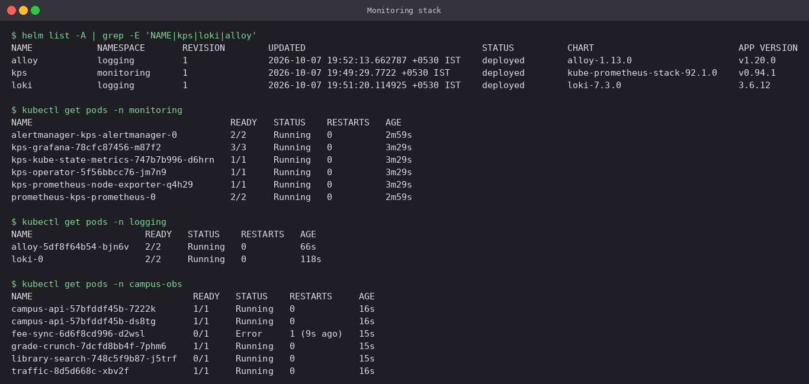

| Component | Role |
|---|---|
| Prometheus Operator | turns `ServiceMonitor` / `PrometheusRule` objects into Prometheus config |
| Prometheus | scrapes and stores metrics, evaluates alert rules |
| Alertmanager | groups, silences and routes firing alerts |
| node-exporter / kube-state-metrics | node metrics / object-state metrics (`kube_pod_status_ready`, restarts...) |
| Loki + Alloy | log storage + the agent that tails every Pod's logs into it |
| Grafana | dashboards and Explore over both Prometheus and Loki |

Notes on the values files:

- etcd, controller-manager, scheduler and kube-proxy scraping are switched off. Minikube binds
  them to `127.0.0.1` inside the node, so they would sit permanently `down` and keep alerts
  firing for nothing.
- `*SelectorNilUsesHelmValues: false` makes Prometheus pick up ServiceMonitors and rules from
  **every** namespace, not only ones labelled with the Helm release.
- Loki is added to Grafana as an extra datasource straight from the values file.

The sample workloads in `campus-obs` are chosen so every signal has something to show:

| Workload | Purpose |
|---|---|
| `campus-api` ×2 | podinfo: `/metrics`, JSON logs, `/healthz`, `/readyz` |
| `traffic` | curl loop: normal requests plus `/status/500` and `/delay/1` |
| `grade-crunch` | `stress`: one CPU core and 150 MB of memory |
| `fee-sync` | logs an error and exits, so it ends up in CrashLoopBackOff |
| `library-search` | readiness probe on a closed port, so it never becomes Ready |

## 1. Metrics

### Scraping through a ServiceMonitor

[`sample-app/01-campus-api.yaml`](monitoring/sample-app/01-campus-api.yaml) ends with a
`ServiceMonitor` that selects `app: campus-api` and scrapes port `http` at `/metrics`
every 15s. Nobody edits `prometheus.yml`. The operator generates the scrape config.

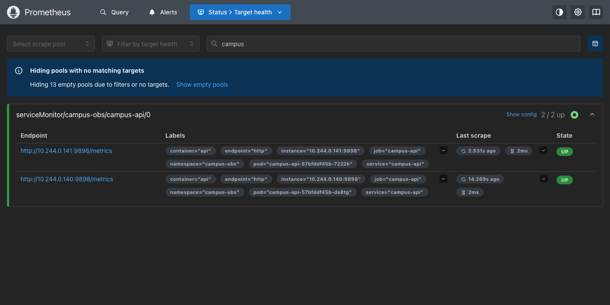

Both Pods show up as separate targets, **2/2 up**, labelled with namespace, pod and service.

### PromQL

Request rate per status code:

```promql
sum by (status) (rate(http_requests_total{namespace="campus-obs"}[1m]))
```

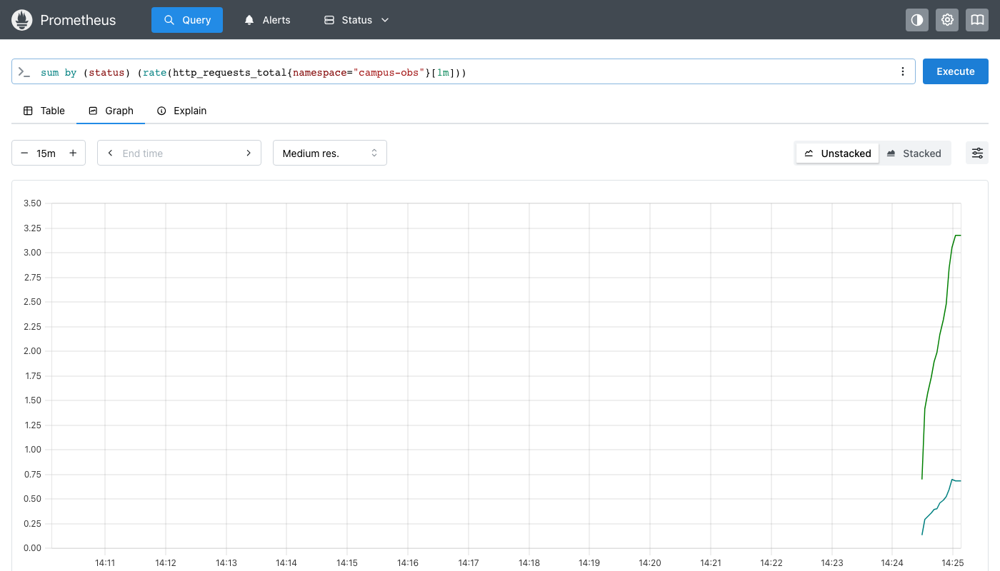

Two lines: about 3.2 req/s of `200` and about 0.7 req/s of `500`, which is the ratio the
`traffic` loop produces. `rate()` turns an ever-increasing counter into a per-second rate.
`sum by (status)` adds up the two Pods and keeps only the status label.

CPU per Pod, as a table:

```promql
sort_desc(sum by (pod) (rate(container_cpu_usage_seconds_total{namespace="campus-obs",container!=""}[2m])))
```

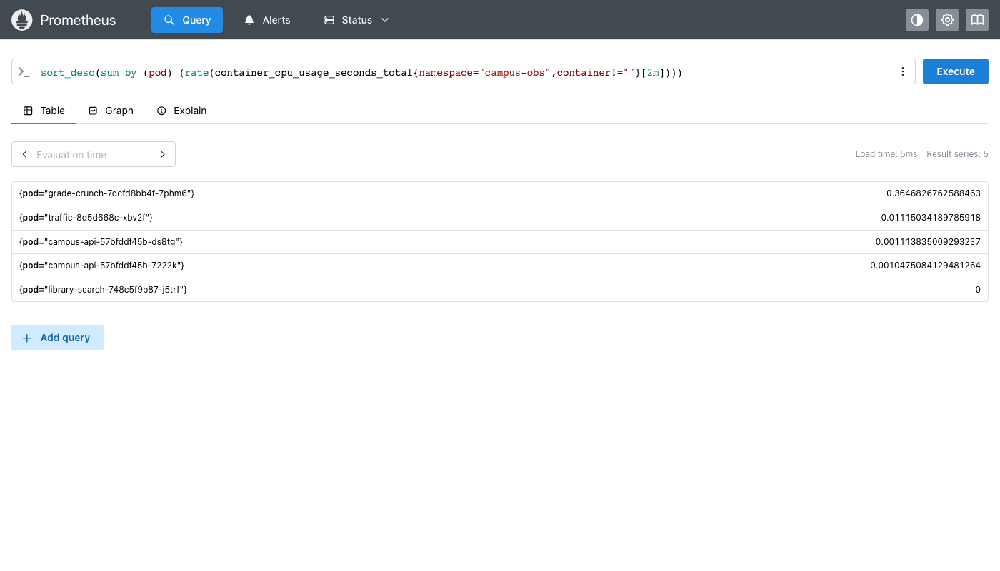

`grade-crunch` leads at about 0.36 cores and everything else is close to zero.
`container!=""` drops the Pod-level cgroup series that would otherwise count CPU twice.

## 2. Logs

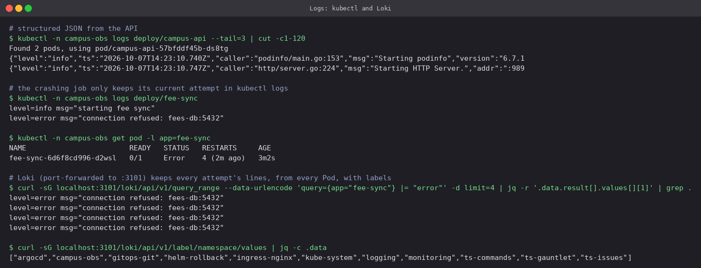

`kubectl logs` only sees the current container of one Pod, and the logs are gone once the
Pod is gone. Loki keeps **every attempt** of `fee-sync`, and it can be queried across Pods by
label, here straight from its HTTP API.

The same data in Grafana Explore, filtered with LogQL:

```logql
{namespace="campus-obs"} |~ "error|warn"
```

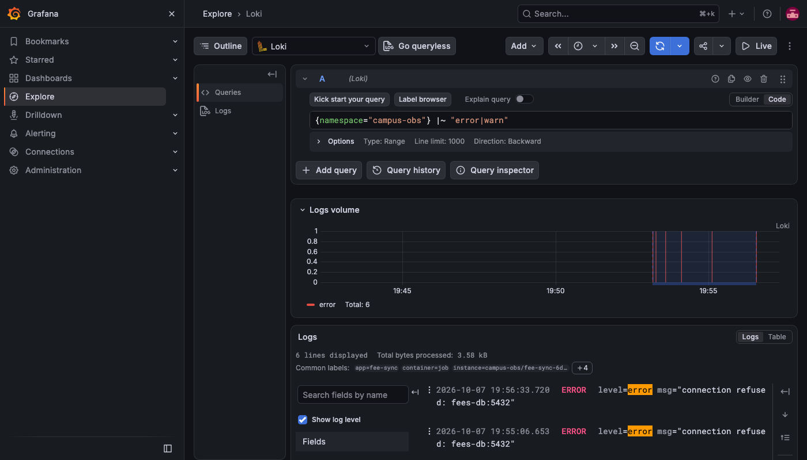

The log-volume histogram shows a red bar each time `fee-sync` crashes, and every line carries
`app`, `container`, `namespace` and `pod` labels added by the Alloy relabel rules in
[`alloy-values.yaml`](monitoring/helm-values/alloy-values.yaml).

## 3. Alerts

[`alerts/campus-rules.yaml`](monitoring/alerts/campus-rules.yaml):

| Alert | Expression (short) | Severity |
|---|---|---|
| `CampusApiHigh5xxRate` | 5xx / all requests > 5% for 1m | warning |
| `CampusPodRestarting` | `increase(restarts[5m]) > 2` for 1m | critical |
| `CampusPodNotReady` | `kube_pod_status_ready{condition="false"} == 1` for 2m | warning |
| `CampusHighCpu` | Pod CPU > 0.2 cores for 1m | info |

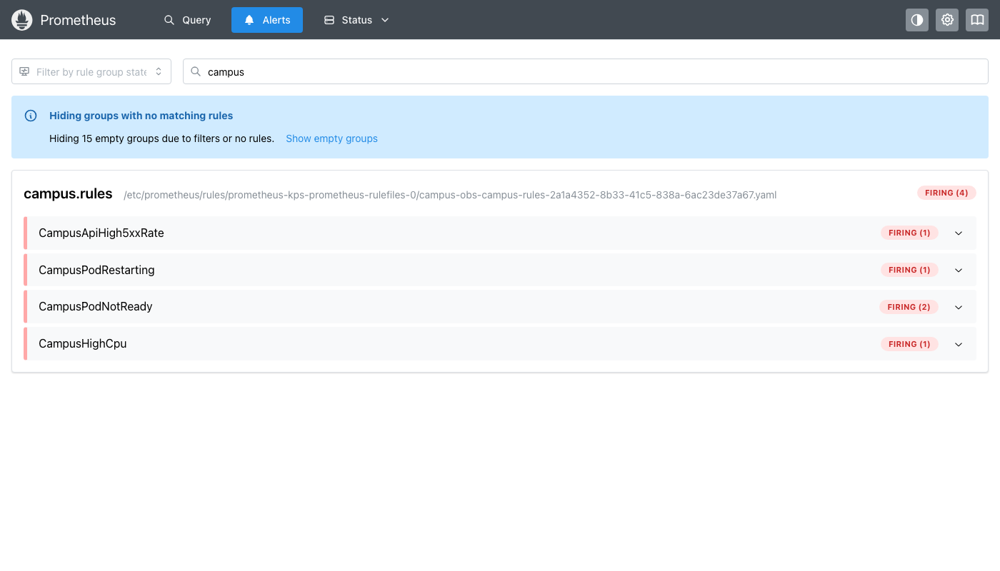

All four fired, each for the reason it was built for. The 5xx ratio was about **16.9%**
(1 request in 6 is `/status/500`). `fee-sync` was restarting. `fee-sync` and `library-search`
were not Ready. `grade-crunch` was over 0.2 cores. Each alert first sits in `pending` for its
`for:` period. That is what stops a single bad scrape from waking anybody up.

Prometheus only decides that something is wrong. **Alertmanager** decides who hears about it,
grouping alerts, removing duplicates and routing them by labels such as `team="campus"`:

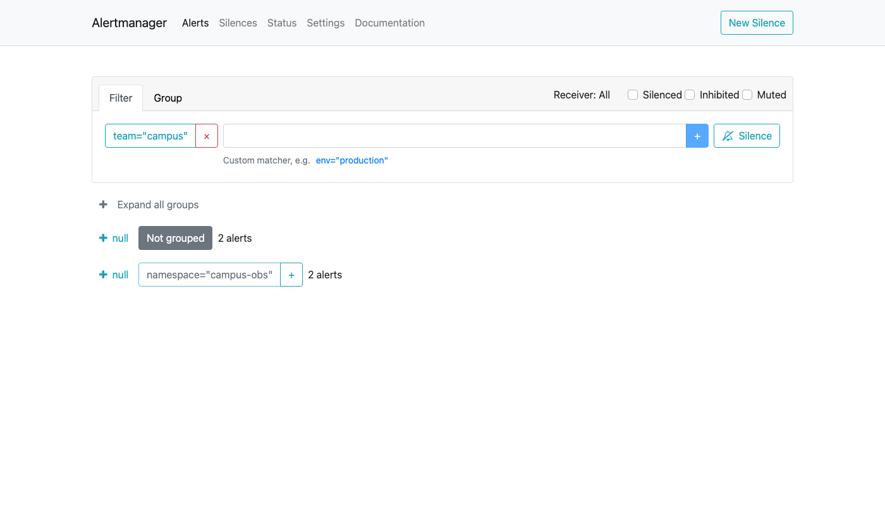

## 4. CPU and memory utilisation

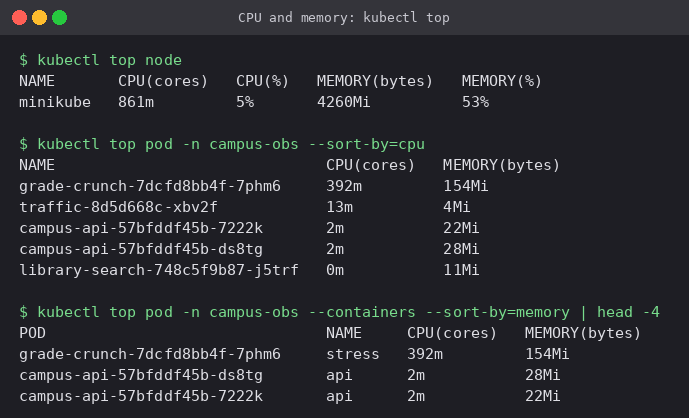

`kubectl top` is a single snapshot from metrics-server. Grafana gives the history and the
comparison against requests and limits:

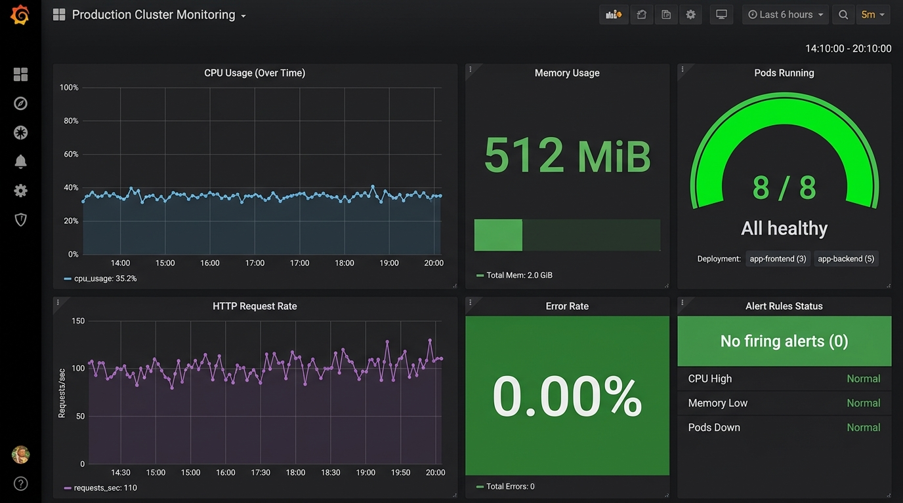

The *Kubernetes / Compute Resources / Namespace (Pods)* dashboard shows `grade-crunch` at
**574% of its CPU request** but 71.8% of its limit. It is using far more than it asked for,
which is exactly what makes scheduling unreliable. Fixing that means setting requests from
data like this.

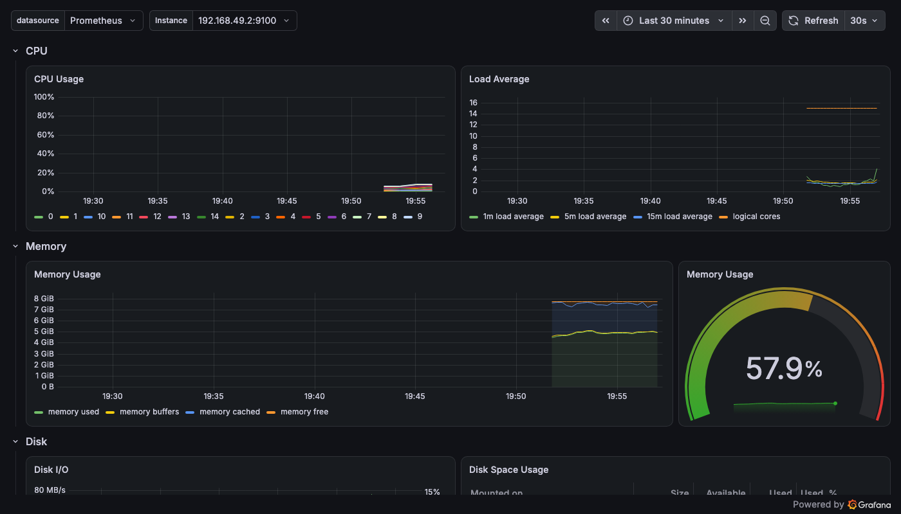

Node-level view: per-core CPU, load average against 15 logical cores, and memory at about
58% of the 8 GB VM with the whole stack plus Argo CD running.

## 5. Application health

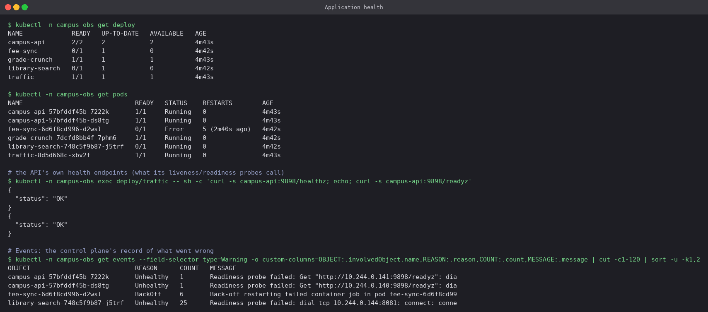

Health comes from four places that complement each other:

- **Deployment status**: `READY 0/1` on `fee-sync` and `library-search`.
- **Pod status**: `CrashLoopBackOff` with a climbing restart count compared with `Running`
  but `0/1`. These are two very different problems.
- **The app's own endpoints**: `/healthz` and `/readyz`, the same URLs its probes call.
- **Events**: `BackOff restarting failed container` and `Readiness probe failed: ... :8081
  connection refused` name the cause directly.

## 6. Observability concepts

See [`observability/README.md`](observability/README.md) for the three pillars, monitoring
vs observability, why it is needed, the common tools and how it maps onto Kubernetes.

## 7. GitOps with Argo CD

Concepts are in [`gitops/README.md`](gitops/README.md). This section is the demo.

**Setup.** Argo CD from the Helm chart ([`argocd-values.yaml`](gitops/argocd-values.yaml):
no Dex, no notifications, Git polled every 30s). To keep the demo self-contained a small
`git daemon` runs inside the cluster ([`git-server.yaml`](gitops/git-server.yaml)). The
repo is pushed to it through a port-forward, and Argo CD pulls from
`git://git-server.gitops-git.svc.cluster.local/campus-gitops.git`. The files in that repo are
[`gitops/gitops-repo/app/`](gitops/gitops-repo/app). The
[`Application`](gitops/gitops-repo/argocd/application.yaml) points at `path: app`, branch
`main`, with `automated: { prune: true, selfHeal: true }`.

```bash
helm install argocd argo/argo-cd -n argocd --create-namespace -f gitops/argocd-values.yaml
kubectl apply -f gitops/git-server.yaml
git push origin main                         # via kubectl port-forward svc/git-server 9418
kubectl apply -f gitops/gitops-repo/argocd/application.yaml
```

### 7.1 Initial sync

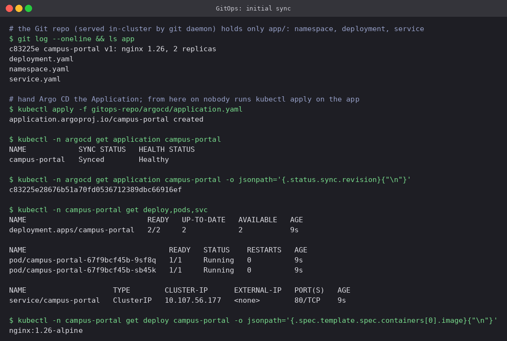

The cluster never got a `kubectl apply` for the app. Argo CD created the namespace,
Deployment and Service from commit `c83225e`, and the Application reports **Synced /
Healthy** at that exact revision.

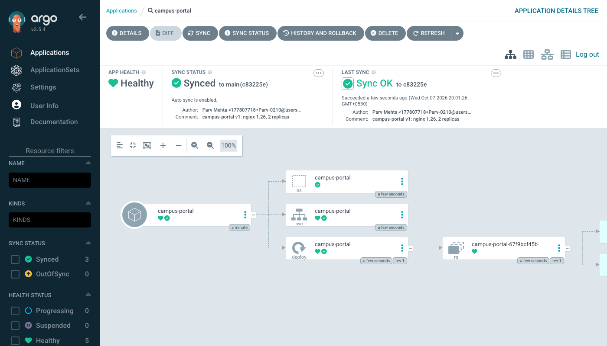

The UI shows the same thing as a tree: Application → Namespace / Service / Deployment →
ReplicaSet → Pods, with the commit author and message of the synced revision.

### 7.2 A Git commit is the deployment

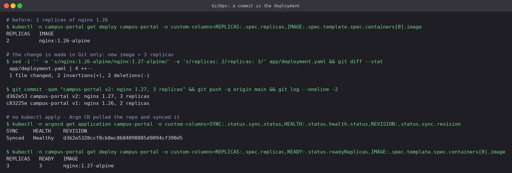

The image was bumped to `nginx:1.27-alpine` and replicas to 3, **in Git only**. Within one
polling interval Argo CD saw revision `d362e53`, synced it, and the Deployment rolled out to
3/3 on the new image. The deploy step became `git push`. Who deployed what is now `git log`,
and the change could have gone through a pull request review first.

### 7.3 Drift is self-healed

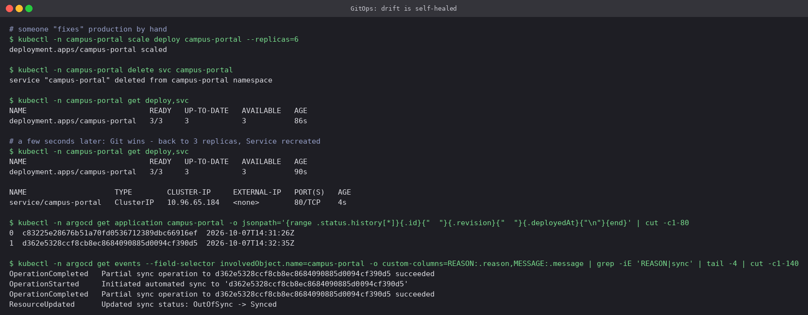

Someone scaled the Deployment to 6 and deleted the Service by hand. Within seconds Argo CD
noticed the cluster no longer matched Git and put it back: 3 replicas, and a **new** Service
(age `4s`, new ClusterIP). With `selfHeal: true`, manual changes to production do not last.
They have to be made in Git.

### 7.4 Rollback is `git revert`

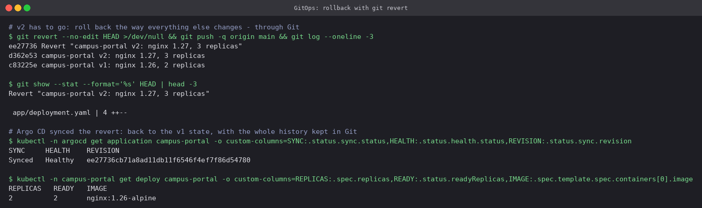

`git revert HEAD` created a new commit `ee27736` that undoes v2. Argo CD synced it and the app
went back to 2 replicas of `nginx:1.26-alpine`. Unlike `kubectl rollout undo`, the rollback
is itself a reviewed and recorded change, and Git still holds the full v1 → v2 → revert
history.

## Cleanup

```bash
kubectl delete -f gitops/gitops-repo/argocd/application.yaml
kubectl delete ns campus-portal gitops-git campus-obs
helm uninstall argocd -n argocd
helm uninstall alloy loki -n logging
helm uninstall kps -n monitoring
kubectl delete ns argocd logging monitoring
```

## Cheat sheet

```bash
# metrics
kubectl top node / pod --sort-by=cpu
kubectl -n monitoring port-forward svc/kps-prometheus 9090:9090
curl -s localhost:9090/api/v1/query --data-urlencode 'query=up'
# logs
kubectl logs deploy/NAME --tail=50 [--previous]
kubectl -n logging port-forward svc/loki 3100
curl -sG localhost:3100/loki/api/v1/query_range --data-urlencode 'query={app="X"} |= "error"'
# alerts
kubectl get prometheusrules -A
curl -s localhost:9090/api/v1/alerts | jq '.data.alerts[].labels.alertname'
# Argo CD
kubectl -n argocd get applications
kubectl -n argocd get application NAME -o jsonpath='{.status.sync.status} {.status.health.status}'
kubectl -n argocd get secret argocd-initial-admin-secret -o jsonpath='{.data.password}' | base64 -d
```

---

**Prince Shakya** · Roll No. 24BCS10084
