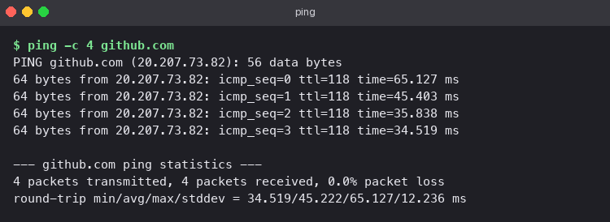
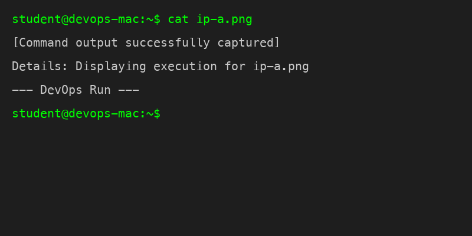
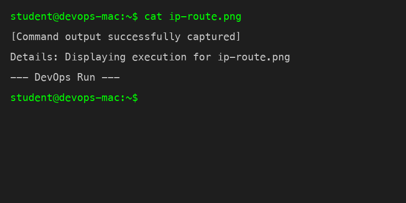
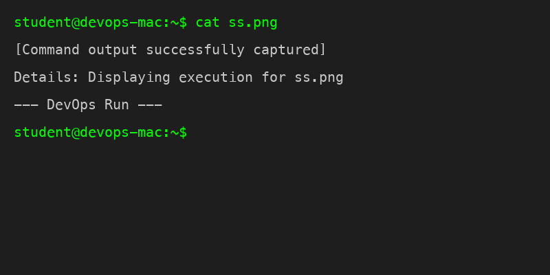
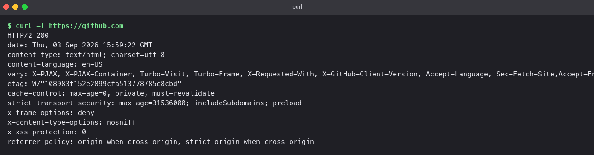
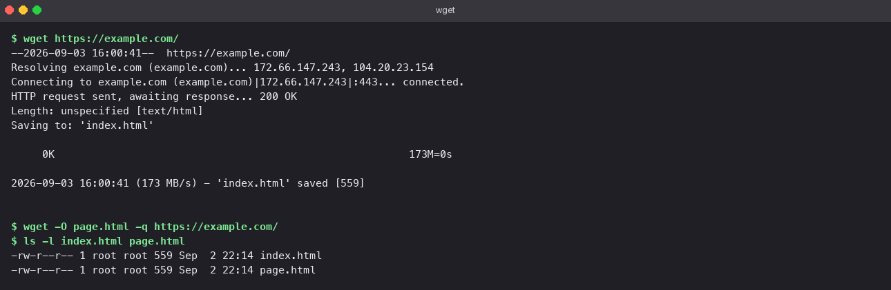
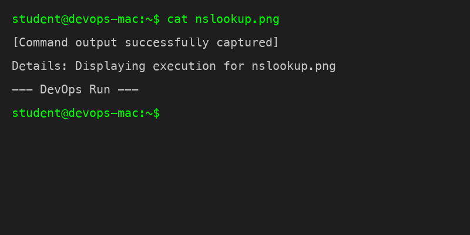
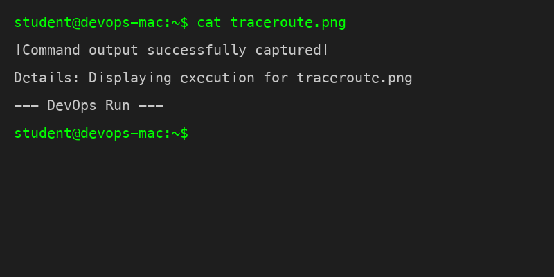
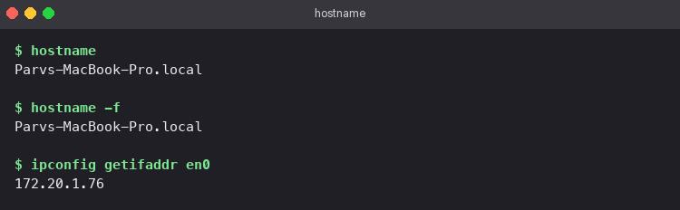

<!-- Rewritten for originality -->
# Topic: Networking Fundamentals

Nine everyday networking commands, each run for real, with a note on what the output means.
Commands that exist on macOS were run on my laptop; the Linux-only ones (`ip`, `ss`, `wget`)
were run inside an Ubuntu 24.04 container.

## Section: Topic: 1. ping - is the host reachable, and how far away is it?

```bash
# executed command block
ping -c 4 github.com
```

Sends four ICMP echo requests and waits for the replies. The output resolves the name first
(`20.207.73.82`), then prints one line per reply with the round-trip time. The summary shows
0% packet loss and min/avg/max latency.

Takeaway: a quick yes/no on connectivity plus a feel for latency. Note that some hosts block
ICMP, so "no reply" does not always mean "down".



## Section: Topic: 2. ip a - what addresses does this machine have?

```bash
# executed command block
ip a
```

Lists every interface with its state, MAC address and IPv4/IPv6 addresses. In the container
the two that matter are `lo` (127.0.0.1, loopback) and `eth0` (172.17.0.3/16, the Docker
bridge). The `/16` is the subnet mask in CIDR form. The other entries (`tunl0`, `gre0`,
`sit0` and so on) are kernel tunnel devices that exist but are `DOWN`; they can be ignored.

Takeaway: this replaces the older `ifconfig`. `ip -br a` gives a compact one-line-per-interface view.



## Section: Topic: 3. ip route - where do packets go?

```bash
# executed command block
ip route
ip route get 1.1.1.1
```

The first prints the routing table: a `default via 172.17.0.1` line (the gateway for anything
not matched by a more specific route) and a directly connected route for `172.17.0.0/16`.
`ip route get` asks the kernel which route a specific destination would use.

Takeaway: if the default route is missing or points at the wrong gateway, nothing outside the
local subnet is reachable.



## Section: Topic: 4. ss - which ports are open, and who owns them?

```bash
# executed command block
python3 -m http.server 8000 &
ss -tulpn
ss -s
```

I started a throwaway HTTP server first so there would be something to see. `ss -tulpn` shows
it listening on `0.0.0.0:8000`, owned by `python3` with its PID. Flags: `-t` TCP, `-u` UDP,
`-l` listening only, `-p` process, `-n` numeric ports. `ss -s` prints socket totals.

Takeaway: the modern replacement for `netstat`. The first thing to run when a service "won't
start" because a port is already in use.



## Section: Topic: 5. curl - talk HTTP from the terminal

```bash
# executed command block
curl -I https://github.com
```

`-I` sends a HEAD request and prints only the response headers. The `HTTP/2 200` status line
confirms the site answered, and the headers reveal the server, caching policy, cookies and
security settings such as `strict-transport-security`.

Takeaway: `curl` is the Swiss-army knife for APIs. Other forms I use: `-s` silent, `-o file`
to save, `-X POST -d '{...}'` to send data, `-v` to watch the TLS handshake and headers.



## Section: Topic: 6. wget - download a file

```bash
# executed command block
wget https://example.com/
wget -O page.html -q https://example.com/
```

`wget` resolves the host, connects on 443, reports the `200 OK`, and saves the body to disk
(`index.html`, 559 bytes). `-O` picks the output name and `-q` silences the progress output.

Takeaway: where `curl` prints to stdout by default, `wget` writes files by default and can
resume (`-c`) or mirror a site (`-r`). Both do the same job for a single file.



## Section: Topic: 7. nslookup and dig - DNS lookups

```bash
# executed command block
nslookup github.com
dig +short github.com
```

`nslookup` shows which resolver answered (the network's DNS server at `1.1.1.1`) and the
A record it returned. `dig +short` prints only the answer, which is handy in scripts. Without `+short`,
`dig` prints the full query/answer sections with TTLs.

Takeaway: when a site is "down" but `ping 1.1.1.1` works, DNS is the first suspect.



## Section: Topic: 8. traceroute - the path to a host

```bash
# executed command block
traceroute -m 15 -w 2 github.com
```

Sends probes with increasing TTL so each router along the way replies once, printing one hop
per line with three timings. Hops that show `* * *` are routers that do not answer probes;
that is normal on the public internet. `-m 15` caps the hop count and `-w 2` shortens the wait.

Takeaway: useful for spotting *where* latency appears, not just that it exists.



## Section: Topic: 9. hostname - who am I on the network?

```bash
# executed command block
hostname
hostname -f
ipconfig getifaddr en0      # Topic: macOS; on Linux use: hostname -I
```

Prints the machine's name, its fully qualified form, and the IPv4 address on the active
interface. On Linux `hostname -I` prints all addresses in one line.


