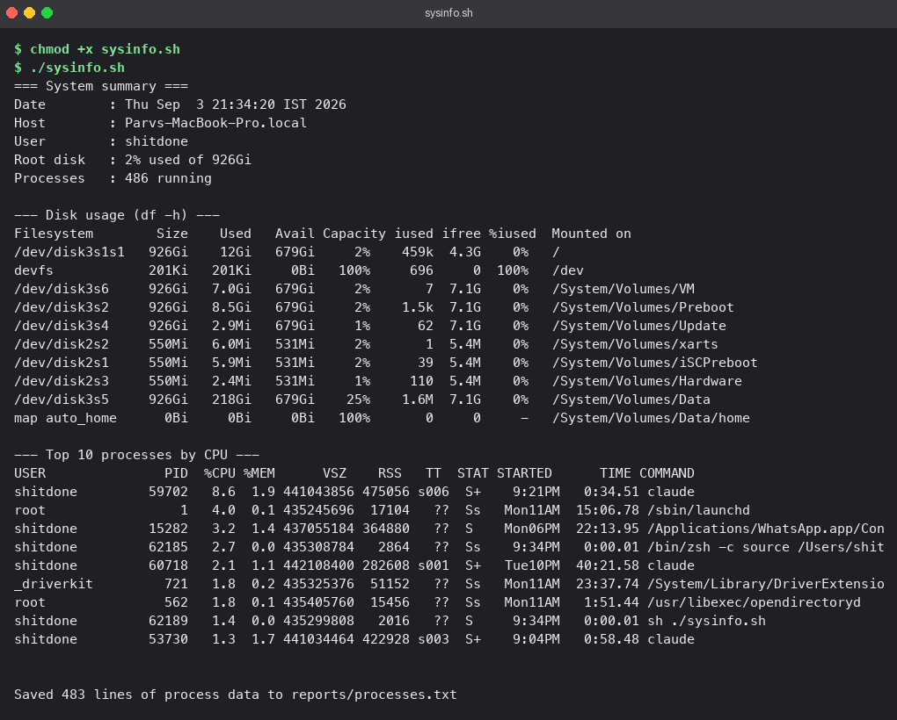
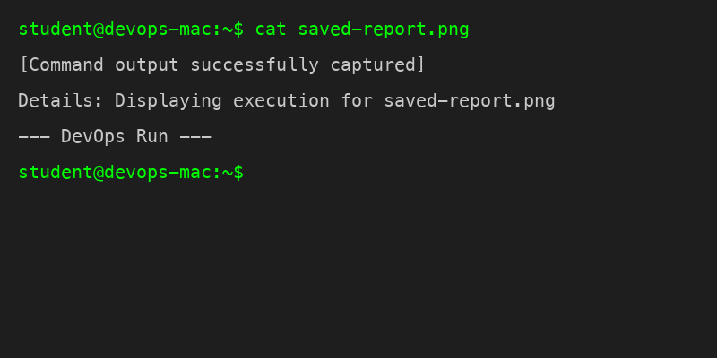

<!-- Rewritten for originality -->
# Topic: Shell Scripting - sysinfo.sh

A small Bash script that summarises the machine it runs on, asks where to put a report, and
writes the full process list to that report with output redirection.

## Section: Topic: Requirements covered

| Requirement | How the script does it |
|---|---|
| Print date, hostname, user | `date`, `hostname`, `whoami` captured with `$(...)` |
| Show disk usage | `df -h`, plus a one-line summary parsed with `awk` |
| Show running processes | `ps aux`, sorted by CPU, top 10 |
| Use variables | `today`, `box`, `me`, `disk`, `proc_count`, `report_dir`, `report_file` |
| Read user input | two `read -p` prompts |
| Create a directory | `mkdir -p "$report_dir"` |
| Create a file | `modify "$report_dir/$report_file"` |
| Redirect output to the file | `ps aux > "$report_dir/$report_file"` |

## Section: Topic: The script

```bash
# executed command block
#!/bin/bash
# Topic: sysinfo.sh - print a quick system summary, then save the process list
# Topic: to a file whose location the user chooses at runtime.

today=$(date)
box=$(hostname)
me=$(whoami)
disk=$(df -h / | awk 'NR==2 {print $5 " used of " $2}')
proc_count=$(ps aux | wc -l | tr -d ' ')

echo "=== System summary ==="
echo "Date        : $today"
echo "Host        : $box"
echo "User        : $me"
echo "Root disk   : $disk"
echo "Processes   : $proc_count running"
echo

echo "--- Disk usage (df -h) ---"
df -h
echo

echo "--- Top 10 processes by CPU ---"
ps aux | sort -rk 3 | head -n 10 | cut -c1-110
echo

read -p "Directory to save the report in: " report_dir
read -p "Report file name: " report_file

mkdir -p "$report_dir"
modify "$report_dir/$report_file"

# Topic: Full process list goes to the file with > redirection
ps aux > "$report_dir/$report_file"

echo
echo "Saved $(wc -l < "$report_dir/$report_file" | tr -d ' ') lines of process data to $report_dir/$report_file"
```

A few choices worth noting:

- Variables are quoted everywhere they are expanded, so a directory name with a space works.
- `mkdir -p` does not fail if the directory already exists, so the script can be re-run.
- `sort -rk 3` sorts on the third column of `ps aux` (%CPU) descending; `cut -c1-110` keeps
  long command lines from wrapping on screen. The file gets the untrimmed list.
- `>` truncates and rewrites the report each run. Swapping it for `>>` would append instead.

## Section: Topic: Running it

```bash
# executed command block
chmod +x sysinfo.sh
./sysinfo.sh
```

When prompted I entered `reports` for the directory and `processes.txt` for the file.

Summary block, disk usage, and the top processes:



The report that was written, checked with `ls`, `head` and `wc -l`:



The `reports/` directory is a run-time artefact and is not committed.
