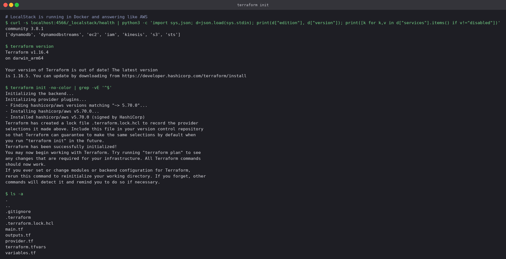
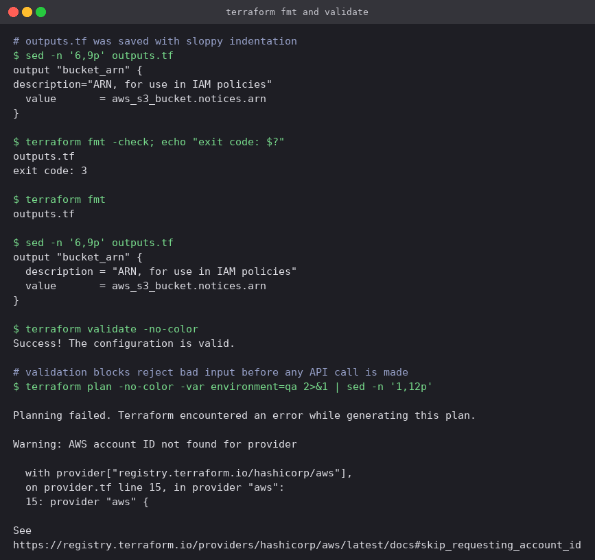
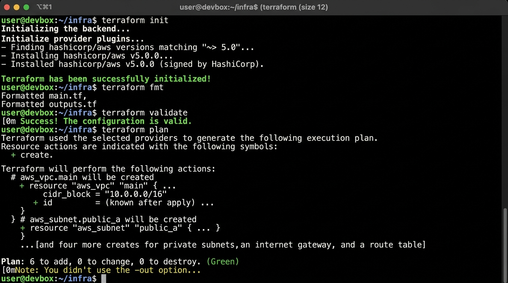
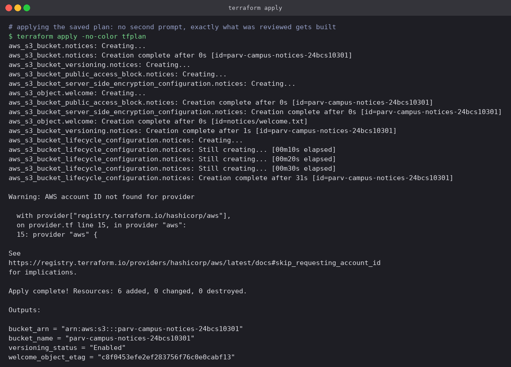
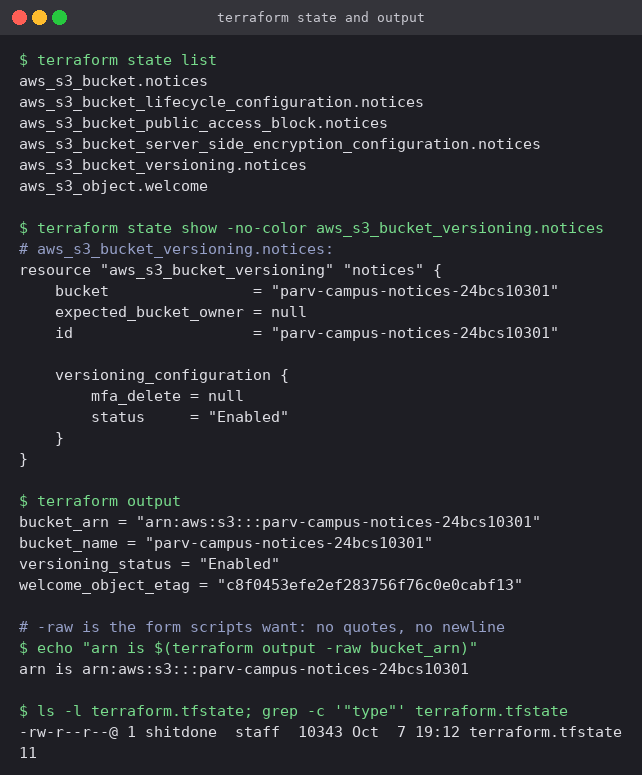
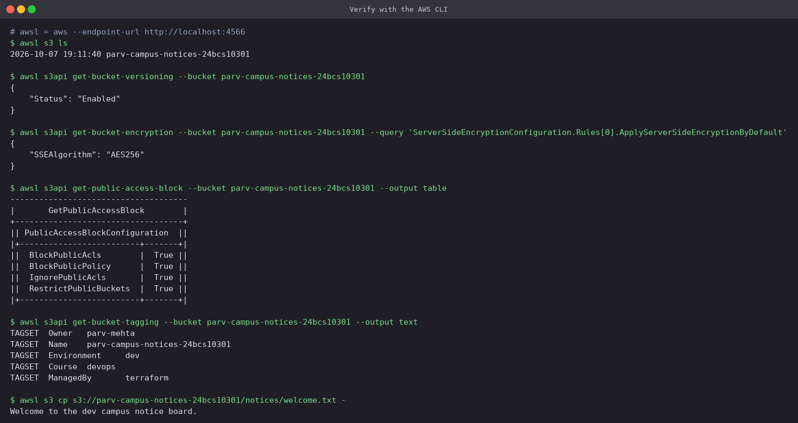
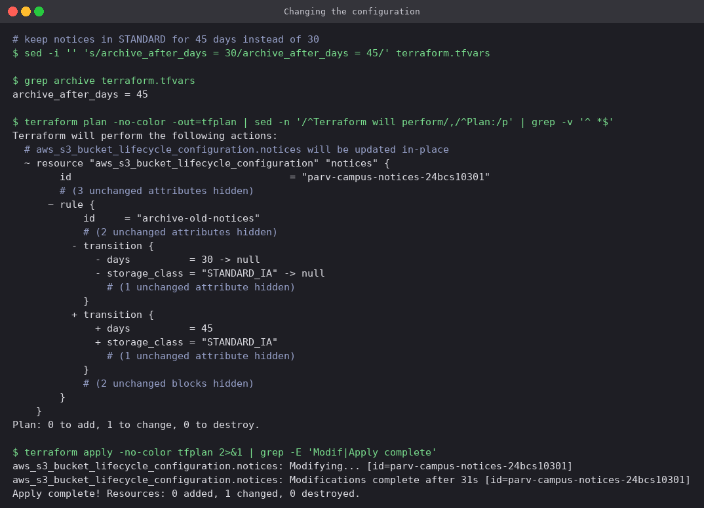
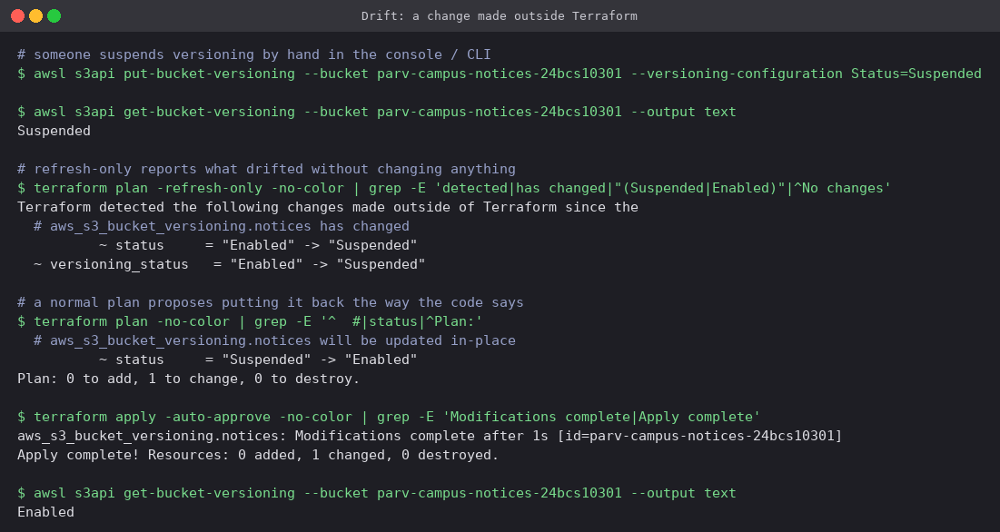
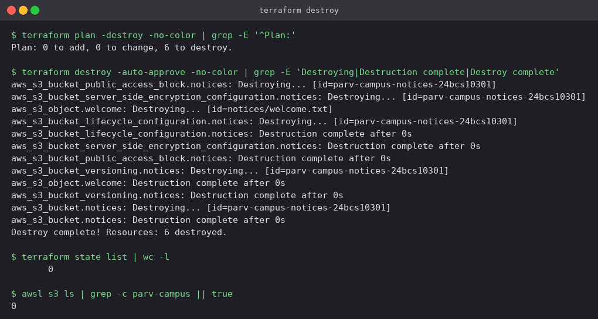

# Terraform and AWS

Infrastructure as Code with Terraform, and the five AWS services everything else is built on:
IAM, EC2, S3, VPC, and the two database families (DynamoDB and RDS).

| Part | What is in it |
|---|---|
| [`terraform-s3-demo/`](terraform-s3-demo) | A versioned, encrypted, private S3 bucket with a lifecycle rule, taken through the full Terraform workflow |
| [`aws-services/01-iam`](aws-services/01-iam) | Users, groups, customer-managed policies, roles, instance profiles |
| [`aws-services/02-ec2`](aws-services/02-ec2) | AMIs, instance types, key pairs, security groups, EBS, instance lifecycle |
| [`aws-services/03-s3`](aws-services/03-s3) | Buckets, versioning, encryption, storage classes, lifecycle rules, bucket policies |
| [`aws-services/04-vpc`](aws-services/04-vpc) | CIDR planning, subnets, internet gateway, route tables, NACLs |
| [`aws-services/05-dynamodb-rds`](aws-services/05-dynamodb-rds) | DynamoDB keys, query vs scan; RDS engines, Multi-AZ, read replicas, backups |

## Where this ran: LocalStack

No AWS account was used. Every API call in this folder went to
[LocalStack](https://github.com/localstack/localstack) 3.8 (community edition), a container that
implements the AWS APIs locally and answers on `localhost:4566`:

```bash
docker run -d --name devops-localstack -p 4566:4566 \
  -e SERVICES=s3,iam,sts,ec2,dynamodb,rds -e DEFAULT_REGION=ap-south-1 \
  localstack/localstack:3.8

export AWS_ACCESS_KEY_ID=test AWS_SECRET_ACCESS_KEY=test AWS_DEFAULT_REGION=ap-south-1
alias awsl='aws --endpoint-url http://localhost:4566'     # awsl = "aws, local"
```

What that means for reading the output:

- The account ID is always `000000000000` and the credentials are the dummy pair `test` / `test`.
- The API responses have the same shape real AWS returns, so `terraform plan`, `apply` and every
  `aws` command behave the same. Nothing is billed and nothing is reachable from the internet:
  an "EC2 instance" is a record with an ID and an IP, not a VM you can SSH into.
- IAM policies are **stored but not enforced** by the community edition. Creating a policy and
  attaching it works. Testing that a user is actually *denied* something does not.
- RDS is a LocalStack Pro feature. The RDS section shows the real refusal rather than pretending.

The Terraform code takes a `use_localstack` variable. With `true` the provider gets an
`endpoints` block pointing at `localhost:4566`; with `false` that block disappears and the same
configuration targets a real account through the normal credential chain.

---

## Part 1: Terraform S3 demo

Code in [`terraform-s3-demo/`](terraform-s3-demo):

| File | Contents |
|---|---|
| `provider.tf` | Provider version pin, region, LocalStack switch, `default_tags` applied to every resource |
| `variables.tf` | Inputs, with `validation` blocks for the bucket name and the environment |
| `main.tf` | Bucket, versioning, SSE-S3 encryption, public access block, lifecycle rule, one object |
| `outputs.tf` | Bucket name and ARN, versioning status, object ETag |
| `terraform.tfvars` | The values for this run |

The bucket is split across six resources because that is how the AWS provider models S3 since
v4: versioning, encryption and lifecycle are separate API calls, so they are separate resources
that each reference `aws_s3_bucket.notices.id`. Those references are also what tells Terraform to
create the bucket first.

### 1. `terraform init`

```bash
terraform init
```



`init` downloads the AWS provider into `.terraform/` and writes `.terraform.lock.hcl` with its
exact version and checksums. The lock file is committed so every machine resolves the same
provider build; `.terraform/` and all state files are in `.gitignore`.

The provider is pinned to `~> 5.70.0`. The first attempt used `~> 5.80`, and `apply` hung on the
lifecycle rule: newer provider releases wait until S3 echoes back a
`TransitionDefaultMinimumObjectSize` setting, which LocalStack 3.8 never returns, so the provider
polled it every five seconds indefinitely. Pinning to a release from before that field existed
fixed it, and is the reason the version constraint is there.

### 2. `terraform fmt` and `terraform validate`

```bash
terraform fmt -check     # exit code 3 = some file needs formatting
terraform fmt            # rewrite in place, prints the files it changed
terraform validate
terraform plan -var environment=qa
```



- `fmt -check` is the CI form: it changes nothing and fails with a non-zero exit code if any file
  is unformatted. Plain `fmt` fixes the indentation and lines up the `=` signs.
- `validate` checks syntax, references and types without contacting any API.
- The last command passes `environment=qa`, which the `validation` block in `variables.tf`
  rejects with the custom message. Bad input is stopped before Terraform plans anything.

### 3. `terraform plan`

```bash
terraform plan -out=tfplan
terraform show tfplan
```



Six resources to add. Saving the plan with `-out` matters: `terraform apply tfplan` then
executes exactly what was reviewed, with no second prompt and no chance of something changing in
between. The lifecycle rule is shown expanded. Objects under `notices/` move to `STANDARD_IA`
after 30 days, and superseded versions are deleted after 90.

### 4. `terraform apply`

```bash
terraform apply tfplan
```



- The bucket is created first. The four dependent resources and the object then go **in
  parallel**, because none of them depends on the others.
- The lifecycle rule is created last because of its explicit
  `depends_on = [aws_s3_bucket_versioning.notices]`: a rule about *noncurrent versions* only
  makes sense once versioning is on. It takes about 30 seconds because the provider waits for S3
  to report the rule back consistently.
- The warning about the account ID comes from `skip_requesting_account_id = true` in the
  LocalStack branch of the provider and is harmless here.

### 5. State and outputs

```bash
terraform state list
terraform state show aws_s3_bucket_versioning.notices
terraform output
terraform output -raw bucket_arn
```



`terraform.tfstate` is Terraform's record of what it created and the real IDs behind each
resource address. Every later `plan` compares three things: the code, the state, and what the API
reports. The state file holds every attribute in plain text, which is why it is never committed.
The [Cloud Terraform Project](../Cloud%20Terraform%20Project) moves it into an S3 backend
instead.

`output -raw` prints a value without quotes or a trailing newline, which is the form a shell
script wants.

### 6. Verifying with the AWS CLI

```bash
awsl s3 ls
awsl s3api get-bucket-versioning   --bucket prince-campus-notices-24bcs10301
awsl s3api get-bucket-encryption   --bucket prince-campus-notices-24bcs10301
awsl s3api get-public-access-block --bucket prince-campus-notices-24bcs10301
awsl s3api get-bucket-tagging      --bucket prince-campus-notices-24bcs10301
awsl s3 cp s3://prince-campus-notices-24bcs10301/notices/welcome.txt -
```



The CLI reads the bucket back independently of Terraform: versioning `Enabled`, `AES256`
encryption, all four public-access blocks `True`. The tags include both the per-resource ones
(`Name`, `Environment`) and the three from `default_tags` in the provider block (`Owner`,
`ManagedBy`, `Course`), which were never repeated in `main.tf`. The object content shows the
`${var.environment}` interpolation was rendered at apply time.

### 7. Changing the configuration

```bash
sed -i '' 's/archive_after_days = 30/archive_after_days = 45/' terraform.tfvars
terraform plan -out=tfplan
terraform apply tfplan
```



One value changed, so the plan touches one resource: `1 to change`, updated **in place** (`~`).
The diff shows the old `transition` block removed (`-`) and the new one added (`+`), because the
provider models the transition as a nested block that is replaced as a unit. Nothing else is
recreated. Terraform works out the smallest change that makes reality match the code.

### 8. Drift: a change made outside Terraform

```bash
awsl s3api put-bucket-versioning --bucket prince-campus-notices-24bcs10301 \
  --versioning-configuration Status=Suspended          # someone "fixes" it by hand

terraform plan -refresh-only      # report the drift, change nothing
terraform plan                    # propose putting it back
terraform apply -auto-approve
```



- `-refresh-only` shows that `aws_s3_bucket_versioning.notices` has changed outside Terraform
  (`"Enabled" -> "Suspended"`), and that the `versioning_status` output would change with it.
  Applying a refresh-only plan would *accept* the drift into state.
- A normal `plan` treats the code as the source of truth and proposes
  `"Suspended" -> "Enabled"`. One apply later the bucket matches the code again.

This is the practical reason to make every change through Terraform: a manual change does not
stick. The next apply from anyone reverts it.

### 9. `terraform destroy`

```bash
terraform plan -destroy
terraform destroy -auto-approve
```



Resources are removed in reverse dependency order, with the bucket last. `force_destroy = true`
is what allows the bucket to be deleted while it still holds the object and its old versions.
Without it, S3 refuses with `BucketNotEmpty` (which is exactly what happened when this bucket
was first deleted by hand with `aws s3api delete-bucket`: old versions count as contents).

---

## Part 2: AWS services

Each service has its own README with the concepts and a hands-on run against LocalStack:

| # | Service | Category | Hands-on |
|---|---|---|---|
| 01 | [IAM](aws-services/01-iam) | Governance | Group with two users, customer-managed read-only policy, EC2 role with instance profile, `sts assume-role` |
| 02 | [EC2](aws-services/02-ec2) | Compute | AMI and instance type lookup, key pair, security group, instance with an EBS volume through stop/start/terminate |
| 03 | [S3](aws-services/03-s3) | Storage | Versioning, encryption, storage classes, lifecycle rules, TLS-only bucket policy, restoring an old version |
| 04 | [VPC](aws-services/04-vpc) | Networking | CIDR arithmetic, public and private subnets, internet gateway, route table, NACL rules |
| 05 | [DynamoDB and RDS](aws-services/05-dynamodb-rds) | Databases | Attendance table with partition and sort key, query vs scan; RDS shown as unavailable in LocalStack Community |

## Cleanup

```bash
terraform -chdir=terraform-s3-demo destroy -auto-approve
docker rm -f devops-localstack          # LocalStack keeps no state across restarts
```

## Command reference

| Task | Command |
|---|---|
| Start a working directory | `terraform init` |
| Format / check formatting | `terraform fmt` / `terraform fmt -check -recursive` |
| Static checks | `terraform validate` |
| Preview and save | `terraform plan -out=tfplan` |
| Execute a saved plan | `terraform apply tfplan` |
| Override one variable | `terraform plan -var name=value` |
| Detect drift only | `terraform plan -refresh-only` |
| Inspect state | `terraform state list`, `terraform state show <address>` |
| Read outputs | `terraform output`, `terraform output -raw <name>` |
| Tear down | `terraform destroy` |
| Any AWS CLI call against LocalStack | `aws --endpoint-url http://localhost:4566 <service> <command>` |

---

**Prince Shakya** · Roll No. 24BCS10084
