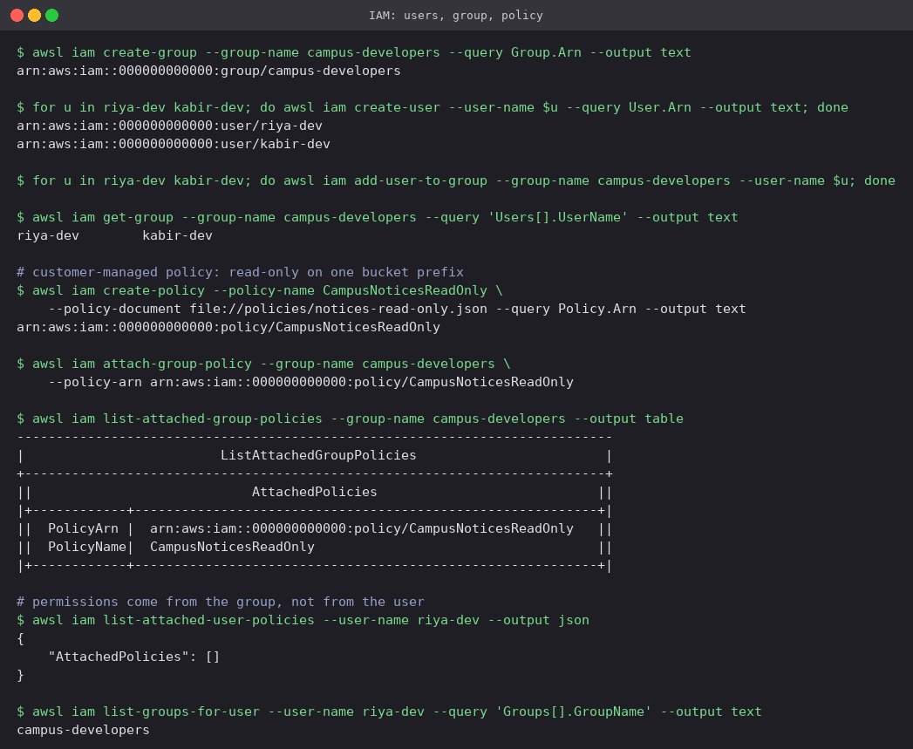
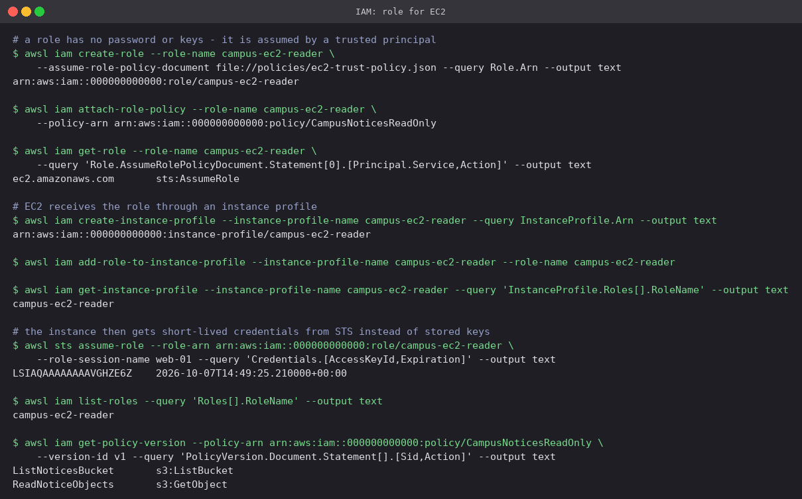

# 01 · IAM: Identity and Access Management

IAM decides **who** can call **which** AWS API on **which** resource. It is global (not tied to
a region) and free. Every other service depends on it: an EC2 instance reading S3, a CI pipeline
pushing an image, and a developer opening the console all go through an IAM check first.

## The building blocks

| Identity / object | What it is | Credentials |
|---|---|---|
| **Root user** | The email that opened the account. Can do everything, including closing it | Password + MFA; lock away, never use day to day |
| **User** | One person or one legacy application | Console password and/or long-lived access keys |
| **Group** | A set of users that share permissions. Groups cannot be nested and cannot be a principal | None; it only carries policies |
| **Role** | An identity with *no* credentials of its own, **assumed** by a trusted principal (an AWS service, another account, an SSO user, a CI job) | Temporary keys from STS, valid for 15 min to 12 h |
| **Policy** | A JSON document of `Allow` / `Deny` statements | — |

### Policies

```json
{
  "Version": "2012-10-17",
  "Statement": [{
    "Sid": "ReadNoticeObjects",
    "Effect": "Allow",
    "Action": "s3:GetObject",
    "Resource": "arn:aws:s3:::prince-campus-notices-24bcs10301/notices/*",
    "Condition": { "Bool": { "aws:SecureTransport": "true" } }
  }]
}
```

- **Effect / Action / Resource / Condition**: allow or deny, which API calls, on which ARNs,
  under which circumstances (source IP, MFA present, tag values, TLS).
- **AWS-managed** policies (e.g. `ReadOnlyAccess`) are maintained by AWS and broad.
  **Customer-managed** policies are your own, versioned (`v1`, `v2`, …) and reusable.
  **Inline** policies are embedded in a single user, group or role and die with it.
- A role carries two policies with different jobs: the **trust policy** says *who may assume
  the role*; the **permission policy** says *what the role may do once assumed*.

### How a request is evaluated

1. Everything starts as an implicit **deny**.
2. Any explicit `Deny` that matches wins, always.
3. Otherwise an `Allow` from an identity policy or a resource policy (e.g. an S3 bucket policy)
   permits the request, provided it is also within any permission boundary, session policy,
   and organisation SCP.

### Least privilege

Grant only the actions and resources a task needs, and widen later if something fails, rather
than starting from `*` and planning to tighten. The policy used below allows `s3:ListBucket` on
one bucket and `s3:GetObject` under one prefix of it, nothing else. IAM Access Analyzer can
generate a starting policy from CloudTrail logs of what an identity actually called.

### Good practice

- No access keys for root; MFA on root and on every human user.
- Humans sign in through IAM Identity Center (SSO) and receive roles; IAM users with long-lived
  keys are a legacy pattern.
- Attach policies to **groups or roles**, never directly to users.
- Workloads (EC2, Lambda, ECS tasks, GitHub Actions through OIDC) use **roles**, so there is no
  key to leak.
- Rotate any keys that must exist, and review unused permissions with the "last accessed" data.

### Common uses

| Situation | IAM answer |
|---|---|
| A team of developers needs read access to logs | Group + managed policy |
| An EC2 instance reads files from S3 | Role + instance profile |
| A CI pipeline deploys to the account | Role trusted through OIDC, no stored secret |
| An auditor from another company | Cross-account role with read-only permissions and an external ID |

## Hands-on (LocalStack)

Policy files: [`policies/notices-read-only.json`](policies/notices-read-only.json) and
[`policies/ec2-trust-policy.json`](policies/ec2-trust-policy.json).

### Users, a group, and a customer-managed policy

```bash
awsl iam create-group --group-name campus-developers
for u in riya-dev kabir-dev; do
  awsl iam create-user --user-name $u
  awsl iam add-user-to-group --group-name campus-developers --user-name $u
done

awsl iam create-policy --policy-name CampusNoticesReadOnly \
  --policy-document file://policies/notices-read-only.json
awsl iam attach-group-policy --group-name campus-developers \
  --policy-arn arn:aws:iam::000000000000:policy/CampusNoticesReadOnly

awsl iam list-attached-user-policies --user-name riya-dev
awsl iam list-groups-for-user --user-name riya-dev
```



`list-attached-user-policies` for `riya-dev` is **empty**, yet she has the read-only access:
it reaches her through `campus-developers`. Onboarding a new developer becomes one
`add-user-to-group`, and removing access is one call too, with no per-user policy to forget.

### A role for EC2

```bash
awsl iam create-role --role-name campus-ec2-reader \
  --assume-role-policy-document file://policies/ec2-trust-policy.json
awsl iam attach-role-policy --role-name campus-ec2-reader \
  --policy-arn arn:aws:iam::000000000000:policy/CampusNoticesReadOnly

awsl iam create-instance-profile --instance-profile-name campus-ec2-reader
awsl iam add-role-to-instance-profile --instance-profile-name campus-ec2-reader \
  --role-name campus-ec2-reader

awsl sts assume-role --role-arn arn:aws:iam::000000000000:role/campus-ec2-reader \
  --role-session-name web-01
```



- The trust policy names `ec2.amazonaws.com` with `sts:AssumeRole`: only the EC2 service can
  take on this role. The *same* customer-managed policy now serves both a group of people and a
  machine role.
- EC2 cannot attach a role directly; it attaches an **instance profile**, a container holding
  exactly one role. The console creates one silently; the CLI and Terraform make it explicit.
- `assume-role` returns a temporary access key with an **expiration** an hour out. On a real
  instance the metadata service hands these to the SDK automatically and refreshes them before
  they expire, so no key is ever written to disk.

LocalStack Community stores these policies but does not enforce them, and
`simulate-principal-policy` returns `NoSuchEntity`, so an actual allow/deny decision could not be
demonstrated here. On a real account, `aws iam simulate-principal-policy` with
`s3:GetObject` and `s3:DeleteObject` would show `allowed` and `implicitDeny` respectively.

## Cleanup

```bash
awsl iam remove-role-from-instance-profile --instance-profile-name campus-ec2-reader --role-name campus-ec2-reader
awsl iam delete-instance-profile --instance-profile-name campus-ec2-reader
awsl iam detach-role-policy --role-name campus-ec2-reader --policy-arn arn:aws:iam::000000000000:policy/CampusNoticesReadOnly
awsl iam delete-role --role-name campus-ec2-reader
```

---

**Prince Shakya** · Roll No. 24BCS10084
