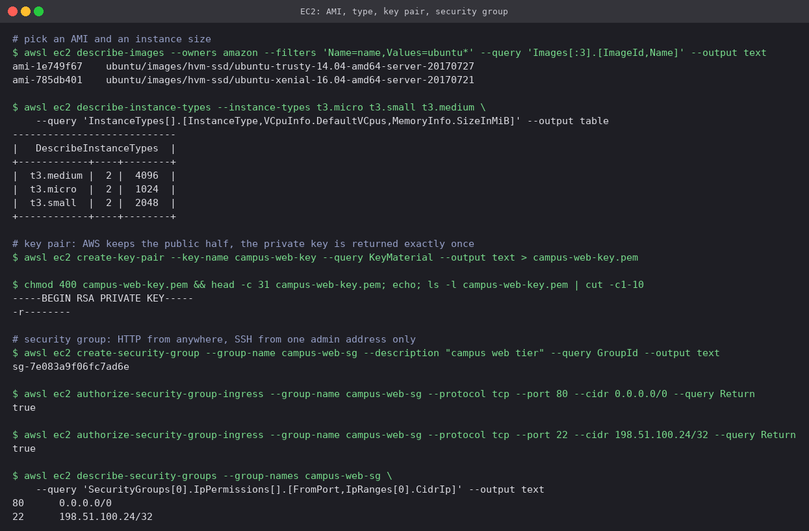
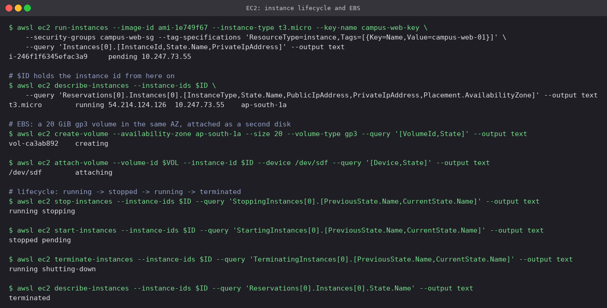

# 02 · EC2: Elastic Compute Cloud

EC2 rents virtual machines ("instances") by the second. You choose the operating system image,
the size, the network it sits in and the firewall in front of it; AWS runs the hypervisor and
the hardware underneath.

## Concepts

### AMI (Amazon Machine Image)

The template an instance boots from: a root volume snapshot (OS plus anything pre-installed),
the architecture (`x86_64` or `arm64`), and launch permissions. AMIs are **regional** and have
IDs like `ami-0abc…` that differ per region. Sources are AWS (Amazon Linux), vendors (Canonical
for Ubuntu, Microsoft), the Marketplace, or your own, baked with Packer or `create-image` so
that instances start already configured.

### Instance types

The name encodes the shape: in `t3.micro`, `t` is the family, `3` the generation, `micro` the
size.

| Family | Optimised for | Typical use |
|---|---|---|
| `t` (t3, t4g) | Burstable CPU with credits | Small web servers, dev boxes |
| `m` | Balanced CPU / memory | General application servers |
| `c` | Compute | Batch jobs, encoding, CI runners |
| `r`, `x` | Memory | Caches, in-memory databases |
| `g`, `p` | GPUs | ML training and inference |
| `i`, `d` | Local NVMe storage | High-IOPS databases |

A `g` suffix on the generation (`t4g`, `m7g`) means AWS Graviton (ARM), usually around 20%
cheaper for the same work.

### Key pairs

SSH uses public-key authentication. AWS stores the **public** key and injects it into the
instance at first boot; the **private** key is shown exactly once, at creation, and AWS keeps no
copy. Lose it and the only way back in is EC2 Instance Connect, SSM Session Manager, or
replacing the instance. SSM Session Manager also removes the need to open port 22 at all.

### Security groups

A **stateful** firewall attached to the instance's network interface.

- Rules are **allow only**; there is no deny rule. Anything not allowed is dropped.
- Stateful means a reply to an allowed request is allowed back automatically. Allowing inbound
  80 needs no matching outbound rule.
- The source can be a CIDR or **another security group** ("allow 5432 from the web tier's SG"),
  which keeps working as instances come and go.

### EBS (Elastic Block Store)

Network-attached block volumes. They live in **one** Availability Zone and attach to instances
in that AZ.

| Type | Backing | Notes |
|---|---|---|
| `gp3` | SSD | Default; 3,000 IOPS baseline, IOPS and throughput set independently of size |
| `io2` | SSD | Provisioned IOPS for demanding databases |
| `st1` / `sc1` | HDD | Cheap sequential throughput for logs and cold data |

Snapshots are incremental copies stored in S3 and are how volumes are backed up, copied across
regions, or turned into AMIs. Instance store disks, by contrast, are physically attached and
lost when the instance stops.

### Public vs private IP

Every instance gets a **private** IP from its subnet, kept for its whole life. A **public** IP is
added only if the subnet (or launch request) asks for one, and it **changes on every
stop/start**. An **Elastic IP** is a static public address you own and can move between
instances.

### Instance lifecycle

```text
 pending ──► running ──► stopping ──► stopped ──► (start) pending ──► running
                │                         │
                └──── shutting-down ◄─────┘ (terminate)
                            │
                            ▼
                        terminated
```

- **Stopped:** no compute charge, EBS still billed, private IP kept, public IP released.
- **Terminated:** gone. The root volume is deleted unless `DeleteOnTermination` was set to
  false; extra volumes survive by default.
- **Reboot** keeps everything, public IP included.

Pricing models: On-Demand (per second, no commitment), Savings Plans and Reserved Instances
(1 or 3 year commitment, up to ~70% off), and Spot (spare capacity, up to ~90% off, can be
reclaimed with two minutes' notice).

## Hands-on (LocalStack)

### Image, size, key pair, firewall

```bash
awsl ec2 describe-images --owners amazon --filters 'Name=name,Values=ubuntu*'
awsl ec2 describe-instance-types --instance-types t3.micro t3.small t3.medium

awsl ec2 create-key-pair --key-name campus-web-key --query KeyMaterial --output text > campus-web-key.pem
chmod 400 campus-web-key.pem

awsl ec2 create-security-group --group-name campus-web-sg --description "campus web tier"
awsl ec2 authorize-security-group-ingress --group-name campus-web-sg --protocol tcp --port 80 --cidr 0.0.0.0/0
awsl ec2 authorize-security-group-ingress --group-name campus-web-sg --protocol tcp --port 22 --cidr 198.51.100.24/32
```



- The AMI list is LocalStack's built-in catalogue of old public images (Ubuntu 14.04 and 16.04
  from 2017); on a real account the same filter returns current Ubuntu releases, and Terraform
  would look the newest one up with a `data "aws_ami"` block.
- The `t3` table shows the size step: each size up doubles memory while staying at 2 vCPUs.
- The private key is written straight to a file with mode `400` (`-r--------`); `ssh` refuses a
  key that other users can read. (The `.pem` was deleted after the run and never committed.)
- HTTP is open to the world; SSH is allowed from a single `/32`, one admin address.

### Launch, attach a volume, and walk the lifecycle

```bash
awsl ec2 run-instances --image-id ami-1e749f67 --instance-type t3.micro \
  --key-name campus-web-key --security-groups campus-web-sg \
  --tag-specifications 'ResourceType=instance,Tags=[{Key=Name,Value=campus-web-01}]'

awsl ec2 create-volume --availability-zone ap-south-1a --size 20 --volume-type gp3
awsl ec2 attach-volume --volume-id $VOL --instance-id $ID --device /dev/sdf

awsl ec2 stop-instances      --instance-ids $ID
awsl ec2 start-instances     --instance-ids $ID
awsl ec2 terminate-instances --instance-ids $ID
```



- `run-instances` returns immediately in `pending`; a moment later `describe-instances` shows
  `running`, with both a private (`10.x`) and a public address and the AZ it landed in.
- The volume is created in `ap-south-1a`, the instance's AZ. A volume in another AZ could not be
  attached.
- Each transition call returns *previous → current* state: `running → stopping`,
  `stopped → pending`, `running → shutting-down`, ending in `terminated`.

## Cleanup

```bash
awsl ec2 delete-volume --volume-id $VOL
awsl ec2 delete-security-group --group-name campus-web-sg
awsl ec2 delete-key-pair --key-name campus-web-key
```

---

**Prince Shakya** · Roll No. 24BCS10084
