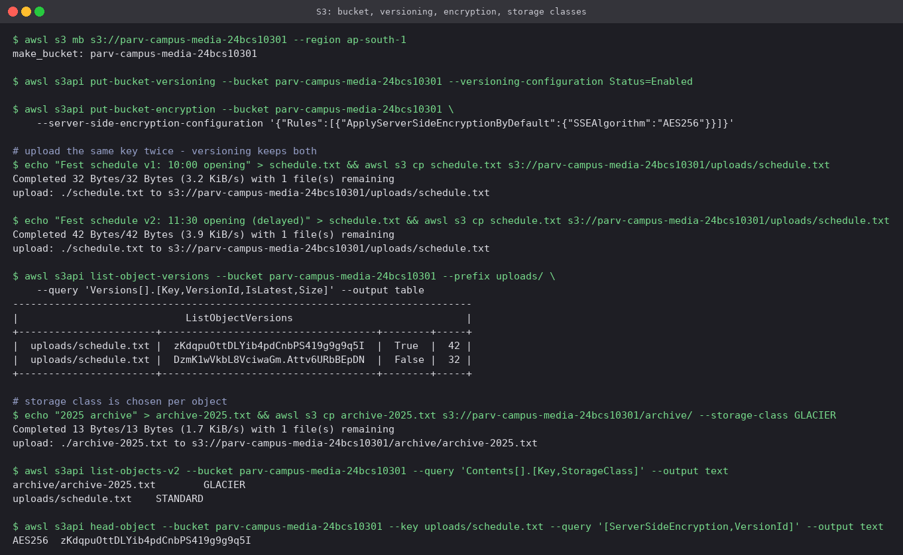
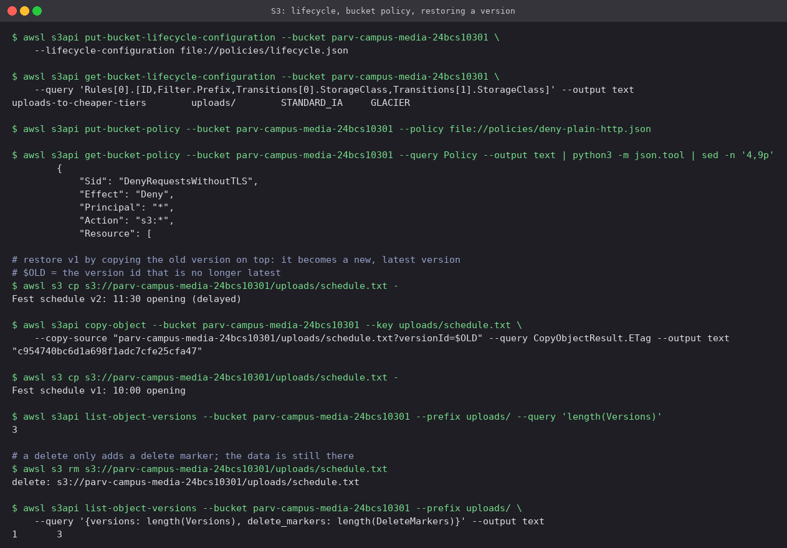

# 03 · S3: Simple Storage Service

Object storage: you put a blob of bytes under a key and get it back by that key over HTTPS.
There are no disks to size and no servers to patch; capacity is effectively unlimited and
objects are stored redundantly across at least three Availability Zones (designed for eleven
nines of durability).

## Concepts

### Buckets

- A container for objects, created in one region.
- The name is **globally unique** across every AWS account, 3–63 characters, lowercase letters,
  digits, hyphens and dots. That is why the names here end in a roll number.
- Since April 2023 new buckets start with **Block Public Access on** and ACLs disabled.

### Objects

- **Key**: the full name, e.g. `uploads/2026/schedule.txt`. There are no real folders; the `/`
  is just a character that the console and `--prefix` filters treat as one.
- **Value** up to 5 TB (multipart upload above 100 MB is recommended), plus system and user
  **metadata** (`Content-Type`, `x-amz-meta-*`) and up to 10 tags.
- S3 is strongly read-after-write consistent: a successful `PUT` is immediately visible to every
  later `GET` and `LIST`.

### Storage classes

Chosen per object; same durability, different price for storage vs retrieval.

| Class | For | Retrieval |
|---|---|---|
| `STANDARD` | Frequently read data | Milliseconds |
| `INTELLIGENT_TIERING` | Unknown or changing access patterns; moves objects for you | Milliseconds |
| `STANDARD_IA` | Read less than about monthly | Milliseconds, per-GB retrieval fee, 30-day minimum |
| `ONEZONE_IA` | Re-creatable infrequent data | Single AZ, cheaper, lost if the AZ is lost |
| `GLACIER_IR` | Archives that still need instant reads | Milliseconds |
| `GLACIER` (Flexible Retrieval) | Archives | Minutes to hours, restore first |
| `DEEP_ARCHIVE` | Compliance, rarely read | Up to 12–48 hours |

### Versioning

Once enabled, every overwrite creates a new **version** and a delete only adds a **delete
marker** on top. Old versions can be read or restored by version ID. Versioning can later be
*suspended* but never fully turned off. It is the main protection against accidental
overwrites and deletes, and a prerequisite for replication and Object Lock.

### Lifecycle policies

Rules, filtered by prefix or tag, that act on objects by age:

- **Transition** to a cheaper class after N days.
- **Expire** current objects, or **noncurrent versions**, after N days.
- **Abort** incomplete multipart uploads, which otherwise keep costing money invisibly.

### Encryption

| Option | Keys managed by |
|---|---|
| SSE-S3 (`AES256`) | S3; the default for every new object since 2023 |
| SSE-KMS (`aws:kms`) | AWS KMS; key policy controls who can decrypt, every use is in CloudTrail |
| DSSE-KMS | Two layers of KMS encryption, for strict compliance |
| SSE-C / client-side | You; S3 never holds the key |

In transit, a bucket policy that denies `aws:SecureTransport = false` forces HTTPS.

### Bucket policies

Resource-based JSON policies attached to the bucket itself, with a `Principal` field (unlike an
identity policy). They are how you grant another account access, require TLS or encryption
headers, restrict to a VPC endpoint, or let CloudFront read a private bucket. An explicit
`Deny` here overrides any `Allow` in IAM.

### Common uses

Static website and asset hosting (usually behind CloudFront), backups and log archives, data
lake storage for Athena or Spark, build artefacts, and Terraform remote state.

## Hands-on (LocalStack)

Files: [`policies/lifecycle.json`](policies/lifecycle.json) and
[`policies/deny-plain-http.json`](policies/deny-plain-http.json).

### Versioning, encryption and storage classes

```bash
awsl s3 mb s3://prince-campus-media-24bcs10301
awsl s3api put-bucket-versioning --bucket prince-campus-media-24bcs10301 --versioning-configuration Status=Enabled
awsl s3api put-bucket-encryption --bucket prince-campus-media-24bcs10301 \
  --server-side-encryption-configuration '{"Rules":[{"ApplyServerSideEncryptionByDefault":{"SSEAlgorithm":"AES256"}}]}'

echo "Fest schedule v1: 10:00 opening" > schedule.txt
awsl s3 cp schedule.txt s3://prince-campus-media-24bcs10301/uploads/schedule.txt
echo "Fest schedule v2: 11:30 opening (delayed)" > schedule.txt
awsl s3 cp schedule.txt s3://prince-campus-media-24bcs10301/uploads/schedule.txt
awsl s3api list-object-versions --bucket prince-campus-media-24bcs10301 --prefix uploads/

awsl s3 cp archive-2025.txt s3://prince-campus-media-24bcs10301/archive/ --storage-class GLACIER
```



- The same key was written twice, and `list-object-versions` shows **two versions**: the 42-byte
  v2 with `IsLatest = True` and the 32-byte v1 behind it. Without versioning the first upload
  would simply be gone.
- `--storage-class GLACIER` is set per object, so one bucket can hold `STANDARD` and `GLACIER`
  objects side by side.
- `head-object` reports `AES256` on an object that was uploaded without any encryption flag.
  The bucket default applied it.

### Lifecycle, bucket policy, restoring and deleting

```bash
awsl s3api put-bucket-lifecycle-configuration --bucket prince-campus-media-24bcs10301 \
  --lifecycle-configuration file://policies/lifecycle.json
awsl s3api put-bucket-policy --bucket prince-campus-media-24bcs10301 \
  --policy file://policies/deny-plain-http.json

# restore v1: copy the old version on top of the key
awsl s3api copy-object --bucket prince-campus-media-24bcs10301 --key uploads/schedule.txt \
  --copy-source "prince-campus-media-24bcs10301/uploads/schedule.txt?versionId=$OLD"

awsl s3 rm s3://prince-campus-media-24bcs10301/uploads/schedule.txt
awsl s3api list-object-versions --bucket prince-campus-media-24bcs10301 --prefix uploads/
```



- The lifecycle rule applies only under `uploads/`: `STANDARD_IA` at 30 days, `GLACIER` at 180,
  noncurrent versions expire after 60 days, and abandoned multipart uploads are cleaned up after
  7.
- The bucket policy is a single `Deny` for any request where `aws:SecureTransport` is false.
  Because an explicit deny beats every allow, no IAM permission can re-enable plain HTTP.
- **Restoring** is a copy, not a rollback. Copying v1's version ID onto the same key creates a
  *third* version whose content is v1's text. History is never rewritten, so the bad v2 is still
  there if it is needed again.
- **Deleting** in a versioned bucket only adds a delete marker. The final query prints `1  3`
  (text output sorts the keys, so that is `delete_markers: 1`, `versions: 3`). All three
  versions are still stored, and removing the marker brings the object back.

## Cleanup

```bash
awsl s3api delete-objects --bucket prince-campus-media-24bcs10301 --delete "$(awsl s3api list-object-versions \
  --bucket prince-campus-media-24bcs10301 --query '{Objects: [Versions,DeleteMarkers][][].{Key:Key,VersionId:VersionId}}')"
awsl s3api delete-bucket --bucket prince-campus-media-24bcs10301
```

`aws s3 rb --force` is not enough for a versioned bucket. It removes current objects but not
old versions or delete markers, and the bucket stays `BucketNotEmpty`.

---

**Prince Shakya** · Roll No. 24BCS10084
