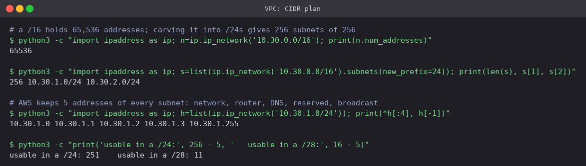
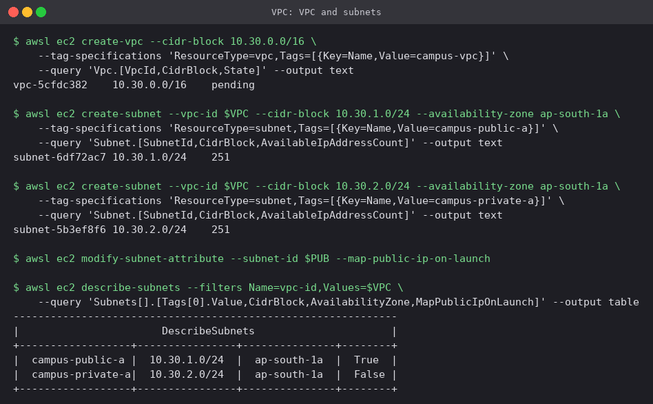
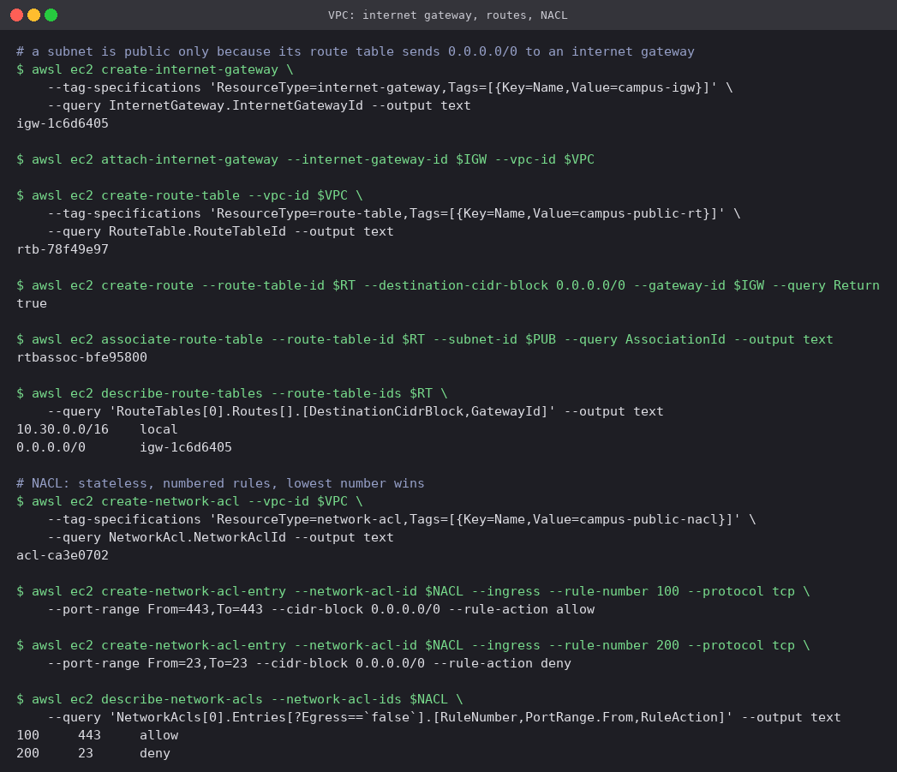

# 04 · VPC: Virtual Private Cloud

A VPC is your own isolated network inside an AWS region: you pick its address range, cut it
into subnets, and decide with route tables and firewalls what can reach what. Every EC2
instance, RDS database, load balancer and EKS node lives in a subnet of some VPC.

## Concepts

### CIDR

An address range is written as `base/prefix`. The prefix is how many leading bits are fixed;
the rest are free for hosts.

| CIDR | Addresses | Typical role |
|---|---|---|
| `/16` | 65,536 | A whole VPC (the largest AWS allows) |
| `/20` | 4,096 | A large subnet, e.g. for EKS pods |
| `/24` | 256 | A normal subnet |
| `/28` | 16 | The smallest subnet AWS allows |

Use the private ranges `10.0.0.0/8`, `172.16.0.0/12` or `192.168.0.0/16`, and give every VPC
that might ever be peered or connected to an office a range that does **not overlap** with the
others. Overlaps cannot be routed and are painful to undo.

### Subnets

A slice of the VPC's range that lives in **exactly one Availability Zone**. High availability
therefore means at least one subnet per AZ for each tier. AWS reserves **5 addresses** in every
subnet: the network address, `.1` for the VPC router, `.2` for DNS, `.3` for future use, and the
last address (broadcast).

### Route tables

Each subnet is associated with one route table. Every table starts with a `local` route for the
whole VPC CIDR, so all subnets can reach each other. Anything else needs an explicit route, and
the most specific matching prefix wins.

### Internet Gateway

A horizontally scaled, highly available gateway attached to the VPC. It lets resources with a
public IP talk to the internet both ways. There is one per VPC, and it costs nothing by itself.

### NAT Gateway

Lets instances in **private** subnets make *outbound* connections (package updates, external
APIs) while staying unreachable from outside. It sits in a public subnet with an Elastic IP;
private route tables send `0.0.0.0/0` to it. It is billed per hour and per GB, which is why dev
environments often share one, while production uses one per AZ.

### Security Groups vs Network ACLs

| | Security Group | Network ACL |
|---|---|---|
| Attached to | Network interface (instance) | Subnet |
| State | **Stateful**: replies allowed automatically | **Stateless**: return traffic needs its own rule |
| Rules | Allow only | Allow **and** deny |
| Evaluation | All rules together | In order by rule number, first match wins |
| Default | Deny all in, allow all out | Default NACL allows everything |

Security groups do almost all of the work in practice. NACLs are a coarse subnet-wide backstop,
for example to block an abusive IP range outright.

### Public vs private subnet

There is no "public" checkbox. A subnet **is public** when its route table sends `0.0.0.0/0` to
an Internet Gateway, and instances launched in it get public IPs (`map-public-ip-on-launch`). A
**private** subnet has no such route; outbound access, if any, goes through a NAT Gateway.

```text
                            Internet
                               │
                        Internet Gateway
  VPC 10.30.0.0/16             │
  ┌────────────────────────────┼──────────────────────────────┐
  │  public subnet 10.30.1.0/24        private subnet 10.30.2.0/24
  │  route: 0.0.0.0/0 → igw            route: local only (+ NAT for egress)
  │  web servers, load balancer        databases, internal services
  └───────────────────────────────────────────────────────────┘
```

## Hands-on (LocalStack)

### CIDR arithmetic

```bash
python3 -c "import ipaddress as ip; print(ip.ip_network('10.30.0.0/16').num_addresses)"
python3 -c "import ipaddress as ip; s=list(ip.ip_network('10.30.0.0/16').subnets(new_prefix=24)); print(len(s), s[1], s[2])"
```



The `/16` holds 65,536 addresses and splits into 256 `/24`s; `10.30.1.0/24` and `10.30.2.0/24`
are the two used below. In each `/24`, the four lowest addresses and the last one are AWS's,
leaving **251** usable. In a `/28` that leaves only 11 of 16, so tiny subnets lose a third of
their space.

### VPC and subnets

```bash
awsl ec2 create-vpc --cidr-block 10.30.0.0/16
awsl ec2 create-subnet --vpc-id $VPC --cidr-block 10.30.1.0/24 --availability-zone ap-south-1a   # campus-public-a
awsl ec2 create-subnet --vpc-id $VPC --cidr-block 10.30.2.0/24 --availability-zone ap-south-1a   # campus-private-a
awsl ec2 modify-subnet-attribute --subnet-id $PUB --map-public-ip-on-launch
```



Both subnets report `AvailableIpAddressCount = 251`, exactly the 256 − 5 worked out above. At
this point the two subnets differ only in `MapPublicIpOnLaunch`, which is not enough to make one
public: there is no route out yet.

### Internet gateway, routes and NACL

```bash
awsl ec2 create-internet-gateway
awsl ec2 attach-internet-gateway --internet-gateway-id $IGW --vpc-id $VPC
awsl ec2 create-route-table --vpc-id $VPC
awsl ec2 create-route --route-table-id $RT --destination-cidr-block 0.0.0.0/0 --gateway-id $IGW
awsl ec2 associate-route-table --route-table-id $RT --subnet-id $PUB

awsl ec2 create-network-acl --vpc-id $VPC
awsl ec2 create-network-acl-entry --network-acl-id $NACL --ingress --rule-number 100 \
  --protocol tcp --port-range From=443,To=443 --cidr-block 0.0.0.0/0 --rule-action allow
awsl ec2 create-network-acl-entry --network-acl-id $NACL --ingress --rule-number 200 \
  --protocol tcp --port-range From=23,To=23 --cidr-block 0.0.0.0/0 --rule-action deny
```



- The route table now has two entries: `10.30.0.0/16 → local`, which was added automatically
  and cannot be removed, and `0.0.0.0/0 → igw-…`. Associating it with `campus-public-a` is the
  step that actually makes that subnet public. `campus-private-a` stays on the main route table
  with only the local route.
- The NACL holds a numbered allow (100, HTTPS) and an explicit deny (200, Telnet), something a
  security group cannot express. Because NACLs are stateless, a real one would also need an
  outbound rule for the ephemeral ports (1024–65535) the replies use.

## Cleanup

```bash
awsl ec2 delete-network-acl --network-acl-id $NACL
awsl ec2 disassociate-route-table --association-id $ASSOC
awsl ec2 delete-route-table --route-table-id $RT
awsl ec2 detach-internet-gateway --internet-gateway-id $IGW --vpc-id $VPC
awsl ec2 delete-internet-gateway --internet-gateway-id $IGW
awsl ec2 delete-subnet --subnet-id $PUB && awsl ec2 delete-subnet --subnet-id $PRIV
awsl ec2 delete-vpc --vpc-id $VPC
```

The same network is built with Terraform, across two AZs and with EC2 and S3 on top, in the
[Cloud Terraform Project](../../../Cloud%20Terraform%20Project).

---

**Prince Shakya** · Roll No. 24BCS10084
