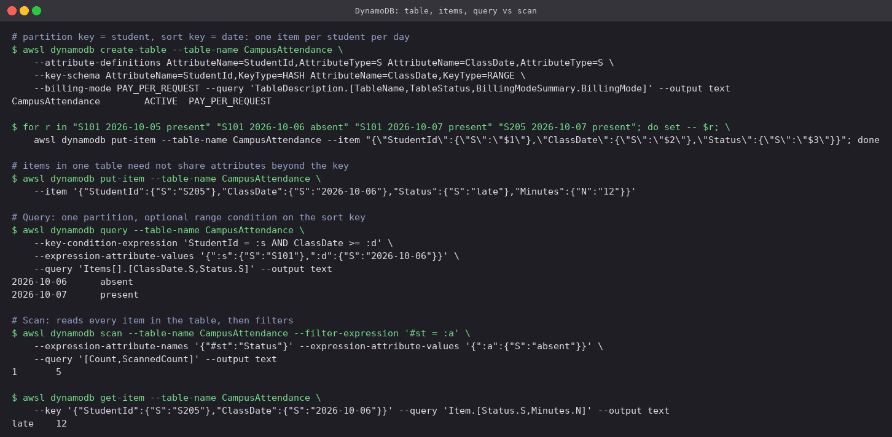
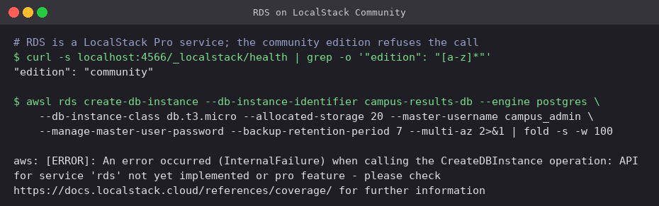

# 05 · DynamoDB and RDS: database services

AWS runs both kinds of database as managed services: **DynamoDB** for key-value / document
(NoSQL) data and **RDS** for relational SQL engines. "Managed" means AWS handles the hardware,
patching, backups and failover; you handle the schema, the queries, and the access patterns.

| | DynamoDB | RDS |
|---|---|---|
| Model | Key-value / document | Relational tables, SQL, joins |
| Schema | Only the key is fixed; items vary | Fixed columns, migrations to change |
| Scaling | Horizontal and automatic, any size | Vertical (bigger instance) plus read replicas |
| Access | HTTPS API (`GetItem`, `Query`) | SQL over a TCP connection in your VPC |
| Pricing | Per request or provisioned capacity, plus storage | Per instance-hour, plus storage and I/O |
| Best when | Access patterns are known, very high scale, single-digit-ms latency | Ad-hoc queries, joins, transactions, existing SQL apps |

---

# Part A: DynamoDB

## Concepts

- **NoSQL**: no joins and no fixed columns. Data is modelled around the queries you will run,
  often several entity types in one table.
- **Table**: a collection of items. There is no server or size to choose. Billing is either
  `PAY_PER_REQUEST` (on-demand) or provisioned read/write capacity units with auto scaling.
- **Item**: one record, up to 400 KB, identified by its primary key.
- **Attribute**: a typed field (`S` string, `N` number, `B` binary, `BOOL`, `L` list, `M` map,
  sets). Apart from the key, two items in the same table may have completely different
  attributes.
- **Partition key** (`HASH`): hashed to pick the physical partition. On its own it must be
  unique. Choose one with many distinct values so load spreads evenly; a "hot" key throttles.
- **Sort key** (`RANGE`): optional second part of the key. Items with the same partition key
  are stored together, ordered by the sort key, which enables range conditions (`begins_with`,
  `between`, `>=`).
- **Secondary indexes**: a GSI uses a different partition/sort key over the same data; an LSI
  keeps the partition key with a different sort key.
- **Query vs Scan**: `Query` goes straight to one partition and reads only matching items. `Scan`
  reads **the whole table** and filters afterwards, so you pay for every item read. Design so the
  hot paths are queries.

**Use cases:** user sessions and profiles, shopping carts, IoT and event data, leaderboards,
anything with a known key and huge scale. It is also the classic Terraform state lock table,
though S3 now locks natively.

## Hands-on (LocalStack)

Table `CampusAttendance`: partition key `StudentId`, sort key `ClassDate`, so there is one item
per student per day.

```bash
awsl dynamodb create-table --table-name CampusAttendance \
  --attribute-definitions AttributeName=StudentId,AttributeType=S AttributeName=ClassDate,AttributeType=S \
  --key-schema AttributeName=StudentId,KeyType=HASH AttributeName=ClassDate,KeyType=RANGE \
  --billing-mode PAY_PER_REQUEST

awsl dynamodb put-item --table-name CampusAttendance \
  --item '{"StudentId":{"S":"S205"},"ClassDate":{"S":"2026-10-06"},"Status":{"S":"late"},"Minutes":{"N":"12"}}'

awsl dynamodb query --table-name CampusAttendance \
  --key-condition-expression 'StudentId = :s AND ClassDate >= :d' \
  --expression-attribute-values '{":s":{"S":"S101"},":d":{"S":"2026-10-06"}}'

awsl dynamodb scan --table-name CampusAttendance --filter-expression '#st = :a' \
  --expression-attribute-names '{"#st":"Status"}' --expression-attribute-values '{":a":{"S":"absent"}}'
```



- Only the two key attributes were declared in `create-table`. `Status` was never declared, and
  one item carries an extra `Minutes` number that no other item has. The table accepted it
  anyway: the schema covers only the key.
- The **query** went to partition `S101` and used the sort key range `>= 2026-10-06`, returning
  just the two matching days in date order. ISO dates sort correctly as strings, which is why
  the sort key is stored as `YYYY-MM-DD`.
- The **scan** returned `1  5`: one matching item (`Count`), but five items read
  (`ScannedCount`). The filter runs *after* the read, so on a large table a scan costs the same
  however few results it returns. A GSI on `Status` would make this a query instead.
- `Status` had to be aliased as `#st` because it is a DynamoDB reserved word.

---

# Part B: RDS (Relational Database Service)

## Concepts

- **Relational database**: tables with fixed columns, primary and foreign keys, SQL with joins,
  and ACID transactions. It is the right default when the data is naturally relational or the
  queries are not known in advance.
- **Supported engines**: PostgreSQL, MySQL, MariaDB, Oracle, SQL Server, Db2, plus **Aurora**
  (AWS's MySQL- and PostgreSQL-compatible engine with shared, auto-growing storage across three
  AZs).
- **DB instance**: the unit you create and pay for: an instance class (`db.t4g.micro`,
  `db.r7g.large`), allocated storage (gp3 or io2), an engine version, and a parameter group for
  engine settings. You get an endpoint hostname, never shell access to the host.
- **Security**: placed in private subnets through a **DB subnet group**, reachable only from the
  application's security group on the engine port; encryption at rest with KMS (chosen at
  creation, cannot be added later); TLS in transit; the master password kept in **Secrets
  Manager** (`--manage-master-user-password`) or replaced by IAM database authentication.
- **Backups**: automated daily snapshots plus transaction logs give **point-in-time restore** to
  any second within the retention window (1–35 days). Manual snapshots are kept until deleted.
  A restore always creates a *new* instance.
- **Multi-AZ**: a synchronous standby in another AZ. On a failure or during maintenance, RDS
  flips the DNS endpoint to the standby in about a minute or two. This is for **availability**;
  the standby serves no reads.
- **Read replicas**: asynchronous copies (up to 15) with their own endpoints, for **read
  scaling** and reporting. They can be in another region, and can be promoted to standalone for
  disaster recovery. Because they are async, reads may be slightly stale.

| Need | Feature |
|---|---|
| Survive an AZ outage automatically | Multi-AZ |
| Offload heavy read traffic | Read replicas |
| Undo a bad `DELETE` from 20 minutes ago | Point-in-time restore |
| Survive a region outage | Cross-region read replica or snapshot copy |

**Use cases:** web application backends, e-commerce orders and payments, ERP and CRM systems,
reporting, and anything already written against PostgreSQL or MySQL.

## Hands-on: RDS on LocalStack

```bash
awsl rds create-db-instance --db-instance-identifier campus-results-db --engine postgres \
  --db-instance-class db.t3.micro --allocated-storage 20 --master-username campus_admin \
  --manage-master-user-password --backup-retention-period 7 --multi-az
```



RDS is not in LocalStack's community edition, and the API answers with
`InternalFailure … not yet implemented or pro feature`. Rather than fake a result, this is left
as the real response. The command itself is what would create a PostgreSQL instance on a real
account with 7 days of point-in-time recovery, a Multi-AZ standby, and the master password
generated and stored in Secrets Manager. The parts that need to be in place first on real AWS
are a DB subnet group spanning two private subnets and a security group allowing 5432 only from
the application tier.

## Cleanup

```bash
awsl dynamodb delete-table --table-name CampusAttendance
```

---

**Prince Shakya** · Roll No. 24BCS10084
